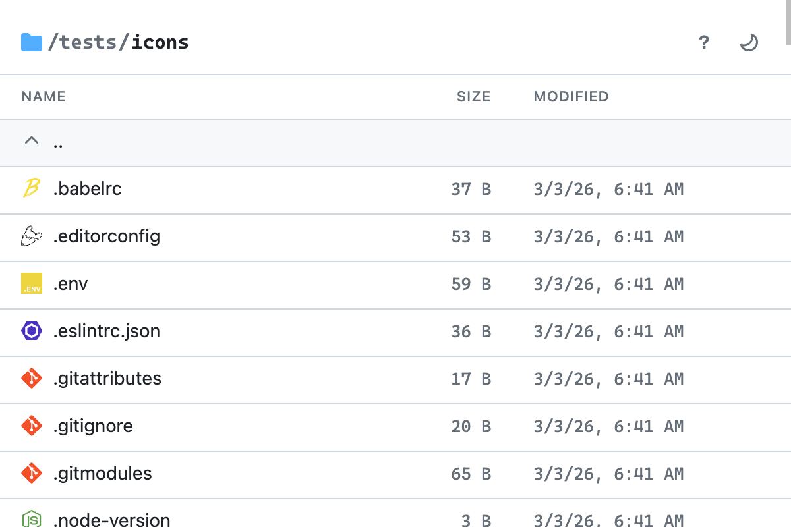
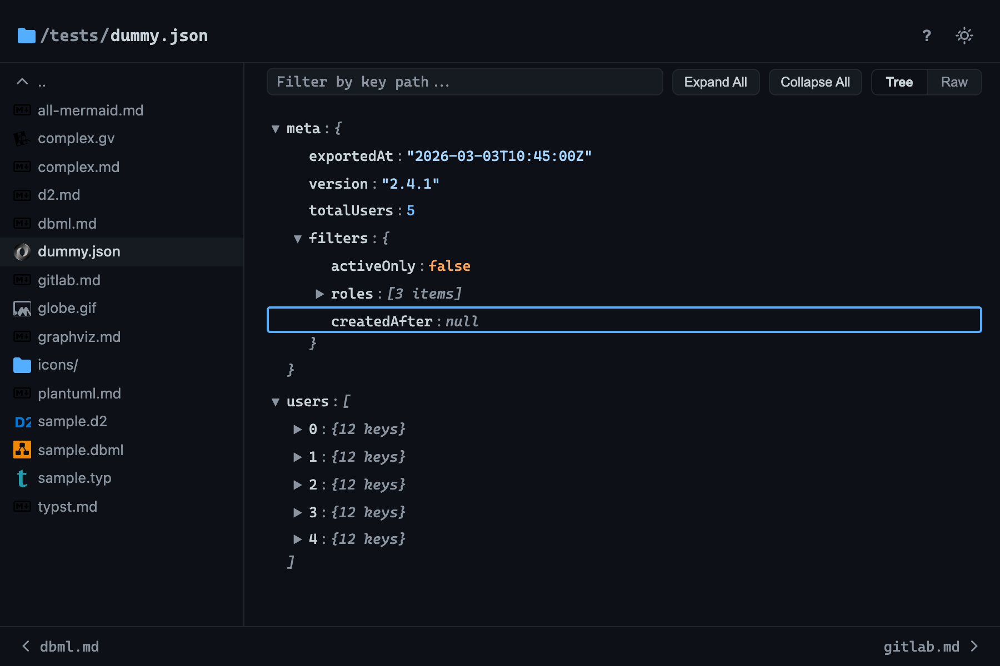
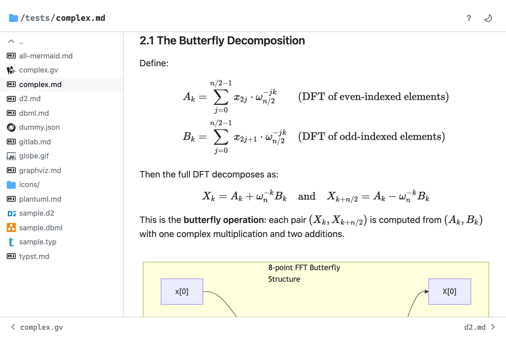
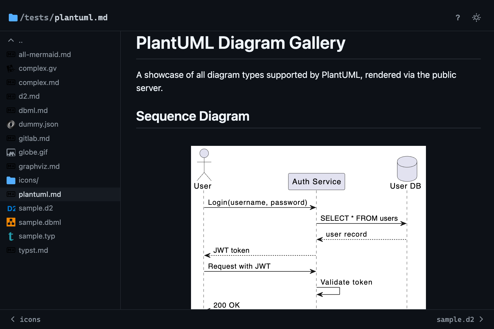

# Dirsv


Local directory browser with live reload. Single Go binary, embedded web UI.
Browse files with a clean table view, render markdown with syntax-highlighted
code blocks, and see changes instantly via WebSocket.

https://github.com/user-attachments/assets/e8ad4e6e-ad58-463c-bcac-cf6414539240

|            Directory browsing            |                JSON tree view                 |
| :--------------------------------------: | :-------------------------------------------: |
|  |          |
|       **Markdown with KaTeX math**       |             **PlantUML diagrams**             |
|      |  |

## Why

I **write various kind of markdown docs in nvim**:

- Throwaway note
- Technical design that might contains heavy diagrams.
- [Learning notes][sicp-1.45] that are math heavy.
- Personal knowledge graphs.

I also would like **preview more kinds of diagrams**, not just mermaid,
**offline browsing a repo**, **previewing web static assets**.

None of the existing solutions covers all my need. So, I build `dirsv` and
[dirsv.nvim][dnvim].

## Features

### Viewers

- **Directory browsing** — table view with [Devicon][devicon] file-type icons,
  sizes, and modification dates. Keyboard navigation (`j`/`k`, Enter to open)
- **Markdown rendering** — [GFM][gfm] and [MDX][mdx] via
  [unified/remark][remark] with [Shiki][shiki] syntax highlighting,
  [KaTeX][katex] math, definition lists, color chips, GitHub-style alerts,
  emoji, raw HTML blocks, video embeds, anchor links on headings, and a sticky
  table of contents sidebar. Supports `:::` [container directives][directives]
  as an alternative to fenced code blocks for diagrams and admonitions
- **Diagrams** — fenced code blocks or `:::` directives for [Mermaid][mermaid],
  [PlantUML][plantuml], [Graphviz][graphviz], [D2][d2], and [DBML][dbml].
  Standalone `.gv`/`.dot`, `.d2`, and `.dbml` files render directly. All
  client-side via WASM or JS
- **Code view** — syntax highlighting for 100+ languages, line numbers, copy
  button
- **JSON / YAML tree view** — collapsible tree with path filtering, Tree/Raw
  toggle, copy-to-clipboard per node. Large files (>500 KB) default to raw
- **Image viewer** — gallery navigation between sibling images, preloading, fade
  transitions
- **Video player** — HTML5 controls with gallery navigation for `.mp4`, `.webm`,
  `.ogg`, `.mov`
- **Terminal recordings** — [asciinema][asciinema] `.cast` playback with
  [asciinema-player][asciinema-player]
- **HTML preview** — iframe sandbox with automatic URL rewriting for static
  sites
- **Binary files** — detected by MIME type, shown with an "Open in app" link

### UI

- **File sidebar** — resizable panel listing sibling files with type icons.
  Prev/next navigation. State syncs across browser tabs
- **Breadcrumb navigation** — clickable path segments, or press `Alt+L` to edit
  the full path directly (with validation)
- **Focus overlay** — double-click any image, video, or diagram to open a
  full-screen lightbox. Scroll-to-zoom, drag-to-pan, `+`/`-`/`0` keys, pinch
  gesture, `←`/`→` to cycle items, `f` for browser fullscreen
- **Figure toolbar** — each code block and diagram gets copy, view-source
  toggle, and expand buttons
- **Content prefetch** — hovering sidebar links prefetches content; adjacent
  siblings auto-prefetch after load
- **Dark/light theme** — toggle with persistent override, respects
  `prefers-color-scheme`. Syncs across tabs
- **Keyboard shortcuts** — `?` opens a help popover listing all bindings.
  `Ctrl+B` toggle sidebar, `Ctrl+E` focus toggle, `h`/`Backspace` parent dir

### Editor integration

- **Editor sync** — WebSocket endpoint for editor plugins (see
  [dirsv.nvim][dnvim]). Syncs cursor position, text selection, and scroll
  position from the editor to the browser in real time. Closing the buffer sends
  a close event that dismisses the browser tab
- **Live-reload highlights** — changed lines flash briefly after each reload.
  Duration configurable via `--highlight-ms` (default 5000 ms). Line-level diffs
  computed server-side with a Myers O(ND) algorithm

### Server

- **Live reload** — per-path WebSocket with server-side filtering. Only watched
  paths are broadcast
- **Rate limiting** — per-IP token bucket (50 req/s, burst 100). Use
  `--trusted-proxy` behind a reverse proxy
- **Security** — DNS rebinding protection, tightened CSP for HTML previews,
  WebSocket origin checks
- **Single binary** — frontend assets embedded via `go:embed` with
  pre-compressed gzip, no runtime dependencies. File-type icons and [Nerd
  Font][nerdfont] bundled for fully offline use

## Install

**macOS / Linux:**

```sh
curl -fsSL https://raw.githubusercontent.com/letientai299/dirsv/main/scripts/install.sh | bash
```

**Windows (PowerShell 5.1+):**

```powershell
irm https://raw.githubusercontent.com/letientai299/dirsv/main/scripts/install.ps1 | iex
```

**Custom directory:**

```sh
curl -fsSL https://raw.githubusercontent.com/letientai299/dirsv/main/scripts/install.sh | bash -s -- -d ~/.local/bin
```

Or download a binary directly from [Releases][releases].

## Quick start

```sh
dirsv        # serve current directory on :8080, open browser
dirsv ./docs # serve a specific directory
```

### CLI flags

```text
Usage: dirsv [flags] [path]

  -b, --browser string    browser to open (default: system default)
  -d, --debug             enable verbose watcher logs
      --highlight-ms int  duration (ms) of background flash on changed elements (default 5000)
      --host string       listen address (default "localhost")
      --no-open           don't auto-open browser
  -p, --port int          listen port (default 8080)
      --trusted-proxy     trust proxy headers for rate limiting
  -v, --version           print version and exit
```

When `[path]` is a file, the server restricts browsing to that single file. If
the port is taken and wasn't explicitly set, the server auto-finds a free port
in the 8080-8179 range.

### Build from source

Requires [mise][mise] (manages Go, [Bun][bun], and [golangci-lint][gclint]
automatically).

```sh
mise build   # build frontend + Go binary
./bin/server # serves current directory on :8080, opens browser
```

## Development

```sh
mise dev # Go server + Vite dev server in parallel (HMR)
```

The Go server runs on `:8080` and proxies non-API requests to [Vite][vite] on
`:5173`.

## License

MIT

[devicon]: https://devicon.dev/
[remark]: https://github.com/remarkjs/remark
[gfm]: https://github.github.com/gfm/
[shiki]: https://shiki.style/
[katex]: https://katex.org/
[mermaid]: https://mermaid.js.org/
[plantuml]: https://plantuml.com/
[graphviz]: https://graphviz.org/
[d2]: https://d2lang.com/
[dbml]: https://dbml.dbdiagram.io/
[mise]: https://mise.jdx.dev/
[vite]: https://vite.dev/
[bun]: https://bun.sh/
[gclint]: https://golangci-lint.run/
[releases]: https://github.com/letientai299/dirsv/releases
[asciinema]: https://asciinema.org/
[asciinema-player]: https://github.com/asciinema/asciinema-player
[dnvim]: https://github.com/letientai299/dirsv.nvim
[sicp-1.45]: https://github.com/letientai299/read-sicp/blob/master/ch01/1.45.md
[mdx]: https://mdxjs.com/
[nerdfont]: https://www.nerdfonts.com/
[directives]:
  https://talk.commonmark.org/t/generic-directives-plugins-syntax/444
