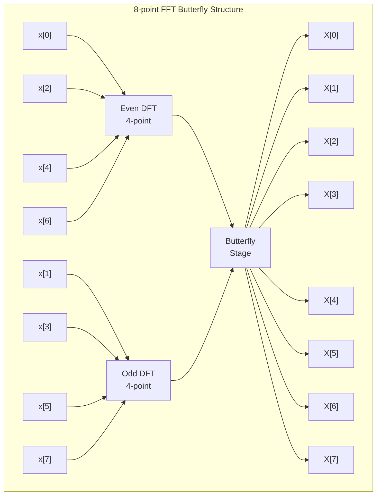
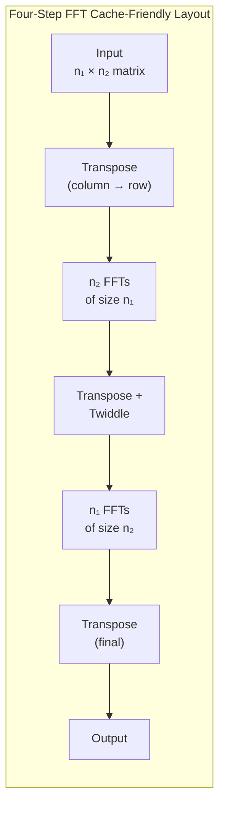
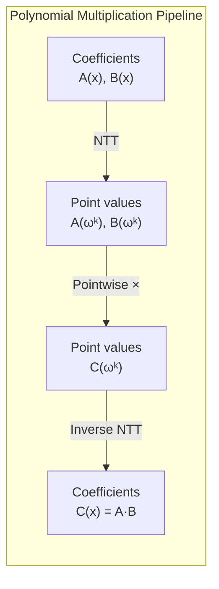
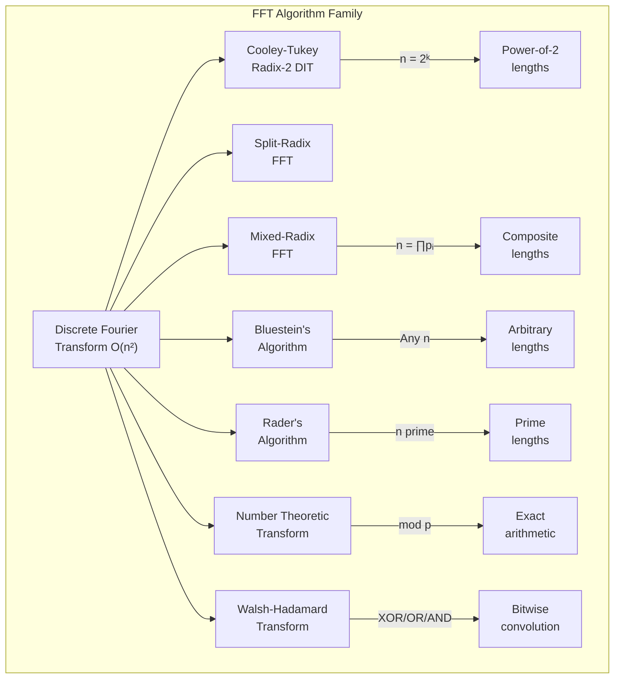
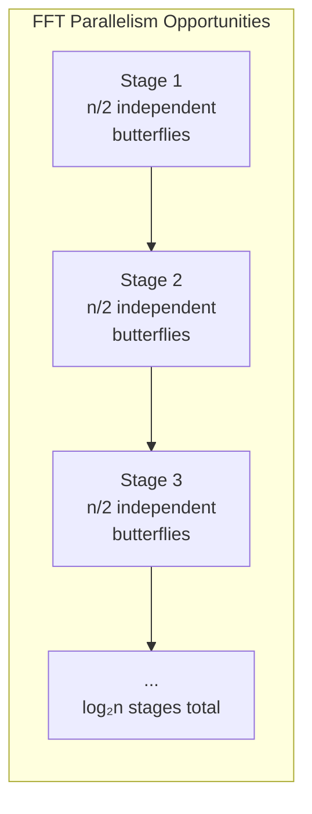

# The Fast Fourier Transform: A Complete Analysis

The **Fast Fourier Transform** (FFT) is one of the most important algorithms in
computer science. It reduces the Discrete Fourier Transform from $O(n^2)$ to
$O(n \log n)$ — a speedup that made digital signal processing practical.

This document walks through the theory, implementation, complexity analysis, and
applications in enough depth to serve as a study reference.

---

## Table of Contents

- [1. The Discrete Fourier Transform](#1-the-discrete-fourier-transform)
- [2. Cooley-Tukey FFT](#2-cooley-tukey-fft)
- [3. Implementation](#3-implementation)
- [4. Complexity Analysis](#4-complexity-analysis)
- [5. Number Theoretic Transform](#5-number-theoretic-transform)
- [6. Applications](#6-applications)
- [7. Comparison of FFT Variants](#7-comparison-of-fft-variants)

---

## 1. The Discrete Fourier Transform

Given a sequence of $n$ complex numbers $x_0, x_1, \ldots, x_{n-1}$, the
**Discrete Fourier Transform** (DFT) produces another sequence
$X_0, X_1, \ldots, X_{n-1}$ defined by:

$$
X_k = \sum_{j=0}^{n-1} x_j \cdot e^{-2\pi i \, jk / n}
\quad \text{for } k = 0, 1, \ldots, n-1
$$

Let $\omega_n = e^{2\pi i / n}$ be a **primitive $n$-th root of unity**. Then:

$$
X_k = \sum_{j=0}^{n-1} x_j \cdot \omega_n^{-jk}
$$

The inverse DFT recovers the original sequence:

$$
x_j = \frac{1}{n} \sum_{k=0}^{n-1} X_k \cdot \omega_n^{jk}
$$

### 1.1 Properties of Roots of Unity

The $n$-th roots of unity satisfy several critical identities:

| Property | Formula | Notes |
|---|---|---|
| Periodicity | $\omega_n^{n} = 1$ | Definition |
| Symmetry | $\omega_n^{k + n/2} = -\omega_n^k$ | Cancellation lemma |
| Reduction | $\omega_{2n}^{2k} = \omega_n^k$ | Halving lemma |
| Sum | $\sum_{j=0}^{n-1} \omega_n^{jk} = 0$ for $k \not\equiv 0$ | Orthogonality |
| Conjugate | $\overline{\omega_n^k} = \omega_n^{-k} = \omega_n^{n-k}$ | Inverse DFT |

The **cancellation lemma** is the key insight that makes FFT work: it lets us
split an $n$-point DFT into two $n/2$-point DFTs.

### 1.2 Matrix Formulation

The DFT can be written as a matrix-vector product $\mathbf{X} = F_n \mathbf{x}$
where $F_n$ is the **DFT matrix**:

$$
F_n = \begin{pmatrix}
1 & 1 & 1 & \cdots & 1 \\
1 & \omega_n^{-1} & \omega_n^{-2} & \cdots & \omega_n^{-(n-1)} \\
1 & \omega_n^{-2} & \omega_n^{-4} & \cdots & \omega_n^{-2(n-1)} \\
\vdots & \vdots & \vdots & \ddots & \vdots \\
1 & \omega_n^{-(n-1)} & \omega_n^{-2(n-1)} & \cdots & \omega_n^{-(n-1)^2}
\end{pmatrix}
$$

This matrix is **unitary** (up to scaling): $F_n^{-1} = \frac{1}{n} F_n^*$.
Direct matrix multiplication requires $O(n^2)$ operations.

---

## 2. Cooley-Tukey FFT

The Cooley-Tukey algorithm (1965) exploits the **divide-and-conquer** structure
of the DFT. For $n = 2^m$, we split the input into even-indexed and odd-indexed
elements.

### 2.1 The Butterfly Decomposition

Define:

$$
\begin{aligned}
A_k &= \sum_{j=0}^{n/2 - 1} x_{2j} \cdot \omega_{n/2}^{-jk}
    && \text{(DFT of even-indexed elements)} \\
B_k &= \sum_{j=0}^{n/2 - 1} x_{2j+1} \cdot \omega_{n/2}^{-jk}
    && \text{(DFT of odd-indexed elements)}
\end{aligned}
$$

Then the full DFT decomposes as:

$$
X_k = A_k + \omega_n^{-k} B_k
\quad \text{and} \quad
X_{k + n/2} = A_k - \omega_n^{-k} B_k
$$

This is the **butterfly operation**: each pair $(X_k, X_{k+n/2})$ is computed
from $(A_k, B_k)$ with one complex multiplication and two additions.



### 2.2 Recurrence Relation

Let $T(n)$ be the number of operations for an $n$-point FFT:

$$
T(n) = 2T\!\left(\frac{n}{2}\right) + \Theta(n)
$$

By the **Master Theorem** (Case 2: $a = 2, b = 2, f(n) = \Theta(n)$):

$$
T(n) = \Theta(n \log n)
$$

More precisely, the radix-2 FFT requires:

$$
\frac{n}{2} \log_2 n \text{ complex multiplications and } n \log_2 n \text{ complex additions}
$$

### 2.3 The Bit-Reversal Permutation

The iterative FFT requires the input to be in **bit-reversed order**. For an
index $j$ with binary representation $b_{m-1} b_{m-2} \ldots b_1 b_0$, its
bit-reversal is $b_0 b_1 \ldots b_{m-2} b_{m-1}$.

| Index (decimal) | Binary | Reversed Binary | Reversed (decimal) |
|---|---|---|---|
| 0 | 000 | 000 | 0 |
| 1 | 001 | 100 | 4 |
| 2 | 010 | 010 | 2 |
| 3 | 011 | 110 | 6 |
| 4 | 100 | 001 | 1 |
| 5 | 101 | 101 | 5 |
| 6 | 110 | 011 | 3 |
| 7 | 111 | 111 | 7 |

---

## 3. Implementation

### 3.1 Recursive FFT (Python)

The recursive version directly mirrors the mathematical definition:

```python
import numpy as np

def fft_recursive(x: np.ndarray) -> np.ndarray:
    """Compute FFT using Cooley-Tukey radix-2 DIT algorithm."""
    n = len(x)
    if n == 1:
        return x.copy()

    if n % 2 != 0:
        raise ValueError("Length must be a power of 2")

    # Recursive calls on even and odd indices
    even = fft_recursive(x[0::2])
    odd = fft_recursive(x[1::2])

    # Twiddle factors
    k = np.arange(n // 2)
    twiddle = np.exp(-2j * np.pi * k / n)

    # Butterfly combination
    return np.concatenate([
        even + twiddle * odd,
        even - twiddle * odd,
    ])
```

### 3.2 Iterative FFT (C++)

The iterative version avoids recursion overhead and works in-place:

```cpp
#include <complex>
#include <vector>
#include <cmath>

using cd = std::complex<double>;
const double PI = std::acos(-1.0);

void fft_iterative(std::vector<cd>& a, bool invert = false) {
    int n = a.size();
    if (n == 1) return;

    // Bit-reversal permutation
    for (int i = 1, j = 0; i < n; i++) {
        int bit = n >> 1;
        for (; j & bit; bit >>= 1)
            j ^= bit;
        j ^= bit;
        if (i < j) std::swap(a[i], a[j]);
    }

    // Butterfly stages
    for (int len = 2; len <= n; len <<= 1) {
        double angle = 2 * PI / len * (invert ? -1 : 1);
        cd wlen(std::cos(angle), std::sin(angle));

        for (int i = 0; i < n; i += len) {
            cd w(1);
            for (int j = 0; j < len / 2; j++) {
                cd u = a[i + j];
                cd v = a[i + j + len / 2] * w;
                a[i + j] = u + v;
                a[i + j + len / 2] = u - v;
                w *= wlen;
            }
        }
    }

    if (invert) {
        for (cd& x : a)
            x /= n;
    }
}
```

### 3.3 Iterative FFT (Rust)

A safe Rust implementation using `num_complex`:

```rust
use num_complex::Complex64;
use std::f64::consts::PI;

pub fn fft(a: &mut [Complex64], invert: bool) {
    let n = a.len();
    assert!(n.is_power_of_two(), "length must be a power of 2");

    // Bit-reversal permutation
    let mut j: usize = 0;
    for i in 1..n {
        let mut bit = n >> 1;
        while j & bit != 0 {
            j ^= bit;
            bit >>= 1;
        }
        j ^= bit;
        if i < j {
            a.swap(i, j);
        }
    }

    // Butterfly stages
    let mut len = 2;
    while len <= n {
        let angle = 2.0 * PI / len as f64 * if invert { -1.0 } else { 1.0 };
        let wlen = Complex64::new(angle.cos(), angle.sin());

        for block in (0..n).step_by(len) {
            let mut w = Complex64::new(1.0, 0.0);
            for j in 0..len / 2 {
                let u = a[block + j];
                let v = a[block + j + len / 2] * w;
                a[block + j] = u + v;
                a[block + j + len / 2] = u - v;
                w *= wlen;
            }
        }
        len <<= 1;
    }

    if invert {
        let n_f64 = n as f64;
        for x in a.iter_mut() {
            *x /= n_f64;
        }
    }
}
```

### 3.4 Go Implementation

```go
package fft

import (
	"math"
	"math/cmplx"
)

// FFT computes the Fast Fourier Transform in-place.
// The length of a must be a power of 2.
func FFT(a []complex128, invert bool) {
	n := len(a)

	// Bit-reversal permutation
	for i, j := 1, 0; i < n; i++ {
		bit := n >> 1
		for j&bit != 0 {
			j ^= bit
			bit >>= 1
		}
		j ^= bit
		if i < j {
			a[i], a[j] = a[j], a[i]
		}
	}

	// Butterfly stages
	for length := 2; length <= n; length <<= 1 {
		angle := 2 * math.Pi / float64(length)
		if invert {
			angle = -angle
		}
		wlen := cmplx.Rect(1, angle)

		for i := 0; i < n; i += length {
			w := complex(1, 0)
			for j := 0; j < length/2; j++ {
				u := a[i+j]
				v := a[i+j+length/2] * w
				a[i+j] = u + v
				a[i+j+length/2] = u - v
				w *= wlen
			}
		}
	}

	if invert {
		nf := complex(float64(n), 0)
		for i := range a {
			a[i] /= nf
		}
	}
}
```

---

## 4. Complexity Analysis

### 4.1 Operation Counts

Each butterfly stage processes $n$ elements with $n/2$ multiplications and $n$
additions. There are $\log_2 n$ stages.

| Operation | Count per stage | Total |
|---|---|---|
| Complex multiply | $n/2$ | $\frac{n}{2} \log_2 n$ |
| Complex add | $n$ | $n \log_2 n$ |
| Twiddle factor | $n/2$ | $\frac{n}{2} \log_2 n$ |

A complex multiplication $(a + bi)(c + di)$ expands to:

$$
(ac - bd) + (ad + bc)i
$$

requiring **4 real multiplications** and **2 real additions** (or 3
multiplications with Karatsuba's trick):

$$
\begin{aligned}
k_1 &= c(a + b) \\
k_2 &= a(d - c) \\
k_3 &= b(c + d) \\
\text{real} &= k_1 - k_3 \\
\text{imag} &= k_1 + k_2
\end{aligned}
$$

### 4.2 Space Complexity

| Variant | Time | Extra Space | In-place? |
|---|---|---|---|
| Recursive | $O(n \log n)$ | $O(n \log n)$ | No |
| Iterative (Cooley-Tukey) | $O(n \log n)$ | $O(1)$ | Yes |
| Bluestein's | $O(n \log n)$ | $O(n)$ | No |
| Rader's | $O(n \log n)$ | $O(n)$ | No |

### 4.3 Cache Performance

The iterative FFT has poor **cache locality** in the first stages — stride-$n/2$
accesses. The **four-step FFT** (also called six-step) rearranges computation to
improve locality:

$$
\text{DFT}_n = P \cdot (\text{DFT}_{n_1} \otimes I_{n_2}) \cdot D \cdot (I_{n_1} \otimes \text{DFT}_{n_2}) \cdot P^T
$$

where $n = n_1 \cdot n_2$, $P$ is a permutation matrix, $D$ is a diagonal
matrix of twiddle factors, and $\otimes$ is the Kronecker product.



### 4.4 Comparison with Naive DFT

For practical sizes:

| $n$ | Naive DFT ($n^2$) | FFT ($n \log_2 n$) | Speedup |
|---|---|---|---|
| $2^{8}$ (256) | 65,536 | 2,048 | 32× |
| $2^{10}$ (1024) | 1,048,576 | 10,240 | 102× |
| $2^{16}$ (65536) | $4.3 \times 10^9$ | $1.05 \times 10^6$ | 4,096× |
| $2^{20}$ (1M) | $1.1 \times 10^{12}$ | $2.1 \times 10^7$ | 52,429× |
| $2^{24}$ (16M) | $2.8 \times 10^{14}$ | $4.0 \times 10^8$ | 699,051× |

---

## 5. Number Theoretic Transform

The **Number Theoretic Transform** (NTT) is the FFT over a finite field
$\mathbb{Z}/p\mathbb{Z}$ instead of $\mathbb{C}$. It's exact (no floating-point
errors) and widely used in competitive programming for polynomial multiplication.

### 5.1 Setup

Choose a prime $p$ such that $p - 1$ is divisible by a large power of 2. Common
choices:

| Prime $p$ | $p - 1$ | Max power-of-2 | Generator $g$ |
|---|---|---|---|
| $998244353$ | $2^{23} \times 7 \times 17$ | $2^{23}$ | 3 |
| $985661441$ | $2^{23} \times \ldots$ | $2^{23}$ | 3 |
| $754974721$ | $2^{24} \times \ldots$ | $2^{24}$ | 11 |
| $469762049$ | $2^{26} \times \ldots$ | $2^{26}$ | 3 |

The primitive $n$-th root of unity in $\mathbb{Z}/p\mathbb{Z}$ is:

$$
\omega_n \equiv g^{(p-1)/n} \pmod{p}
$$

where $g$ is a primitive root modulo $p$.

### 5.2 NTT Implementation (C++)

```cpp
const int MOD = 998244353;
const int PRIMITIVE_ROOT = 3;

long long power(long long base, long long exp, long long mod) {
    long long result = 1;
    base %= mod;
    while (exp > 0) {
        if (exp & 1) result = result * base % mod;
        base = base * base % mod;
        exp >>= 1;
    }
    return result;
}

void ntt(std::vector<long long>& a, bool invert) {
    int n = a.size();

    for (int i = 1, j = 0; i < n; i++) {
        int bit = n >> 1;
        for (; j & bit; bit >>= 1)
            j ^= bit;
        j ^= bit;
        if (i < j) std::swap(a[i], a[j]);
    }

    for (int len = 2; len <= n; len <<= 1) {
        long long w = invert
            ? power(PRIMITIVE_ROOT, MOD - 1 - (MOD - 1) / len, MOD)
            : power(PRIMITIVE_ROOT, (MOD - 1) / len, MOD);

        for (int i = 0; i < n; i += len) {
            long long wn = 1;
            for (int j = 0; j < len / 2; j++) {
                long long u = a[i + j];
                long long v = a[i + j + len / 2] * wn % MOD;
                a[i + j] = (u + v) % MOD;
                a[i + j + len / 2] = (u - v + MOD) % MOD;
                wn = wn * w % MOD;
            }
        }
    }

    if (invert) {
        long long n_inv = power(n, MOD - 2, MOD);
        for (long long& x : a)
            x = x * n_inv % MOD;
    }
}
```

### 5.3 Polynomial Multiplication via NTT

To multiply polynomials $A(x)$ and $B(x)$ of degree $< n$:

1. Pad both to length $2n$ (next power of 2)
2. Forward NTT on both
3. Pointwise multiplication: $C_k = A_k \cdot B_k \pmod{p}$
4. Inverse NTT to get result



Total complexity: $O(n \log n)$ instead of $O(n^2)$ for naive convolution.

---

## 6. Applications

### 6.1 Polynomial Multiplication

Given $A(x) = \sum_{i=0}^{n-1} a_i x^i$ and $B(x) = \sum_{j=0}^{m-1} b_j x^j$,
their product $C(x) = A(x) \cdot B(x)$ has coefficients:

$$
c_k = \sum_{i+j=k} a_i \cdot b_j = (a * b)_k
$$

This is a **convolution**. FFT computes it in $O((n+m) \log(n+m))$.

### 6.2 Big Integer Multiplication

Multiplying two $n$-digit numbers can be done via:

1. Represent digits as polynomial coefficients
2. Use FFT-based convolution
3. Propagate carries

This gives $O(n \log n)$ digit multiplication (used by GMP, Python's `int`).

For exact results, use either:
- NTT with Chinese Remainder Theorem (multiple primes)
- Floating-point FFT with careful rounding

### 6.3 String Matching

To find all occurrences of pattern $P$ in text $T$, define:

$$
\text{match}(k) = \sum_{j=0}^{m-1} (T_{k+j} - P_j)^2
$$

$\text{match}(k) = 0$ iff $P$ occurs at position $k$. Expanding the square and
using FFT for the cross-correlation term gives $O(n \log n)$ string matching.

### 6.4 Signal Processing

The **convolution theorem** states:

$$
\mathcal{F}\{f * g\} = \mathcal{F}\{f\} \cdot \mathcal{F}\{g\}
$$

This enables:

- **Low-pass filtering**: zero out high-frequency components
- **Cross-correlation**: align signals
- **Spectral analysis**: identify frequency components
- **Audio compression** (MP3, AAC): Modified DCT, a real-valued variant of FFT

### 6.5 Competitive Programming Patterns

Common problems solvable with FFT/NTT:

| Problem | Reduction | Complexity |
|---|---|---|
| Polynomial multiplication | Direct convolution | $O(n \log n)$ |
| Large number multiplication | Digit convolution | $O(n \log n)$ |
| Counting subset sums | Generating function product | $O(n \log n)$ |
| String matching with wildcards | Convolution trick | $O(n \log n)$ |
| Bitwise OR/AND convolution | Subset-sum / Möbius transform | $O(n \log n)$ |
| Power series inversion | Newton's method + FFT | $O(n \log n)$ |
| Power series exp/log | Newton's method + FFT | $O(n \log n)$ |

---

## 7. Comparison of FFT Variants



### Detailed Comparison

| Algorithm | Length Restriction | Operations | Numerical Precision | Use Case |
|---|---|---|---|---|
| Cooley-Tukey (Radix-2) | $n = 2^k$ | $\frac{n}{2}\log_2 n$ mults | Floating-point | General purpose |
| Split-Radix | $n = 2^k$ | $\frac{n}{3}(\log_2 n - 3) + 4$ mults | Floating-point | Optimized radix-2 |
| Mixed-Radix | $n = \prod p_i^{a_i}$ | Depends on factorization | Floating-point | Non-power-of-2 |
| Bluestein's (Chirp-Z) | Any $n$ | $3 \cdot \text{FFT}(2n)$ | Floating-point | Arbitrary length |
| Rader's | $n$ prime | $2 \cdot \text{FFT}(n-1)$ | Floating-point | Prime length |
| NTT | $n \mid (p-1)$ | $\frac{n}{2}\log_2 n$ mults mod $p$ | Exact | Competitive prog |
| Walsh-Hadamard | $n = 2^k$ | $n \log_2 n$ adds | Exact (integers) | Bitwise convolution |

### 7.1 Numerical Stability

Floating-point FFT accumulates rounding errors. For $n$-point FFT with
double-precision arithmetic:

$$
\text{Relative error} \leq O(\epsilon \log n)
$$

where $\epsilon \approx 2.2 \times 10^{-16}$ is machine epsilon. For polynomial
multiplication of degree-$n$ polynomials with integer coefficients bounded by
$M$:

$$
\text{Max coefficient of product} \leq n M^2
$$

To guarantee exact results via rounding, we need:

$$
n M^2 < \frac{1}{2} \cdot 2^{53} \approx 4.5 \times 10^{15}
$$

This limits practical FFT-based integer polynomial multiplication to about
$n \leq 10^6$ with $M \leq 10^4$.

### 7.2 Parallelism



Within each stage, all $n/2$ butterflies are **independent** and can execute in
parallel. On a machine with $P$ processors:

$$
T_P(n) = O\!\left(\frac{n \log n}{P}\right) + O(\log n)
$$

The $O(\log n)$ term is the **critical path** — the sequential dependency chain
across stages. Work-optimal for $P \leq n / \log n$.

GPU implementations (cuFFT, VkFFT) achieve throughputs exceeding 1 TFLOP/s for
large batches, limited primarily by memory bandwidth.

---

## Appendix: Worked Example

Compute the 4-point DFT of $x = [1, 2, 3, 4]$.

$\omega_4 = e^{2\pi i/4} = i$, so $\omega_4^{-1} = -i$.

$$
\begin{aligned}
X_0 &= 1 \cdot 1 + 2 \cdot 1 + 3 \cdot 1 + 4 \cdot 1 = 10 \\
X_1 &= 1 \cdot 1 + 2 \cdot (-i) + 3 \cdot (-1) + 4 \cdot i = -2 + 2i \\
X_2 &= 1 \cdot 1 + 2 \cdot (-1) + 3 \cdot 1 + 4 \cdot (-1) = -2 \\
X_3 &= 1 \cdot 1 + 2 \cdot i + 3 \cdot (-1) + 4 \cdot (-i) = -2 - 2i
\end{aligned}
$$

Verify with the butterfly decomposition:

- Even: $\text{DFT}_2([1, 3]) = [4, -2]$
- Odd: $\text{DFT}_2([2, 4]) = [6, -2]$
- Twiddle: $\omega_4^0 = 1$, $\omega_4^{-1} = -i$

$$
\begin{aligned}
X_0 &= 4 + 1 \cdot 6 = 10 \\
X_1 &= -2 + (-i)(-2) = -2 + 2i \\
X_2 &= 4 - 1 \cdot 6 = -2 \\
X_3 &= -2 - (-i)(-2) = -2 - 2i \quad \checkmark
\end{aligned}
$$

---

> **Further reading**: Cormen et al., *Introduction to Algorithms* (Chapter 30);
> Knuth, *The Art of Computer Programming* Vol. 2 (Section 4.3.3); Press et al.,
> *Numerical Recipes* (Chapter 12).

---

## Appendix B: Practical Notes

> [!NOTE]
> The FFT requires input length to be a power of 2. Pad your input with zeros
> before calling the transform. Most libraries handle this automatically.

> [!TIP]
> For competitive programming, prefer the NTT with $p = 998244353$ — it avoids
> floating-point precision issues entirely and the prime's structure supports
> transforms up to $2^{23}$ elements.

> [!IMPORTANT]
> The bit-reversal permutation must be applied **before** the butterfly stages
> in the iterative implementation. Forgetting this step produces scrambled output
> that looks plausible but is mathematically wrong.

> [!WARNING]
> Floating-point FFT accumulates rounding errors proportional to $O(\epsilon \log n)$.
> For polynomial multiplication with large coefficients ($M > 10^9$), use NTT or
> multi-precision arithmetic to avoid silent corruption.

> [!CAUTION]
> Never apply the inverse FFT without dividing by $n$. The raw inverse transform
> produces values scaled by the transform length — omitting the $1/n$ factor is
> one of the most common FFT bugs and leads to results that are off by orders of
> magnitude.
