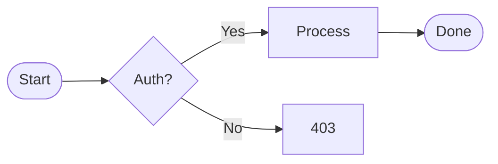
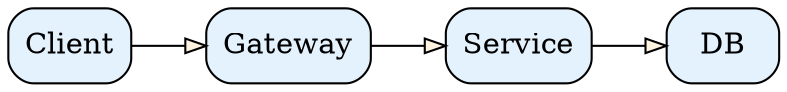
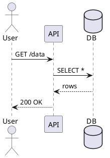

# Relative Link Tests

Test cases for SPA navigation and media rewriting. Every link on this page
should work without a full page reload (check the network tab — no document
requests).

## Supported Diagram Kinds

### Mermaid



### Graphviz



### D2

```d2
direction: right
client -> gateway -> service -> db: {style.stroke-dash: 5}
db: Database {shape: cylinder}
```

### DBML

```dbml
Table users {
  id integer [pk, increment]
  name varchar(255) [not null]
  email varchar(255) [unique]
}

Table posts {
  id integer [pk, increment]
  user_id integer [not null]
  title varchar(255)
}

Ref: posts.user_id > users.id
```

### PlantUML



### Typst

```typst
#set page(width: auto, height: auto, margin: 1em)
#set text(size: 18pt)

$ sum_(k=1)^n k = (n(n+1)) / 2 $
```

---

## Same-directory links

- [Complex markdown](complex.md) — sibling file
- [Mermaid diagrams](all-mermaid.md) — sibling file
- [GraphViz](graphviz.md)
- [D2 diagrams](d2.md)
- [DBML](dbml.md)
- [PlantUML](plantuml.md)
- [Typst](typst.md)
- [GitLab-flavored](gitlab.md)

## Same-directory with ./

- [Complex (dot-slash)](./complex.md)
- [JSON file](./dummy.json)

## Parent traversal

- [README](../README.md) — go up one level

## Absolute path

- [Root README](/README.md) — absolute, no rewriting needed

## External links (should open normally)

- [GitHub](https://github.com)
- [Protocol-relative](//example.com)

## Anchor links (should scroll, not navigate)

- [Back to top](#relative-link-tests)
- [Same-directory links section](#same-directory-links)

## Images (rewritten to /api/raw/)

Globe GIF from the same directory:


With `./` prefix:


From parent `demo/` directory:


## PDF

[Trusting Trust (PDF)](trusting-trust.pdf) — same-directory link to a PDF.

## Modifier-key test

Hold Cmd (Mac) or Ctrl (Windows) and click any relative link above — it should
open in a new tab instead of SPA-navigating.
