# Mermaid Diagram Gallery

A comprehensive test of every Mermaid diagram type. Used to verify the renderer
handles all supported diagrams correctly.

---

## 1. Flowchart


## 2. Sequence Diagram

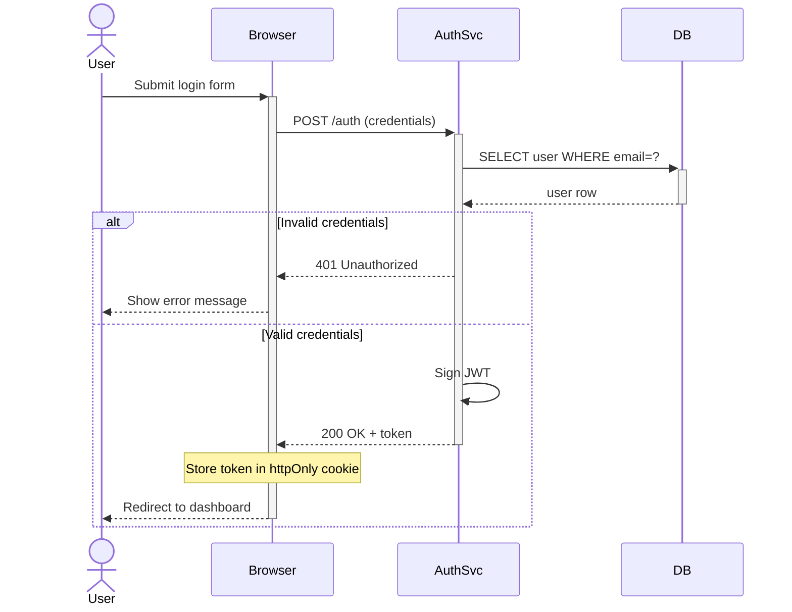

## 3. Class Diagram

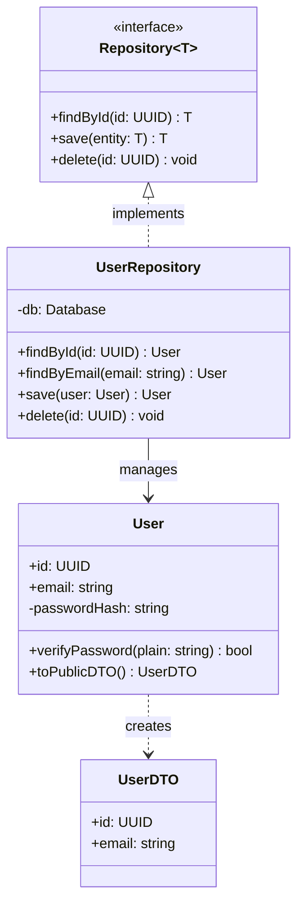

## 4. State Diagram

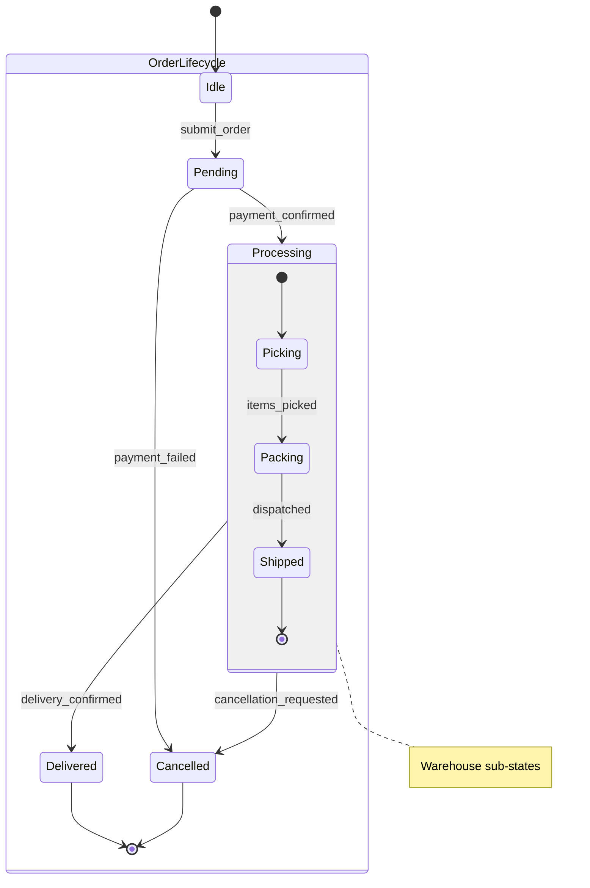

## 5. Entity Relationship Diagram

```mermaid
erDiagram
    TENANT ||--o{ USER : "has"
    TENANT ||--o{ PROJECT : "owns"
    USER ||--o{ PROJECT_MEMBER : "participates in"
    PROJECT ||--o{ PROJECT_MEMBER : "has"
    PROJECT ||--o{ ISSUE : "contains"
    USER ||--o{ ISSUE : "assigned to"

    TENANT { uuid id PK; string slug UK; string plan }
    USER { uuid id PK; uuid tenant_id FK; string email UK; string role }
    PROJECT { uuid id PK; uuid tenant_id FK; string name; string status }
    ISSUE { uuid id PK; uuid project_id FK; uuid assignee_id FK; string priority; string status }
```

## 6. User Journey

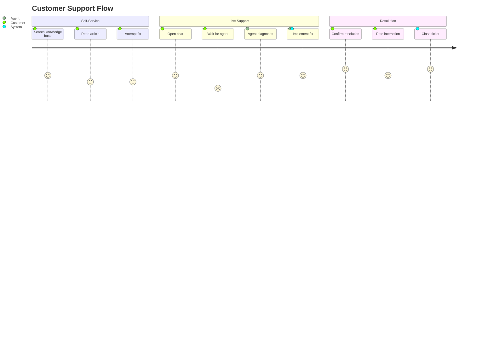

## 7. Gantt Chart

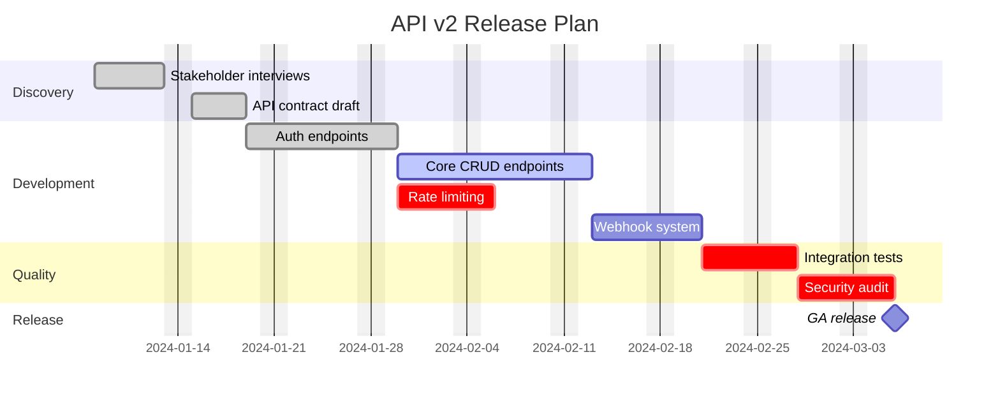

## 8. Pie Chart

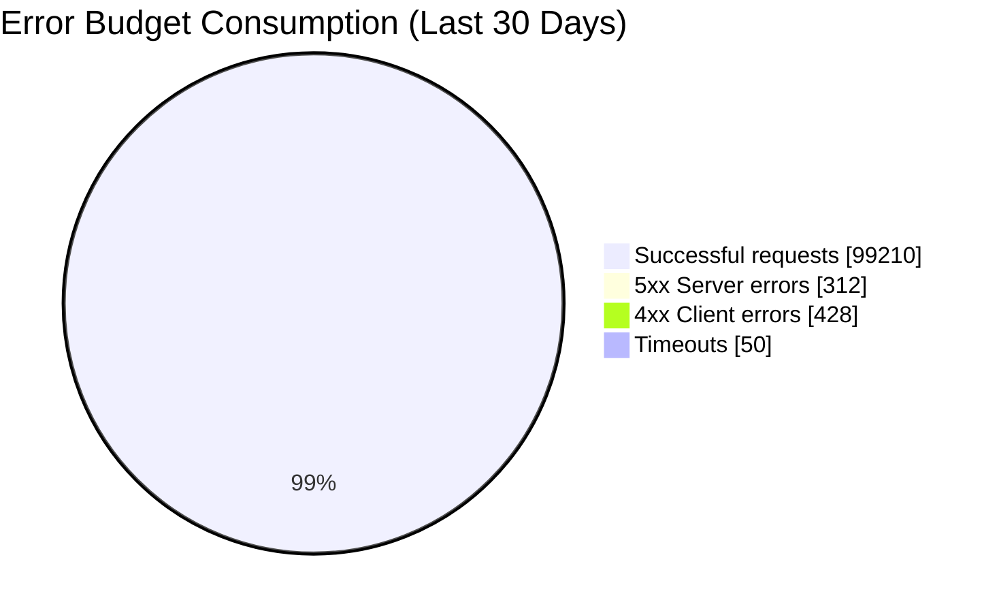

## 9. Quadrant Chart

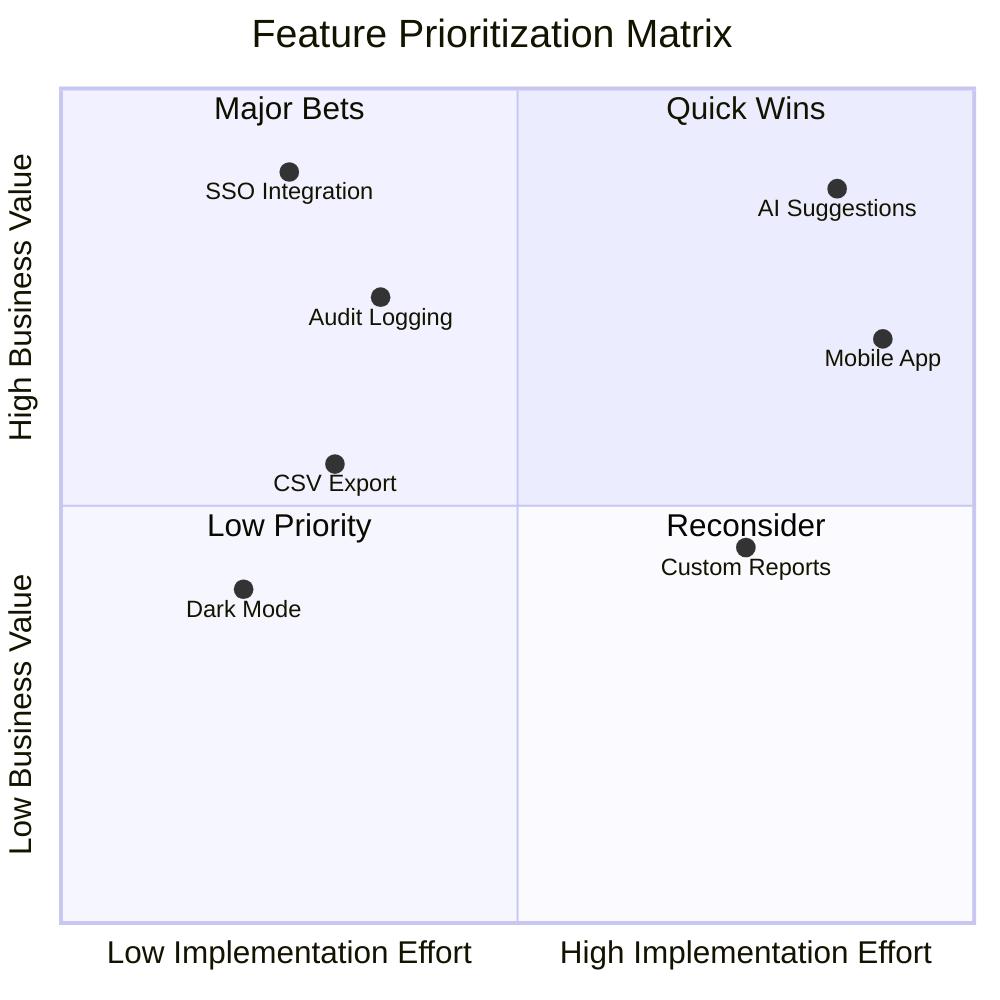

## 10. Requirement Diagram

```mermaid
requirementDiagram

    functionalRequirement data_isolation {
        id: FR-101
        text: Each tenant's data must be logically isolated
        risk: High
        verifymethod: Test
    }

    performanceRequirement query_latency {
        id: NFR-201
        text: 95th-percentile query latency under 100ms at 1000 rps
        risk: Medium
        verifymethod: Test
    }

    element tenant_middleware {
        type: Middleware Component
        docref: docs/arch/tenancy.md
    }

    element query_optimizer {
        type: Database Layer
        docref: docs/arch/db.md
    }

    data_isolation - satisfies -> tenant_middleware
    query_latency - satisfies -> query_optimizer
    query_latency - derives -> data_isolation
```

## 11. Git Graph

```mermaid
gitgraph LR
    commit id: "init" tag: "v1.0.0"
    commit id: "chore: ci setup"

    branch develop
    checkout develop
    commit id: "feat: user auth"
    commit id: "feat: JWT refresh"

    branch feature/payments
    checkout feature/payments
    commit id: "feat: Stripe integration"
    commit id: "test: payment flows"

    checkout develop
    merge feature/payments id: "merge payments"

    checkout main
    branch hotfix/xss
    commit id: "fix: sanitize output" type: HIGHLIGHT
    checkout main
    merge hotfix/xss tag: "v1.0.1"

    checkout develop
    cherry-pick id: "fix: sanitize output"
    commit id: "feat: invoice PDF"
    checkout main
    merge develop tag: "v2.0.0"
```

## 12. C4 Container Diagram

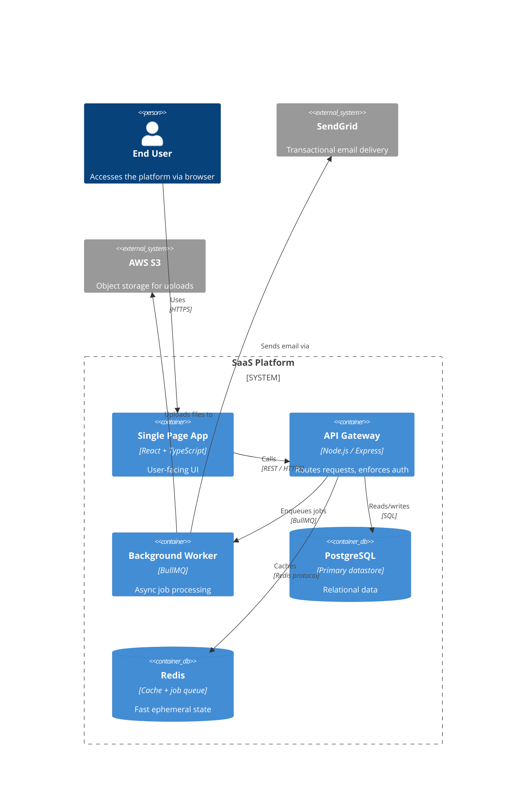

## 13. Mindmap

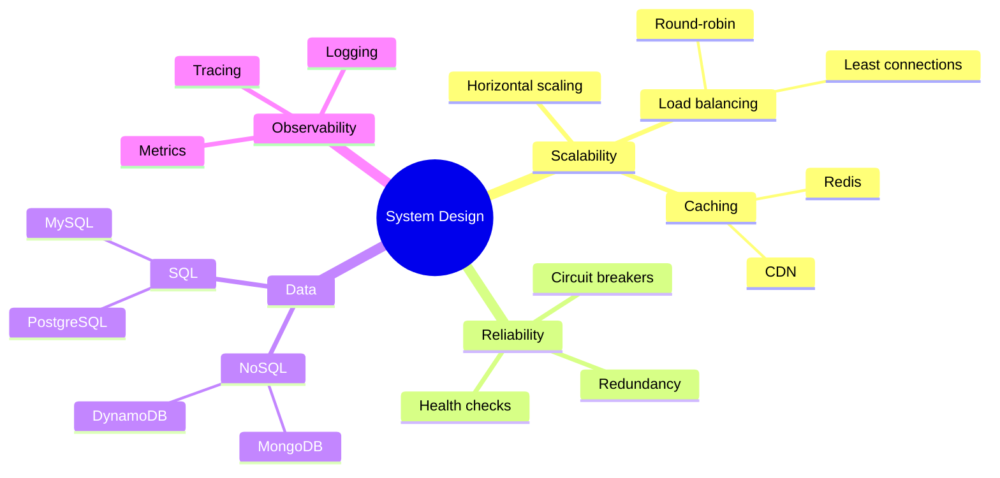

## 14. Timeline

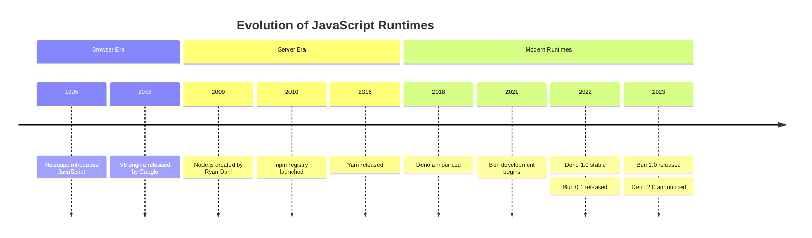

## 15. ZenUML

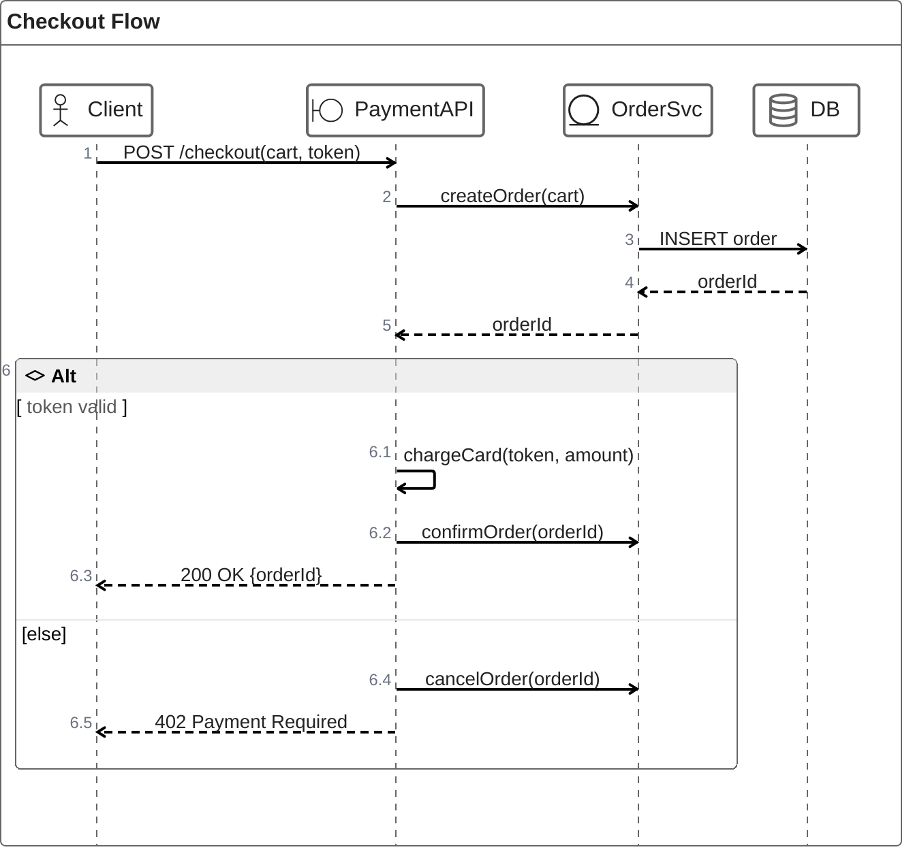

## 16. Sankey Diagram

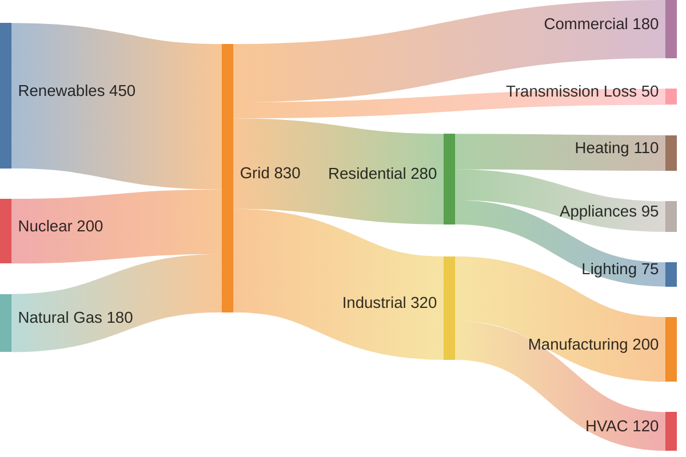

## 17. XY Chart

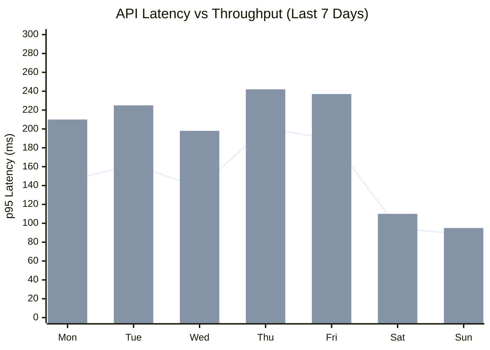

## 18. Block Diagram

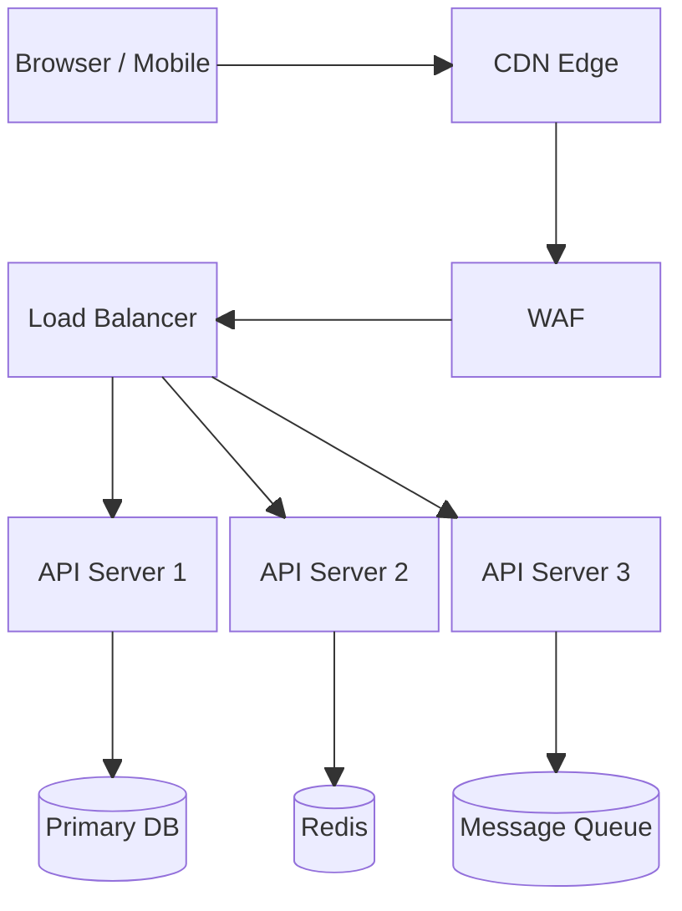

## 19. Packet Diagram

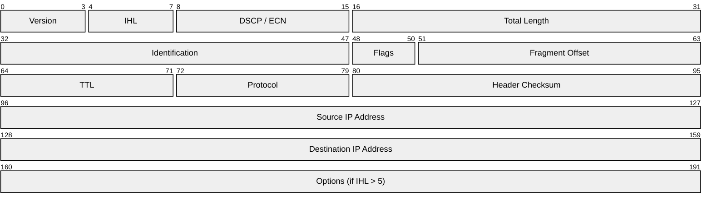

## 20. Kanban

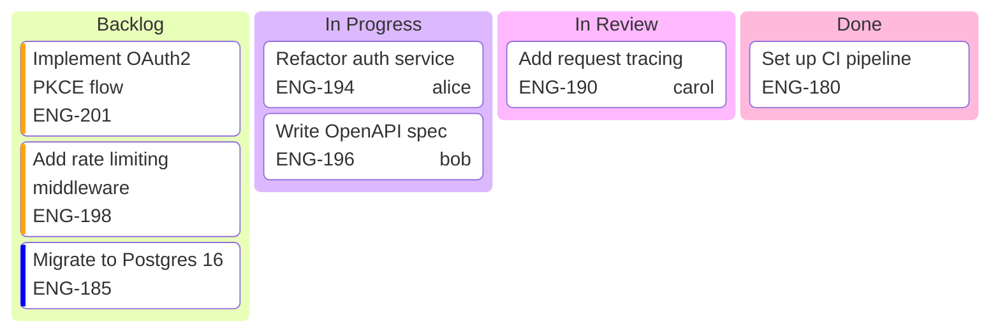

## 21. Architecture Diagram

```mermaid
architecture-beta
    group vpc(cloud)[AWS VPC]
    group public_subnet(internet)[Public Subnet] in vpc
    group private_subnet(server)[Private Subnet] in vpc

    service igw(internet)[Internet Gateway] in public_subnet
    service alb(server)[Application Load Balancer] in public_subnet
    service api1(server)[API Server 1] in private_subnet
    service api2(server)[API Server 2] in private_subnet
    service rds(database)[RDS PostgreSQL] in private_subnet
    service cache(disk)[ElastiCache Redis] in private_subnet
    service users(internet)[Users]

    users:R --> L:igw
    igw:R --> L:alb
    alb:B --> T:api1
    alb:B --> T:api2
    api1:R --> L:rds
    api2:R --> L:rds
    api1:B --> T:cache
    api2:B --> T:cache
```

## 22. Radar Chart

```mermaid
radar-beta
    title Engineering Candidate Evaluation
    axis SystemDesign["System Design"], Algorithms["Algorithms"], Coding["Coding"], Communication["Communication"], Ownership["Ownership"]
    curve candidate_a["Candidate A"]{8, 6, 9, 7, 8}
    curve candidate_b["Candidate B"]{6, 9, 7, 8, 6}
    curve candidate_c["Candidate C"]{9, 7, 8, 9, 9}
    showLegend true
    max 10
    graticule polygon
    ticks 5
```

## 23. Treemap

```mermaid
treemap-beta
    "JavaScript Ecosystem Bundle"
        "React"
            "react": 7
            "react-dom": 130
            "react-router": 25
        "State Management"
            "zustand": 8
            "immer": 14
        "UI Components"
            "radix-ui": 45
            "tailwind-merge": 4
        "Utilities"
            "date-fns": 72
            "zod": 18
            "axios": 20
```
