# Mermaid Diagram Gallery

A comprehensive test of every Mermaid diagram type. Used to verify the renderer
handles all supported diagrams correctly.

---

## 1. Flowchart

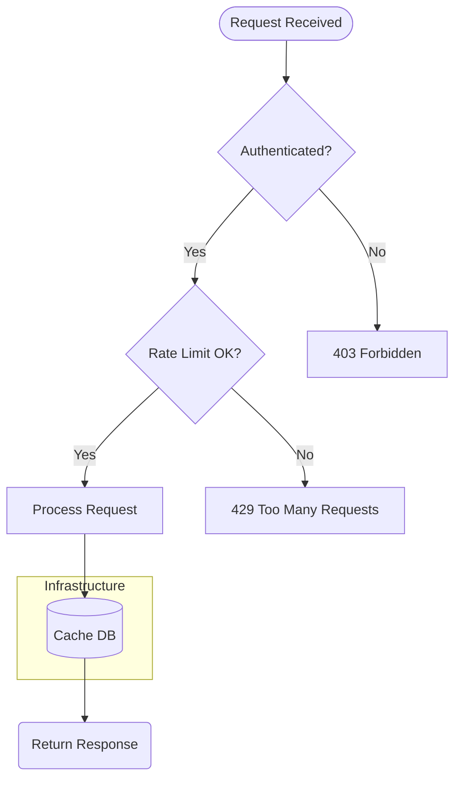
```mermaid
flowchart TD
    start([Request Received])
    auth{Authenticated?}
    ratelimit{Rate Limit OK?}
    process[Process Request]
    cache[(Cache DB)]
    respond(Return Response)
    err403[403 Forbidden]
    err429[429 Too Many Requests]

    start --> auth
    auth -->|Yes| ratelimit
    auth -->|No| err403
    ratelimit -->|Yes| process
    ratelimit -->|No| err429
    process --> cache
    cache --> respond

    subgraph infra[Infrastructure]
        cache
    end
```

## 2. Sequence Diagram

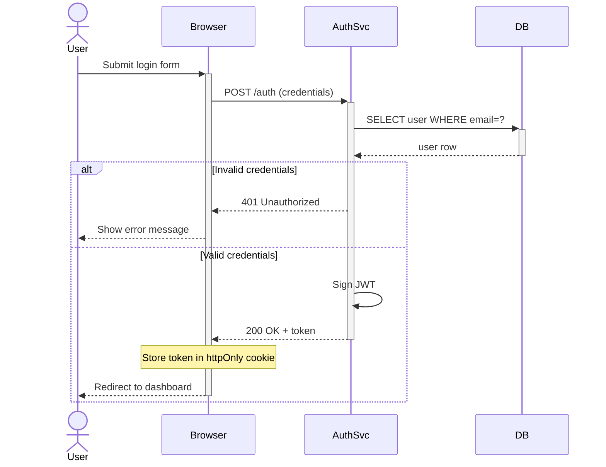
```mermaid
sequenceDiagram
    actor User
    participant Browser
    participant AuthSvc
    participant DB

    User->>+Browser: Submit login form
    Browser->>+AuthSvc: POST /auth (credentials)
    AuthSvc->>+DB: SELECT user WHERE email=?
    DB-->>-AuthSvc: user row

    alt Invalid credentials
        AuthSvc-->>Browser: 401 Unauthorized
        Browser-->>User: Show error message
    else Valid credentials
        AuthSvc->>AuthSvc: Sign JWT
        AuthSvc-->>-Browser: 200 OK + token
        Note over Browser: Store token in httpOnly cookie
        Browser-->>-User: Redirect to dashboard
    end
```

## 3. Class Diagram

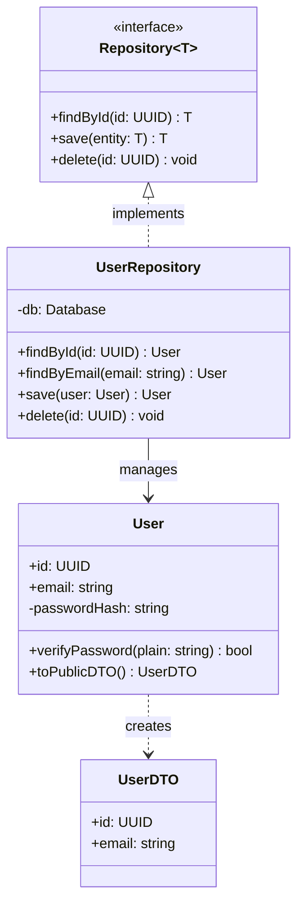
```mermaid
classDiagram
    class Repository~T~ {
        <<interface>>
        +findById(id: UUID) T
        +save(entity: T) T
        +delete(id: UUID) void
    }
    class UserRepository {
        -db: Database
        +findById(id: UUID) User
        +findByEmail(email: string) User
        +save(user: User) User
        +delete(id: UUID) void
    }
    class User {
        +id: UUID
        +email: string
        -passwordHash: string
        +verifyPassword(plain: string) bool
        +toPublicDTO() UserDTO
    }
    class UserDTO {
        +id: UUID
        +email: string
    }

    Repository~T~ <|.. UserRepository : implements
    UserRepository --> User : manages
    User ..> UserDTO : creates
```

## 4. State Diagram

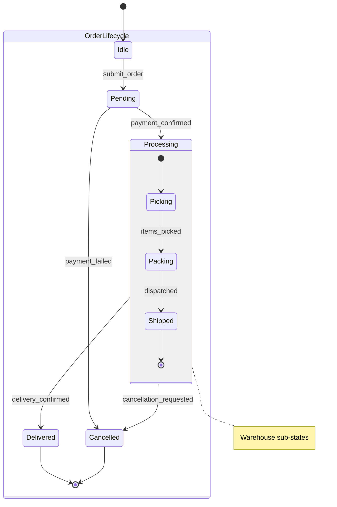
```mermaid
stateDiagram-v2
    [*] --> Idle

    state OrderLifecycle {
        Idle --> Pending: submit_order
        Pending --> Processing: payment_confirmed

        state Processing {
            [*] --> Picking
            Picking --> Packing: items_picked
            Packing --> Shipped: dispatched
            Shipped --> [*]
        }

        Processing --> Delivered: delivery_confirmed
        Processing --> Cancelled: cancellation_requested
        Pending --> Cancelled: payment_failed
        Delivered --> [*]
        Cancelled --> [*]
    }

    note right of Processing
        Warehouse sub-states
    end note
```

## 5. Entity Relationship Diagram

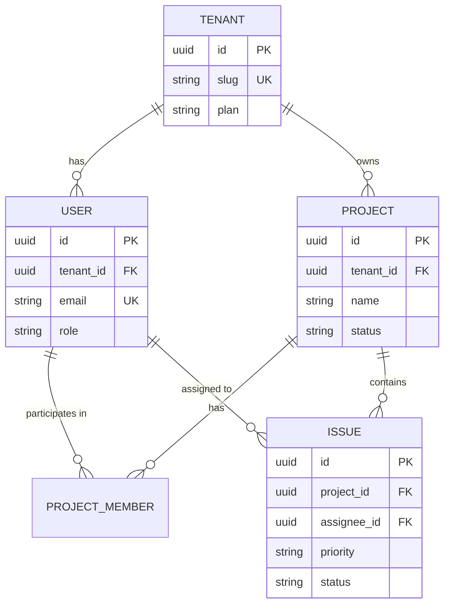
```mermaid
erDiagram
    TENANT ||--o{ USER : "has"
    TENANT ||--o{ PROJECT : "owns"
    USER ||--o{ PROJECT_MEMBER : "participates in"
    PROJECT ||--o{ PROJECT_MEMBER : "has"
    PROJECT ||--o{ ISSUE : "contains"
    USER ||--o{ ISSUE : "assigned to"

    TENANT {
        uuid id PK
        string slug UK
        string plan
    }
    USER {
        uuid id PK
        uuid tenant_id FK
        string email UK
        string role
    }
    PROJECT {
        uuid id PK
        uuid tenant_id FK
        string name
        string status
    }
    ISSUE {
        uuid id PK
        uuid project_id FK
        uuid assignee_id FK
        string priority
        string status
    }
```

## 6. User Journey

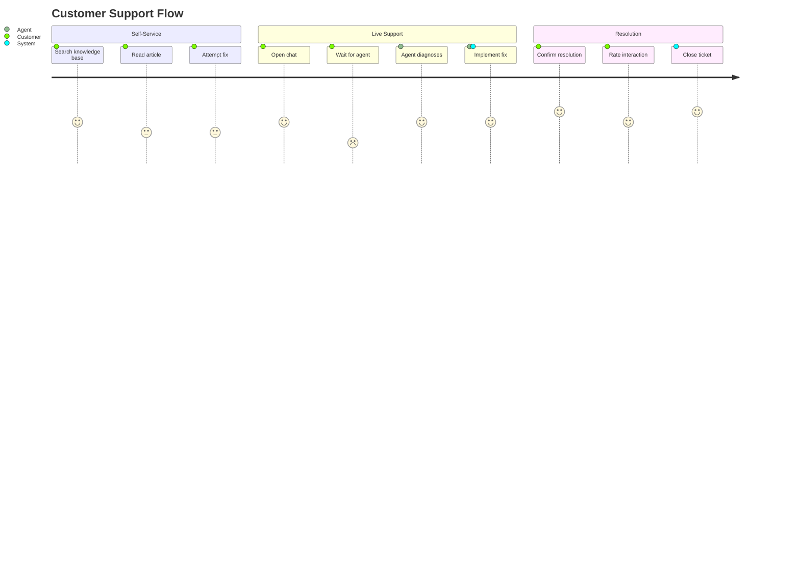
```mermaid
journey
    title Customer Support Flow
    section Self-Service
      Search knowledge base: 4: Customer
      Read article: 3: Customer
      Attempt fix: 3: Customer
    section Live Support
      Open chat: 4: Customer
      Wait for agent: 2: Customer
      Agent diagnoses: 4: Agent
      Implement fix: 4: Agent, System
    section Resolution
      Confirm resolution: 5: Customer
      Rate interaction: 4: Customer
      Close ticket: 5: System
```

## 7. Gantt Chart

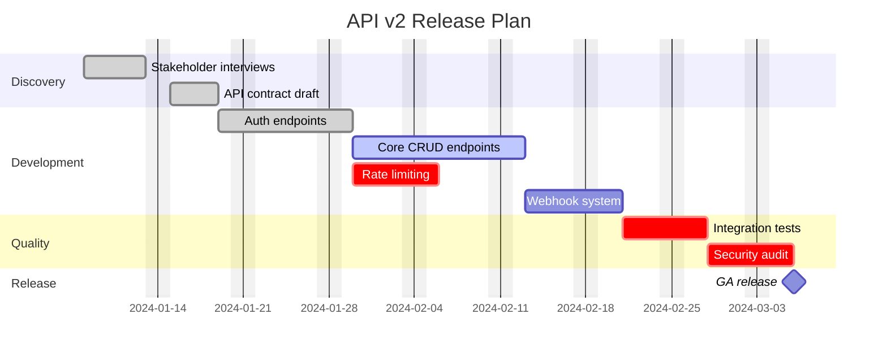
```mermaid
gantt
    title API v2 Release Plan
    dateFormat YYYY-MM-DD
    excludes weekends

    section Discovery
    Stakeholder interviews :done, interviews, 2024-01-08, 5d
    API contract draft     :done, contract, after interviews, 4d

    section Development
    Auth endpoints         :done, auth, after contract, 7d
    Core CRUD endpoints    :active, crud, after auth, 10d
    Rate limiting          :crit, ratelimit, after auth, 5d
    Webhook system         :webhooks, after crud, 6d

    section Quality
    Integration tests      :crit, tests, after webhooks ratelimit, 5d
    Security audit         :crit, audit, after tests, 5d

    section Release
    GA release             :milestone, after audit, 0d
```

## 8. Pie Chart

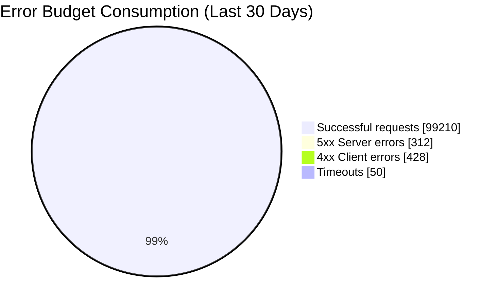
```mermaid
pie showData title Error Budget Consumption (Last 30 Days)
    "Successful requests" : 99210
    "5xx Server errors"   : 312
    "4xx Client errors"   : 428
    "Timeouts"            : 50
```

## 9. Quadrant Chart

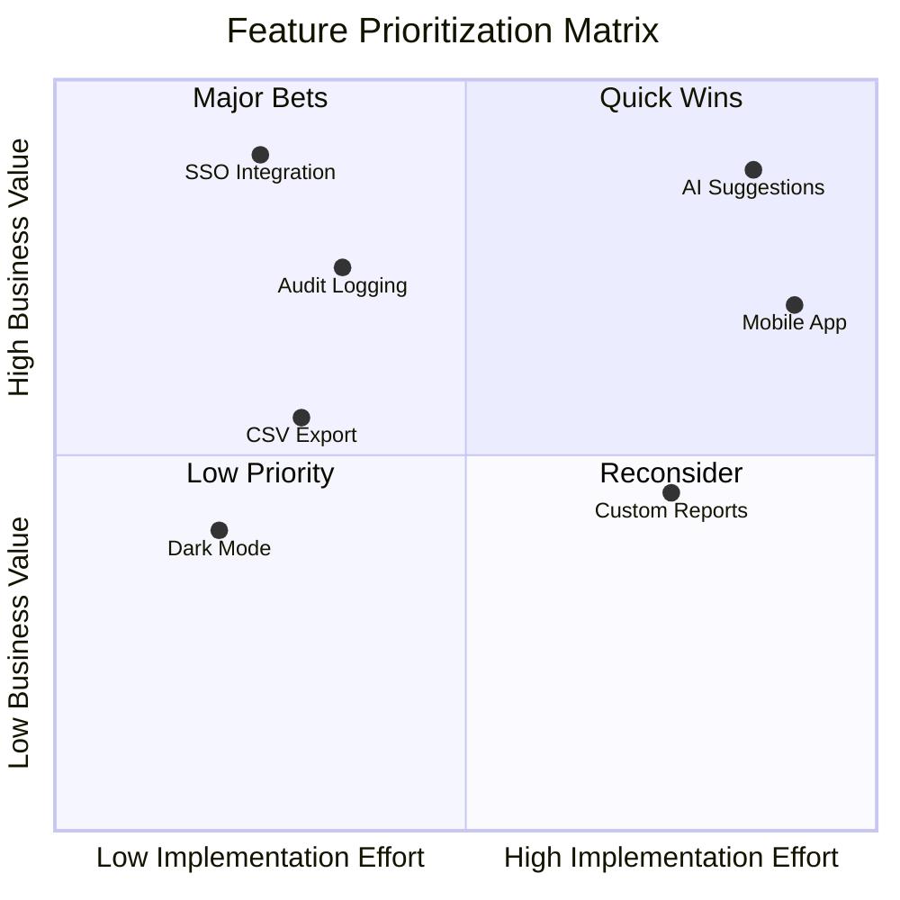
```mermaid
quadrantChart
    title Feature Prioritization Matrix
    x-axis Low Implementation Effort --> High Implementation Effort
    y-axis Low Business Value --> High Business Value
    quadrant-1 Quick Wins
    quadrant-2 Major Bets
    quadrant-3 Low Priority
    quadrant-4 Reconsider
    SSO Integration: [0.25, 0.90]
    Audit Logging: [0.35, 0.75]
    AI Suggestions: [0.85, 0.88]
    CSV Export: [0.30, 0.55]
    Mobile App: [0.90, 0.70]
    Dark Mode: [0.20, 0.40]
    Custom Reports: [0.75, 0.45]
```

## 10. Requirement Diagram

<!-- requirementDiagram is broken in mermaid v11 (parser collapses newlines
     inside braces). Replaced with a flowchart that conveys the same info. -->

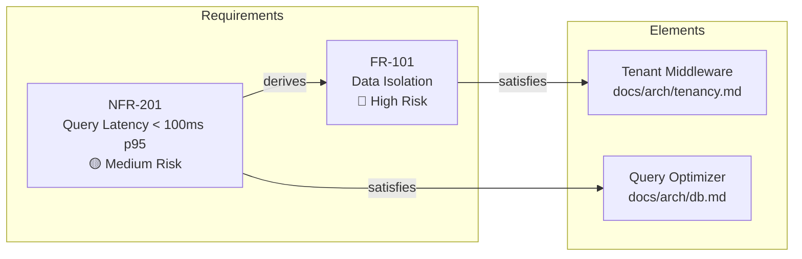
```mermaid
flowchart LR
    subgraph Requirements
        FR101["FR-101\nData Isolation\n🔴 High Risk"]
        NFR201["NFR-201\nQuery Latency < 100ms p95\n🟡 Medium Risk"]
    end

    subgraph Elements
        MW["Tenant Middleware\ndocs/arch/tenancy.md"]
        QO["Query Optimizer\ndocs/arch/db.md"]
    end

    FR101 -- satisfies --> MW
    NFR201 -- satisfies --> QO
    NFR201 -- derives --> FR101
```

## 11. Git Graph

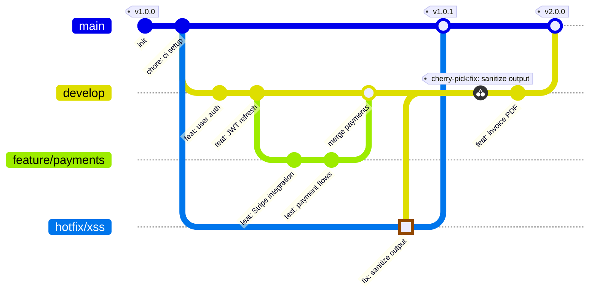
```mermaid
gitGraph
    commit id: "init" tag: "v1.0.0"
    commit id: "chore: ci setup"

    branch develop
    checkout develop
    commit id: "feat: user auth"
    commit id: "feat: JWT refresh"

    branch feature/payments
    checkout feature/payments
    commit id: "feat: Stripe integration"
    commit id: "test: payment flows"

    checkout develop
    merge feature/payments id: "merge payments"

    checkout main
    branch hotfix/xss
    commit id: "fix: sanitize output" type: HIGHLIGHT
    checkout main
    merge hotfix/xss tag: "v1.0.1"

    checkout develop
    cherry-pick id: "fix: sanitize output"
    commit id: "feat: invoice PDF"
    checkout main
    merge develop tag: "v2.0.0"
```

## 12. C4 Container Diagram

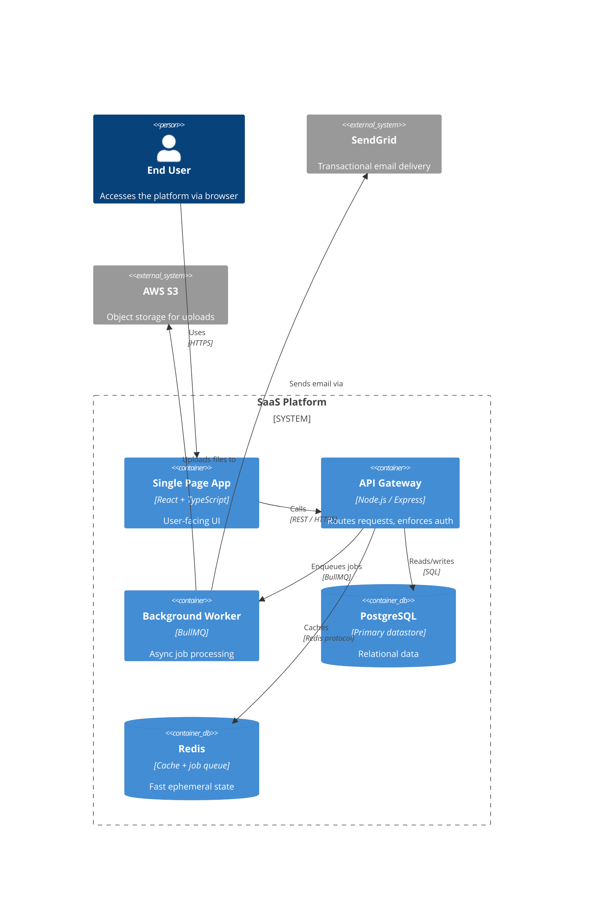
```mermaid
C4Container
    Person(user, "End User", "Accesses the platform via browser")

    System_Boundary(platform, "SaaS Platform") {
        Container(spa, "Single Page App", "React + TypeScript", "User-facing UI")
        Container(api, "API Gateway", "Node.js / Express", "Routes requests, enforces auth")
        Container(worker, "Background Worker", "BullMQ", "Async job processing")
        ContainerDb(pg, "PostgreSQL", "Primary datastore", "Relational data")
        ContainerDb(redis, "Redis", "Cache + job queue", "Fast ephemeral state")
    }

    System_Ext(smtp, "SendGrid", "Transactional email delivery")
    System_Ext(s3, "AWS S3", "Object storage for uploads")

    Rel(user, spa, "Uses", "HTTPS")
    Rel(spa, api, "Calls", "REST / HTTPS")
    Rel(api, pg, "Reads/writes", "SQL")
    Rel(api, redis, "Caches", "Redis protocol")
    Rel(api, worker, "Enqueues jobs", "BullMQ")
    Rel(worker, smtp, "Sends email via")
    Rel(worker, s3, "Uploads files to")
```

## 13. Mindmap

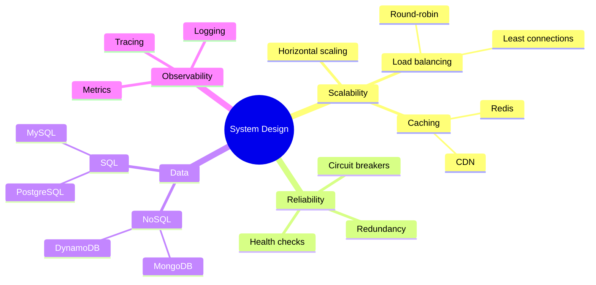
```mermaid
mindmap
  root((System Design))
    Scalability
      Horizontal scaling
      Load balancing
        Round-robin
        Least connections
      Caching
        CDN
        Redis
    Reliability
      Redundancy
      Health checks
      Circuit breakers
    Data
      SQL
        PostgreSQL
        MySQL
      NoSQL
        MongoDB
        DynamoDB
    Observability
      Metrics
      Logging
      Tracing
```

## 14. Timeline

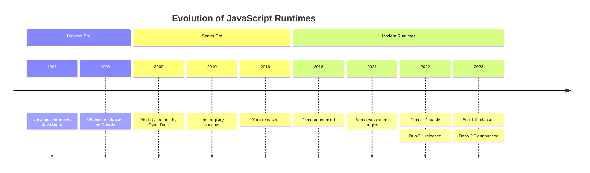
```mermaid
timeline
    title Evolution of JavaScript Runtimes
    section Browser Era
        1995 : Netscape introduces JavaScript
        2008 : V8 engine released by Google
    section Server Era
        2009 : Node.js created by Ryan Dahl
        2010 : npm registry launched
        2016 : Yarn released
    section Modern Runtimes
        2018 : Deno announced
        2021 : Bun development begins
        2022 : Deno 1.0 stable : Bun 0.1 released
        2023 : Bun 1.0 released : Deno 2.0 announced
```

## 15. ZenUML

<!-- ZenUML requires external registration in mermaid v11 (not bundled).
     Replaced with an equivalent sequence diagram. -->

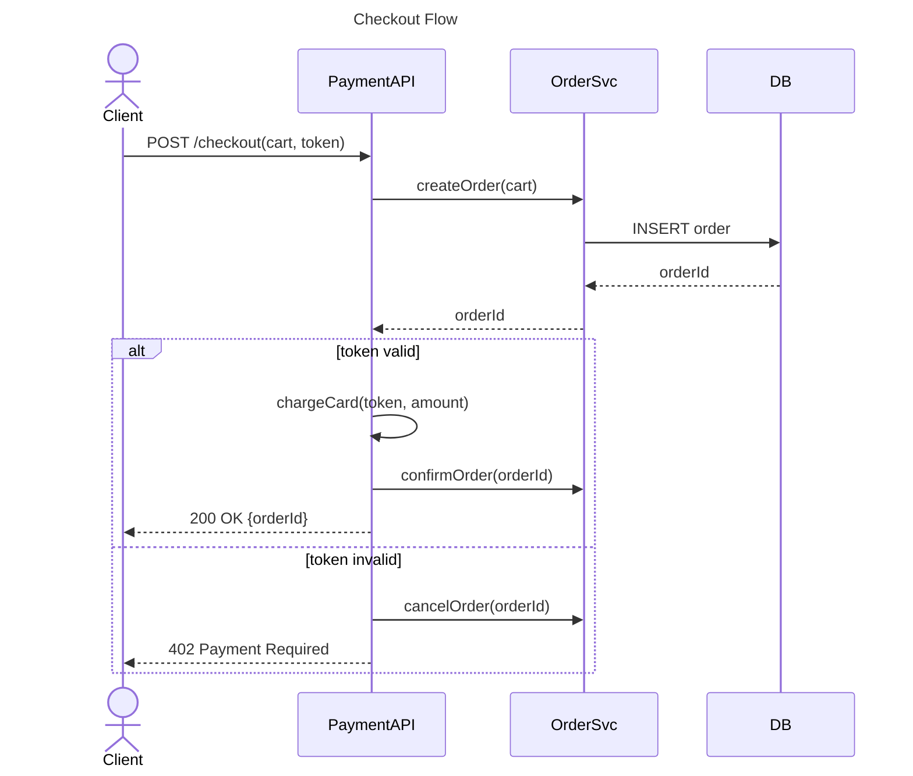
```mermaid
sequenceDiagram
    title Checkout Flow
    actor Client
    participant PaymentAPI
    participant OrderSvc
    participant DB

    Client->>PaymentAPI: POST /checkout(cart, token)
    PaymentAPI->>OrderSvc: createOrder(cart)
    OrderSvc->>DB: INSERT order
    DB-->>OrderSvc: orderId
    OrderSvc-->>PaymentAPI: orderId

    alt token valid
        PaymentAPI->>PaymentAPI: chargeCard(token, amount)
        PaymentAPI->>OrderSvc: confirmOrder(orderId)
        PaymentAPI-->>Client: 200 OK {orderId}
    else token invalid
        PaymentAPI->>OrderSvc: cancelOrder(orderId)
        PaymentAPI-->>Client: 402 Payment Required
    end
```

## 16. Sankey Diagram

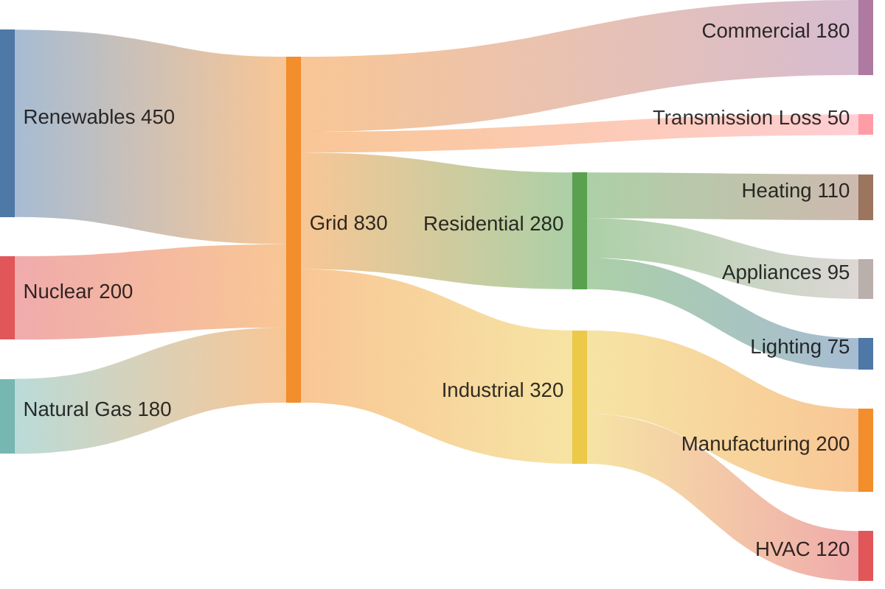
```mermaid
sankey-beta
Renewables,Grid,450
Nuclear,Grid,200
Natural Gas,Grid,180
Grid,Residential,280
Grid,Industrial,320
Grid,Commercial,180
Grid,Transmission Loss,50
Residential,Heating,110
Residential,Appliances,95
Residential,Lighting,75
Industrial,Manufacturing,200
Industrial,HVAC,120
```

## 17. XY Chart

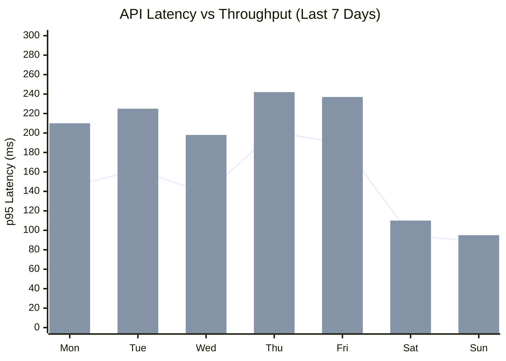
```mermaid
xychart-beta
    title "API Latency vs Throughput (Last 7 Days)"
    x-axis [Mon, Tue, Wed, Thu, Fri, Sat, Sun]
    y-axis "p95 Latency (ms)" 0 --> 300
    line [145, 162, 138, 201, 189, 95, 88]
    bar [210, 225, 198, 242, 237, 110, 95]
```

## 18. Block Diagram

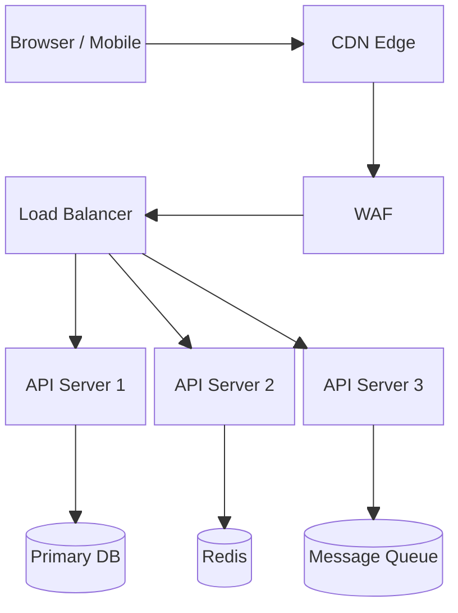
```mermaid
block-beta
    columns 3

    Client["Browser / Mobile"]:1  space:1  CDN["CDN Edge"]:1
    space:3
    LB["Load Balancer"]:1  space:1  WAF["WAF"]:1
    space:3
    API1["API Server 1"]:1  API2["API Server 2"]:1  API3["API Server 3"]:1
    space:3
    DB[("Primary DB")]:1  Cache[("Redis")]:1  Queue[("Message Queue")]:1

    Client --> CDN
    CDN --> WAF
    WAF --> LB
    LB --> API1
    LB --> API2
    LB --> API3
    API1 --> DB
    API2 --> Cache
    API3 --> Queue
```

## 19. Packet Diagram

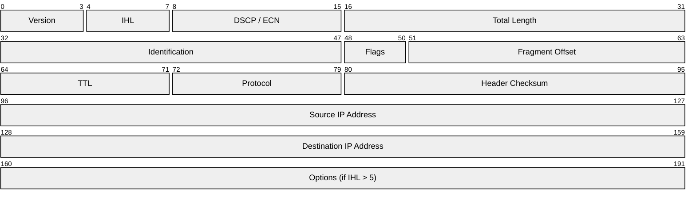
```mermaid
packet-beta
    0-3: "Version"
    4-7: "IHL"
    8-15: "DSCP / ECN"
    16-31: "Total Length"
    32-47: "Identification"
    48-50: "Flags"
    51-63: "Fragment Offset"
    64-71: "TTL"
    72-79: "Protocol"
    80-95: "Header Checksum"
    96-127: "Source IP Address"
    128-159: "Destination IP Address"
    160-191: "Options (if IHL > 5)"
```

## 20. Kanban

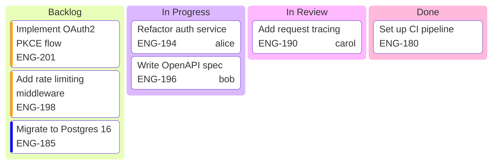
```mermaid
kanban
    backlog[Backlog]
        t1[Implement OAuth2 PKCE flow]@{ ticket: ENG-201, priority: High }
        t2[Add rate limiting middleware]@{ ticket: ENG-198, priority: High }
        t3[Migrate to Postgres 16]@{ ticket: ENG-185, priority: Low }

    inprogress[In Progress]
        t4[Refactor auth service]@{ assigned: alice, ticket: ENG-194 }
        t5[Write OpenAPI spec]@{ assigned: bob, ticket: ENG-196 }

    review[In Review]
        t6[Add request tracing]@{ assigned: carol, ticket: ENG-190 }

    done[Done]
        t7[Set up CI pipeline]@{ ticket: ENG-180 }
```

## 21. Architecture Diagram

```mermaid
architecture-beta
    group vpc(cloud)[AWS VPC]
    group public_subnet(internet)[Public Subnet] in vpc
    group private_subnet(server)[Private Subnet] in vpc

    service igw(internet)[Internet Gateway] in public_subnet
    service alb(server)[Application Load Balancer] in public_subnet
    service api1(server)[API Server 1] in private_subnet
    service api2(server)[API Server 2] in private_subnet
    service rds(database)[RDS PostgreSQL] in private_subnet
    service cache(disk)[ElastiCache Redis] in private_subnet
    service users(internet)[Users]

    users:R --> L:igw
    igw:R --> L:alb
    alb:B --> T:api1
    alb:B --> T:api2
    api1:R --> L:rds
    api2:R --> L:rds
    api1:B --> T:cache
    api2:B --> T:cache
```

## 22. Radar Chart

```mermaid
radar-beta
    title Engineering Candidate Evaluation
    axis SystemDesign["System Design"], Algorithms["Algorithms"], Coding["Coding"], Communication["Communication"], Ownership["Ownership"]
    curve candidate_a["Candidate A"]{8, 6, 9, 7, 8}
    curve candidate_b["Candidate B"]{6, 9, 7, 8, 6}
    curve candidate_c["Candidate C"]{9, 7, 8, 9, 9}
    showLegend true
    max 10
    graticule polygon
    ticks 5
```

## 23. Treemap

```mermaid
treemap-beta
    "JavaScript Ecosystem Bundle"
        "React"
            "react": 7
            "react-dom": 130
            "react-router": 25
        "State Management"
            "zustand": 8
            "immer": 14
        "UI Components"
            "radix-ui": 45
            "tailwind-merge": 4
        "Utilities"
            "date-fns": 72
            "zod": 18
            "axios": 20
```

---

## Stress Tests — Advanced Features

The diagrams below combine multiple advanced Mermaid features (directives,
frontmatter config, theme variables, HTML labels, markdown strings, classDef,
linkStyle, nested subgraphs, click events, notes, and new `@{}` shapes) to
stress-test the renderer.

### S1. Flowchart — Kitchen Sink

Deeply nested subgraphs, mixed directions, new `@{}` shapes, `classDef`,
`linkStyle`, markdown strings, and HTML line breaks.

```mermaid
---
title: CI/CD Pipeline — Full Lifecycle
config:
  theme: base
  themeVariables:
    primaryColor: "#4a90d9"
    primaryTextColor: "#fff"
    primaryBorderColor: "#2c5282"
    lineColor: "#718096"
    secondaryColor: "#48bb78"
    tertiaryColor: "#ed8936"
---
flowchart TB
    trigger@{ shape: stadium, label: "Push to main" }
    gate@{ shape: diam, label: "Branch<br/>protection<br/>passed?" }
    skip@{ shape: bolt, label: "Rejected" }

    subgraph build_phase["🔨 Build Phase"]
        direction LR
        lint@{ shape: rect, label: "**Lint** & Format" }
        compile@{ shape: rect, label: "Compile<br/>TypeScript" }
        bundle@{ shape: rect, label: "Bundle<br/>(Rolldown)" }
        lint --> compile --> bundle
    end

    subgraph test_phase["🧪 Test Phase"]
        direction TB
        subgraph unit["Unit Tests"]
            direction LR
            ut_fe@{ shape: rounded, label: "Frontend<br/>Vitest" }
            ut_be@{ shape: rounded, label: "Backend<br/>go test" }
        end
        subgraph integration["Integration"]
            direction LR
            api_test@{ shape: rounded, label: "API<br/>contracts" }
            e2e@{ shape: rounded, label: "E2E<br/>Playwright" }
        end
        unit --> integration
    end

    subgraph deploy_phase["🚀 Deploy"]
        direction LR
        staging@{ shape: cyl, label: "Staging<br/>DB" }
        canary@{ shape: hex, label: "Canary<br/>10%" }
        prod@{ shape: dbl-circ, label: "Production" }
        staging --> canary --> prod
    end

    report@{ shape: doc, label: "Deploy<br/>Report" }
    notify@{ shape: notch-rect, label: "Slack<br/>Notification" }

    trigger --> gate
    gate -->|Yes| build_phase
    gate -->|No| skip
    build_phase --> test_phase
    test_phase --> deploy_phase
    deploy_phase --> report --> notify

    linkStyle 0,1,8,9,10,11 stroke:#4a90d9,stroke-width:3px
    linkStyle 2 stroke:#e53e3e,stroke-width:2px,stroke-dasharray:5

    classDef success fill:#48bb78,stroke:#276749,color:#ffffff
    classDef danger fill:#fc8181,stroke:#c53030,color:#ffffff
    classDef info fill:#63b3ed,stroke:#2b6cb0,color:#ffffff

    class prod,canary success
    class skip danger
    class report,notify info
```

### S2. Sequence Diagram — Microservice Auth with Parallel, Critical, and Breaks

Actors, participants, activation bars, nested `alt`/`par`/`critical`/`break`,
notes, and `autonumber`.

```mermaid
---
config:
  sequence:
    mirrorActors: false
    messageAlign: center
    actorMargin: 80
---
sequenceDiagram
    autonumber

    actor User
    participant GW as API Gateway
    participant Auth as Auth Service
    participant Cache as Redis Cache
    participant IDP as OAuth2 Provider
    participant DB as PostgreSQL
    participant Audit as Audit Log

    User ->>+ GW: POST /login {email, password}
    GW ->>+ Auth: authenticate(credentials)

    critical Token cache lookup
        Auth ->>+ Cache: GET session:{email}
        Cache -->>- Auth: cache miss
    option Cache hit
        Cache -->> Auth: cached JWT
        Auth -->> GW: 200 OK (cached)
    end

    Auth ->>+ DB: SELECT user WHERE email = $1
    DB -->>- Auth: user row

    alt User not found
        Auth -->> GW: 404 Not Found
        GW -->> User: Invalid credentials
    else Password mismatch
        Auth ->> Audit: log(FAILED_LOGIN, email)
        Auth -->> GW: 401 Unauthorized
        GW -->> User: Invalid credentials
    else Valid credentials
        par Issue tokens & log
            Auth ->> Auth: sign accessToken (15m)
            Auth ->> Auth: sign refreshToken (7d)
        and
            Auth ->>+ Audit: log(LOGIN_SUCCESS, userId)
            Audit -->>- Auth: ack
        end

        Auth ->>+ Cache: SET session:{email} JWT EX 900
        Cache -->>- Auth: OK

        Auth -->>- GW: {accessToken, refreshToken}

        break Rate limit exceeded
            GW -->> User: 429 Too Many Requests
        end

        GW -->>- User: 200 OK + Set-Cookie
    end

    Note over User,Audit: All auth events are<br/>persisted to the audit log<br/>for compliance (SOC 2)
    Note right of Cache: TTL = 15 min<br/>matches access token expiry
```

### S3. Class Diagram — Generic Repository with Patterns

Generics, interfaces, abstract classes, composition, aggregation, dependency,
namespaces, notes, and style overrides.

```mermaid
---
config:
  theme: base
  themeVariables:
    primaryColor: "#ebf8ff"
    primaryBorderColor: "#2b6cb0"
---
classDiagram
    namespace DomainLayer {
        class Entity~ID~ {
            <<abstract>>
            #id: ID
            #createdAt: DateTime
            #updatedAt: DateTime
            +getId() ID
            +equals(other: Entity~ID~) bool
        }
        class AggregateRoot~ID~ {
            <<abstract>>
            -domainEvents: DomainEvent[]
            +addEvent(event: DomainEvent) void
            +clearEvents() DomainEvent[]
        }
        class User {
            +email: EmailAddress
            +role: Role
            -passwordHash: string
            -mfaSecret: string?
            +verifyPassword(plain: string) bool
            +enableMFA() TOTPSecret
            +hasPermission(perm: Permission) bool
        }
        class Role {
            <<enumeration>>
            ADMIN
            EDITOR
            VIEWER
        }
        class Permission {
            <<enumeration>>
            READ
            WRITE
            DELETE
            MANAGE_USERS
        }
    }

    namespace InfrastructureLayer {
        class Repository~T, ID~ {
            <<interface>>
            +findById(id: ID) Promise~T?~
            +findAll(spec: Specification~T~) Promise~T[]~
            +save(entity: T) Promise~T~
            +delete(id: ID) Promise~void~
            +exists(id: ID) Promise~bool~
        }
        class UnitOfWork {
            <<interface>>
            +begin() Promise~void~
            +commit() Promise~void~
            +rollback() Promise~void~
        }
        class PgUserRepository {
            -pool: PgPool
            -mapper: UserMapper
            +findById(id: UUID) Promise~User?~
            +findByEmail(email: string) Promise~User?~
            +save(user: User) Promise~User~
            +delete(id: UUID) Promise~void~
            +exists(id: UUID) Promise~bool~
        }
        class UserMapper {
            +toDomain(row: UserRow) User
            +toPersistence(user: User) UserRow
        }
    }

    Entity~ID~ <|-- AggregateRoot~ID~ : extends
    AggregateRoot~ID~ <|-- User : extends
    Repository~T, ID~ <|.. PgUserRepository : implements
    PgUserRepository --> UserMapper : uses
    PgUserRepository ..> UnitOfWork : requires
    User --> Role : has
    User --> "0..*" Permission : granted

    note for AggregateRoot "Collects domain events\nfor eventual consistency\nvia outbox pattern"
    note for PgUserRepository "Connection pooling via\npg-pool (max 20 conns)"
```

### S4. State Diagram — Complex Order Lifecycle

Nested composite states, concurrent regions, choice/fork/join pseudo-states,
entry/exit actions, and notes.

```mermaid
---
config:
  theme: base
  themeVariables:
    primaryColor: "#f7fafc"
    primaryBorderColor: "#4a5568"
---
stateDiagram-v2
    [*] --> Draft: customer starts order

    state Draft {
        [*] --> EditingCart
        EditingCart --> EditingCart: add/remove item
        EditingCart --> ValidatingCart: checkout
        ValidatingCart --> EditingCart: validation failed
        ValidatingCart --> [*]: valid
    }

    Draft --> AwaitingPayment: submit order

    state AwaitingPayment {
        [*] --> PaymentPending
        PaymentPending --> ProcessingPayment: payment initiated
        ProcessingPayment --> PaymentPending: retry (attempt < 3)

        state payment_choice <<choice>>
        ProcessingPayment --> payment_choice
        payment_choice --> PaymentConfirmed: success
        payment_choice --> PaymentFailed: declined
        PaymentFailed --> [*]
        PaymentConfirmed --> [*]
    }

    AwaitingPayment --> Cancelled: payment failed / timeout

    state Fulfillment {
        state warehouse_fork <<fork>>
        state warehouse_join <<join>>

        [*] --> warehouse_fork
        warehouse_fork --> Picking
        warehouse_fork --> QualityCheck

        Picking --> Packing: items picked
        QualityCheck --> Packing: QC passed

        Packing --> warehouse_join
        warehouse_join --> ReadyToShip
        ReadyToShip --> [*]
    }

    AwaitingPayment --> Fulfillment: payment confirmed

    state Shipping {
        [*] --> InTransit
        InTransit --> OutForDelivery: arrived at local hub
        OutForDelivery --> DeliveryAttempt: driver dispatched

        state delivery_choice <<choice>>
        DeliveryAttempt --> delivery_choice
        delivery_choice --> Delivered: recipient accepted
        delivery_choice --> FailedDelivery: no one home
        FailedDelivery --> OutForDelivery: reschedule
        Delivered --> [*]
    }

    Fulfillment --> Shipping: dispatched
    Shipping --> Completed: delivered

    state Completed {
        [*] --> ReturnWindow
        ReturnWindow --> Closed: 30 days elapsed
        ReturnWindow --> ReturnRequested: customer requests return
        ReturnRequested --> Refunded: return received
        Refunded --> Closed
        Closed --> [*]
    }

    Completed --> [*]
    Cancelled --> [*]

    note right of Fulfillment
        Picking and QC run in
        parallel (fork/join)
    end note

    note left of Shipping
        Max 3 delivery attempts
        before returning to sender
    end note
```

### S5. Gantt — Large Cross-Team Release Plan

8 sections, 40+ tasks, heavy use of milestones, `crit`, `done`, `active`,
multi-task dependencies (`after a b`), `until` constraints, weekend exclusions,
and custom axis formatting.

```mermaid
gantt
    title Platform v3.0 — Full Release Cycle
    dateFormat YYYY-MM-DD
    axisFormat %b %d

    excludes weekends

    section Product
    User research             :done, pr1, 2025-01-06, 10d
    Competitive analysis      :done, pr2, 2025-01-06, 8d
    PRD draft                 :done, pr3, after pr1 pr2, 5d
    Stakeholder review        :done, pr4, after pr3, 3d
    PRD sign-off              :milestone, m_prd, after pr4, 0d

    section Design
    Information architecture  :done, ds1, after m_prd, 5d
    Wireframes                :done, ds2, after ds1, 7d
    Visual design             :done, ds3, after ds2, 8d
    Prototype and user test   :done, ds4, after ds3, 6d
    Design handoff            :milestone, m_design, after ds4, 0d

    section Architecture
    RFC draft                 :done, ar1, after m_prd, 7d
    RFC review                :done, ar2, after ar1, 5d
    ADR decisions             :done, ar3, after ar2, 3d
    Schema migration plan     :done, ar4, after ar3, 4d
    Architecture sign-off     :milestone, m_arch, after ar4, 0d

    section Backend
    Auth service              :done, be1, after m_arch, 12d
    Event bus                 :done, be2, after m_arch, 10d
    Order aggregate           :active, be3, after be1, 8d
    Payment integration       :crit, be4, after be3, 10d
    Idempotency middleware    :be5, after be2, 6d
    Webhook dispatcher        :be6, after be5, 5d
    Rate limiter              :crit, be7, after be2, 4d
    API versioning layer      :be8, after be4 be6, 3d
    Backend complete          :milestone, m_be, after be8 be7, 0d

    section Frontend
    Design system tokens      :done, fe1, after m_design, 7d
    Component library         :active, fe2, after fe1, 10d
    Dashboard rebuild         :fe3, after fe2, 14d
    Checkout flow             :crit, fe4, after fe3, 8d
    Settings and admin pages  :fe5, after fe3, 6d
    A11y audit and fixes      :fe6, after fe4 fe5, 5d
    Frontend complete         :milestone, m_fe, after fe6, 0d

    section Infrastructure
    Terraform modules         :done, in1, after m_arch, 8d
    CI pipeline rewrite       :done, in2, after m_arch, 6d
    Canary deploy pipeline    :in3, after in2, 5d
    Observability stack       :in4, after in1, 7d
    CDN and edge config       :in5, after in3, 3d
    Infra complete            :milestone, m_infra, after in5 in4, 0d

    section QA
    Unit test coverage push   :crit, qa1, after m_be m_fe, 5d
    Integration test suite    :crit, qa2, after qa1, 7d
    Performance benchmarks    :qa3, after qa2, 4d
    Load test at 10x traffic  :crit, qa4, after qa3, 3d
    Security pen test         :crit, qa5, after qa4, 5d
    QA sign-off               :milestone, m_qa, after qa5, 0d

    section Release
    Staging deploy            :rel1, after m_qa m_infra, 2d
    Staging soak period       :rel2, after rel1, 5d
    Release candidate         :milestone, m_rc, after rel2, 0d
    Canary 5 percent          :crit, rel3, after m_rc, 2d
    Canary 25 percent         :crit, rel4, after rel3, 2d
    Full production rollout   :crit, rel5, after rel4, 1d
    GA announcement           :milestone, m_ga, after rel5, 0d
    Post-launch monitoring    :rel6, after m_ga, 5d
```

### S6. Flowchart — Event-Driven Architecture with Custom Shapes

Uses `@{}` shapes (`doc`, `cyl`, `hex`, `cloud`, `notch-rect`, `flag`,
`bow-rect`), themed via frontmatter, with dense inter-service connections.

```mermaid
---
title: Event-Driven Order System
config:
  theme: base
  themeVariables:
    primaryColor: "#1a202c"
    primaryTextColor: "#e2e8f0"
    primaryBorderColor: "#4a5568"
    lineColor: "#a0aec0"
    secondaryColor: "#2d3748"
    tertiaryColor: "#4a5568"
    background: "#0d1117"
---
flowchart LR
    %% --- Sources ---
    web@{ shape: rounded, label: "Web App" }
    mobile@{ shape: rounded, label: "Mobile App" }
    webhook@{ shape: notch-rect, label: "Webhook<br/>Ingest" }

    %% --- Gateway ---
    gw@{ shape: hex, label: "API<br/>Gateway" }

    %% --- Event bus ---
    bus@{ shape: bow-rect, label: "Event Bus<br/>(NATS JetStream)" }

    %% --- Services ---
    subgraph services["Bounded Contexts"]
        direction TB
        order@{ shape: rect, label: "**Order**<br/>Service" }
        payment@{ shape: rect, label: "**Payment**<br/>Service" }
        inventory@{ shape: rect, label: "**Inventory**<br/>Service" }
        shipping@{ shape: rect, label: "**Shipping**<br/>Service" }
        notify@{ shape: rect, label: "**Notification**<br/>Service" }
    end

    %% --- Data stores ---
    order_db@{ shape: cyl, label: "Orders<br/>DB" }
    payment_db@{ shape: cyl, label: "Payments<br/>DB" }
    inv_db@{ shape: cyl, label: "Inventory<br/>DB" }

    %% --- Outputs ---
    email@{ shape: flag, label: "Email<br/>Provider" }
    sms@{ shape: flag, label: "SMS<br/>Provider" }
    report@{ shape: doc, label: "Analytics<br/>Lake" }

    %% --- Connections ---
    web & mobile --> gw
    webhook --> gw
    gw --> bus

    bus --> order
    bus --> payment
    bus --> inventory
    bus --> shipping
    bus --> notify

    order --> order_db
    payment --> payment_db
    inventory --> inv_db

    order -.->|OrderPlaced| bus
    payment -.->|PaymentProcessed| bus
    inventory -.->|StockReserved| bus
    shipping -.->|ShipmentDispatched| bus

    notify --> email & sms
    bus --> report

    classDef store fill:#2d3748,stroke:#4299e1,color:#bee3f8
    classDef svc fill:#1a202c,stroke:#48bb78,color:#c6f6d5
    classDef ext fill:#1a202c,stroke:#ed8936,color:#fefcbf

    class order_db,payment_db,inv_db store
    class order,payment,inventory,shipping,notify svc
    class email,sms,report ext
```

### S7. Sequence Diagram — Distributed Saga with Compensations

Long multi-participant flow with `rect` highlight blocks, `loop`, `opt`,
`par`, and compensation (rollback) paths.

```mermaid
sequenceDiagram
    autonumber
    participant Client
    participant Orchestrator as Saga<br/>Orchestrator
    participant OrderSvc as Order<br/>Service
    participant PaymentSvc as Payment<br/>Service
    participant InventorySvc as Inventory<br/>Service
    participant ShippingSvc as Shipping<br/>Service

    Client ->>+ Orchestrator: createOrder(cart, paymentInfo)

    rect rgb(235, 248, 255)
        Note over Orchestrator,ShippingSvc: === Forward Flow ===

        Orchestrator ->>+ OrderSvc: reserveOrder(cart)
        OrderSvc -->>- Orchestrator: orderId

        Orchestrator ->>+ InventorySvc: reserveStock(orderId, items)
        InventorySvc -->>- Orchestrator: reservationId

        Orchestrator ->>+ PaymentSvc: chargePayment(orderId, amount)

        alt Payment succeeds
            PaymentSvc -->>- Orchestrator: paymentId

            Orchestrator ->>+ ShippingSvc: scheduleShipment(orderId)
            ShippingSvc -->>- Orchestrator: shipmentId

            Orchestrator -->> Client: 201 Created {orderId}
        else Payment fails
            PaymentSvc -->> Orchestrator: 402 Declined
        end
    end

    opt Payment was declined — compensate
        rect rgb(254, 235, 235)
            Note over Orchestrator,InventorySvc: === Compensation Flow ===

            Orchestrator ->>+ InventorySvc: releaseStock(reservationId)
            InventorySvc -->>- Orchestrator: released

            Orchestrator ->>+ OrderSvc: cancelOrder(orderId)
            OrderSvc -->>- Orchestrator: cancelled

            loop Retry notification (max 3)
                Orchestrator ->> Client: notify(ORDER_FAILED, reason)
            end

            Orchestrator -->>- Client: 402 Payment Declined
        end
    end
```

### S8. ER Diagram — Multi-Tenant SaaS with Audit Trail

Dense relationships, composite keys, all cardinality types, and long attribute
lists.

```mermaid
erDiagram
    TENANT ||--o{ ORGANIZATION : "has"
    ORGANIZATION ||--o{ TEAM : "contains"
    ORGANIZATION ||--o{ PROJECT : "owns"
    TEAM ||--o{ TEAM_MEMBER : "has"
    USER ||--o{ TEAM_MEMBER : "belongs to"
    USER ||--o{ SESSION : "authenticates via"
    USER ||--o{ AUDIT_EVENT : "generates"
    USER ||--o{ API_KEY : "owns"
    PROJECT ||--o{ ENVIRONMENT : "deploys to"
    PROJECT ||--o{ RESOURCE : "provisions"
    ENVIRONMENT ||--o{ DEPLOYMENT : "runs"
    DEPLOYMENT ||--o{ AUDIT_EVENT : "recorded in"
    RESOURCE }o--|| RESOURCE_TYPE : "categorized as"
    API_KEY }o--o| ORGANIZATION : "scoped to"

    TENANT {
        uuid id PK
        varchar slug UK "lowercase, [a-z0-9-]"
        varchar plan "free | team | enterprise"
        jsonb feature_flags "runtime toggles"
        timestamptz created_at
        timestamptz suspended_at "null = active"
    }
    USER {
        uuid id PK
        uuid tenant_id FK
        varchar email UK
        varchar password_hash "argon2id"
        varchar mfa_secret "nullable, TOTP"
        varchar role "admin | member | viewer"
        inet last_login_ip
        timestamptz last_login_at
        timestamptz created_at
    }
    ORGANIZATION {
        uuid id PK
        uuid tenant_id FK
        varchar name
        varchar billing_email
        jsonb settings
    }
    TEAM {
        uuid id PK
        uuid org_id FK
        varchar name UK
        text description
    }
    TEAM_MEMBER {
        uuid team_id PK, FK
        uuid user_id PK, FK
        varchar role "lead | member"
        timestamptz joined_at
    }
    PROJECT {
        uuid id PK
        uuid org_id FK
        varchar name
        varchar status "active | archived"
        jsonb config
        timestamptz created_at
    }
    ENVIRONMENT {
        uuid id PK
        uuid project_id FK
        varchar name "dev | staging | prod"
        varchar region "us-east-1, eu-west-1, ..."
        boolean auto_deploy
    }
    DEPLOYMENT {
        uuid id PK
        uuid env_id FK
        uuid triggered_by FK "user_id"
        varchar git_sha
        varchar status "pending | running | success | failed | rolled_back"
        integer duration_ms
        timestamptz started_at
        timestamptz finished_at
    }
    RESOURCE {
        uuid id PK
        uuid project_id FK
        uuid type_id FK
        varchar name
        jsonb spec "provider-specific config"
        varchar status "provisioning | ready | error | destroying"
    }
    RESOURCE_TYPE {
        uuid id PK
        varchar name UK "database | cache | queue | storage | compute"
        varchar provider "aws | gcp | azure"
        jsonb schema_template
    }
    SESSION {
        uuid id PK
        uuid user_id FK
        varchar token_hash UK
        inet ip_address
        text user_agent
        timestamptz expires_at
        timestamptz created_at
    }
    API_KEY {
        uuid id PK
        uuid user_id FK
        uuid org_id FK "nullable, org-scoped"
        varchar key_prefix UK "first 8 chars"
        varchar key_hash
        varchar scopes "comma-separated"
        timestamptz expires_at
        timestamptz last_used_at
    }
    AUDIT_EVENT {
        bigint id PK
        uuid tenant_id FK
        uuid actor_id FK "user or api_key"
        uuid resource_id "polymorphic"
        varchar resource_type "deployment | project | user | ..."
        varchar action "create | update | delete | login | deploy"
        jsonb diff "before/after snapshot"
        inet ip_address
        timestamptz created_at
    }
```
