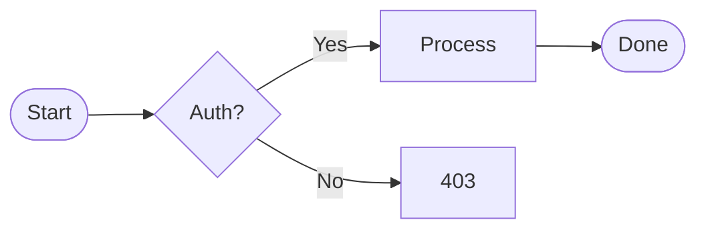

# Directive Syntax (`:::`)

Test file for the generic directive support. Each section shows a `:::`-fenced
block alongside its triple-backtick equivalent so you can verify they render
identically.

## Mermaid

### Backtick fence

### Colon fence

<!-- prettier-ignore-start -->
:::mermaid
flowchart LR
    A([Start]) --> B{Auth?}
    B -->|Yes| C[Process]
    B -->|No| D[403]
    C --> E([Done])
:::
<!-- prettier-ignore-end -->

## Mermaid — Sequence Diagram

<!-- prettier-ignore-start -->
:::mermaid
sequenceDiagram
    participant Browser
    participant Server
    participant DB

    Browser->>Server: GET /api/users
    activate Server
    Server->>DB: SELECT * FROM users
    activate DB
    DB-->>Server: rows
    deactivate DB
    Server-->>Browser: 200 OK (JSON)
    deactivate Server
:::
<!-- prettier-ignore-end -->

## Mermaid — Class Diagram

<!-- prettier-ignore-start -->
:::mermaid
classDiagram
    class Animal {
        +String name
        +int age
        +makeSound() void
    }
    class Dog {
        +fetch() void
    }
    class Cat {
        +purr() void
    }
    Animal <|-- Dog
    Animal <|-- Cat
:::
<!-- prettier-ignore-end -->

## Mermaid — State Diagram

<!-- prettier-ignore-start -->
:::mermaid
stateDiagram-v2
    [*] --> Idle
    Idle --> Loading : fetch()
    Loading --> Success : 200
    Loading --> Error : 4xx/5xx
    Success --> Idle : reset
    Error --> Loading : retry
    Error --> Idle : dismiss
:::
<!-- prettier-ignore-end -->

## Graphviz

<!-- prettier-ignore-start -->
:::graphviz
digraph G {
    rankdir=LR
    node [shape=box, style="rounded,filled", fillcolor="#e3f2fd"]
    Client -> Gateway -> Service -> DB [shape=cylinder, fillcolor="#fef3e0"]
}
:::
<!-- prettier-ignore-end -->

## D2

<!-- prettier-ignore-start -->
:::d2
direction: right
client -> gateway -> service -> db: {style.stroke-dash: 5}
db: Database {shape: cylinder}
:::
<!-- prettier-ignore-end -->

## Admonitions

These map to the same styles as GitHub's `> [!NOTE]` blockquote alerts.

<!-- prettier-ignore-start -->
:::note
This is a note written with `:::note` directive syntax.
It supports **bold**, _italic_, and `code`.
:::

:::tip
Use `:::` directives when your markdown files need to render on Azure DevOps,
Docusaurus, or MyST-based tools.
:::

:::warning
Directive bodies are parsed as markdown. For whitespace-sensitive content
(like some diagram syntaxes), prefer triple-backtick fences.
:::

:::caution
This is a caution admonition — use it for things that could cause problems.
:::

:::important
This is an important admonition — use it for critical information.
:::
<!-- prettier-ignore-end -->

## Admonition with blockquote comparison

The directive syntax above should look identical to the GitHub blockquote syntax
below:

> [!NOTE] This is a note written with GitHub's `> [!NOTE]` blockquote syntax. It
> supports **bold**, _italic_, and `code`.

## Unknown directives

Unknown directive names render as a plain `
` with a `directive-{name}`
class. No special styling — but the content is still parsed as markdown.

<!-- prettier-ignore-start -->
:::details
This is an unknown directive. It renders as a generic div.
You could style `.directive-details` in CSS if needed.
:::
<!-- prettier-ignore-end -->

## Nested colons (::::)

Extra colons work for nesting or visual clarity. The outer fence uses four
colons, the inner uses three.

<!-- prettier-ignore-start -->
::::mermaid
pie title Languages
    "TypeScript" : 60
    "Go" : 25
    "CSS" : 15
::::
<!-- prettier-ignore-end -->

## Azure DevOps style (space after colons)

ADO uses `::: mermaid` with a space. This should also work.

<!-- prettier-ignore-start -->
::: mermaid
graph TD
    A[Azure DevOps] --> B[Wiki]
    A --> C[Repos]
    B --> D[Mermaid Diagrams]
:::
<!-- prettier-ignore-end -->
