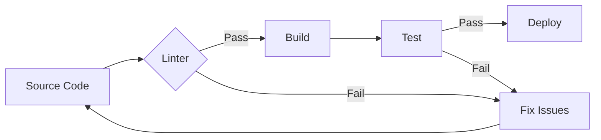
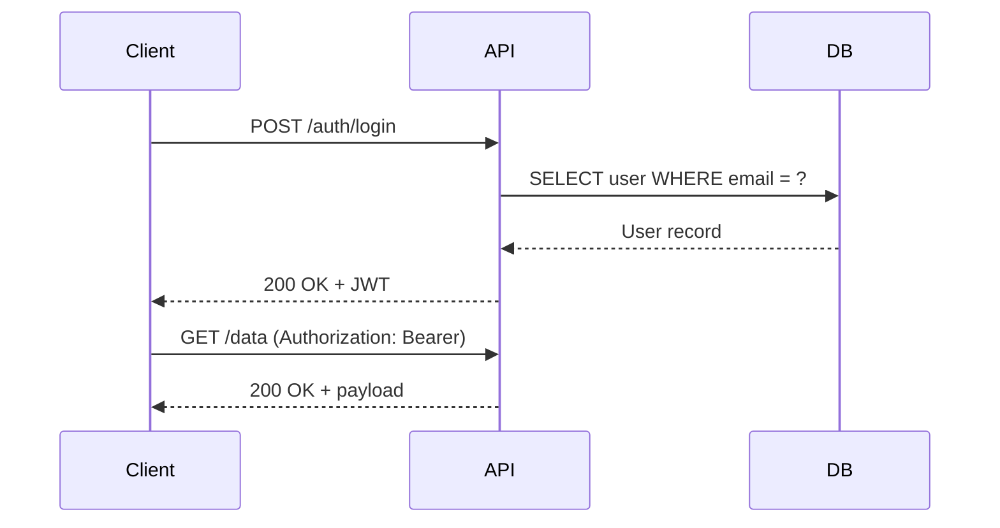

# GitLab Flavored Markdown (GLFM) Showcase

This document exercises GitLab-specific markdown features. Features shared with
GitHub (tables, strikethrough, task lists, footnotes, etc.) are covered in
`complex.md` — this file focuses on GLFM-only syntax.

[[_TOC_]]

## 1. Math

### Inline Math

GitLab supports two inline forms:

- Original GLFM syntax: $`e^{i\pi} + 1 = 0`$
- LaTeX-compatible (since 15.8): $e^{i\pi} + 1 = 0$

The quadratic formula $`x = \frac{-b \pm \sqrt{b^2 - 4ac}}{2a}`$ appears
frequently in algebra. The Euler–Mascheroni constant $\gamma \approx 0.5772$ is
one of the most mysterious constants in mathematics.

### Block Math

Fenced math block:

```math
\int_{-\infty}^{\infty} e^{-x^2} \, dx = \sqrt{\pi}
```

Dollar-sign block:

$$
\nabla \times \mathbf{E} = -\frac{\partial \mathbf{B}}{\partial t}
\quad \text{(Faraday's law)}
$$

$$
\sum_{n=1}^{\infty} \frac{1}{n^2} = \frac{\pi^2}{6}
$$

## 2. Diagrams

### Mermaid





### PlantUML

```plantuml
actor User
participant "Web App" as App
database "PostgreSQL" as DB

User -> App: Submit form
activate App
App -> DB: INSERT INTO records
activate DB
DB --> App: OK
deactivate DB
App --> User: 201 Created
deactivate App
```

## 3. Front Matter

YAML front matter is at the top of this file. GitLab also supports TOML and JSON
front matter:

**TOML** (delimited by `+++`):

```
+++
title = "Example"
draft = true
[params]
  math = true
+++
```

**JSON** (delimited by `;;;`):

```
;;;
{
  "title": "Example",
  "draft": true
}
;;;
```

## 4. Color Chips

GitLab renders backtick-wrapped color values as inline swatches:

| Format      | Example                    | Code                       |
| ----------- | -------------------------- | -------------------------- |
| Hex         | `#FF5733`                  | `#FF5733`                  |
| Hex short   | `#F00`                     | `#F00`                     |
| Hex + alpha | `#FF573380`                | `#FF573380`                |
| RGB         | `RGB(66, 135, 245)`        | `RGB(66, 135, 245)`        |
| RGBA        | `RGBA(66, 135, 245, 0.5)`  | `RGBA(66, 135, 245, 0.5)`  |
| HSL         | `HSL(210, 90%, 61%)`       | `HSL(210, 90%, 61%)`       |
| HSLA        | `HSLA(210, 90%, 61%, 0.8)` | `HSLA(210, 90%, 61%, 0.8)` |

A palette: `#2E3440` `#3B4252` `#434C5E` `#4C566A` `#D8DEE9` `#E5E9F0`
`#ECEFF4` `#8FBCBB` `#88C0D0` `#81A1C1` `#5E81AC` (Nord theme)

## 5. Inline Diff

Review changes inline without a code block:

The function was renamed from {- calculateTotal -} to {+ computeSum +} in the
latest refactor.

Configuration changed from {- debug: true -} to {+ debug: false +} for
production.

We {- removed the legacy API endpoint -} and {+ introduced a versioned REST
interface +}.

## 6. Diff Code Block

```diff
--- a/config.yaml
+++ b/config.yaml
@@ -1,6 +1,6 @@
 server:
-  port: 3000
+  port: 8080
   host: 0.0.0.0
-  debug: true
+  debug: false
   timeout: 30s
```

## 7. Multiline Blockquotes

Standard blockquote (per-line `>`):

> This is a standard blockquote.
> Each line requires a `>` prefix.

GitLab multiline blockquote (no per-line prefix):

> > > This entire block is a blockquote.

It can contain multiple paragraphs, **bold text**, `inline code`, and even lists:

- Item one
- Item two
- Item three

No `>` prefix needed on each line.

> > >

## 8. Definition Lists

HTTP Methods
: **GET** — retrieve a resource
: **POST** — create a resource
: **PUT** — replace a resource
: **PATCH** — partially update a resource
: **DELETE** — remove a resource

Latency
: The time between a request being sent and the first byte of the response
being received.

Throughput
: The number of requests a system can handle per unit of time, typically
measured in requests per second (RPS).

## 9. Abbreviations

_[GLFM]: GitLab Flavored Markdown
_[FFT]: Fast Fourier Transform
_[NTT]: Number Theoretic Transform
_[DFT]: Discrete Fourier Transform
_[WASM]: WebAssembly
_[SSR]: Server-Side Rendering
_[CSR]: Client-Side Rendering
_[HMR]: Hot Module Replacement

GLFM extends standard markdown with features like math blocks and diagram
rendering. When building a high-performance web app, choosing between SSR and CSR
affects initial load time. Modern bundlers support HMR for rapid development
cycles. The app uses WASM modules for FFT, NTT, and DFT computations.

## 10. Task Lists (with Inapplicable State)

Project launch checklist:

- [x] Set up CI/CD pipeline
- [x] Configure staging environment
- [x] Write integration tests
- [ ] Load testing (> 10k concurrent users)
- [ ] Security audit
- [~] Windows support (dropped from scope)
- [~] IE11 compatibility (end of life)
- [ ] Production deploy

The `[~]` syntax marks tasks as inapplicable — distinct from incomplete.

## 11. Alerts / Admonitions

> [!NOTE]
> GitLab added alert blockquotes in 17.10, matching GitHub's syntax.

> [!TIP]
> Use ` ```math ` fenced blocks for display equations instead of `$$` when you
> need reliable rendering across GitLab versions.

> [!IMPORTANT]
> The `[[_TOC_]]` directive must be on its own line with no surrounding text.

> [!WARNING]
> PlantUML requires server-side configuration. On self-managed GitLab, an admin
> must enable it. On GitLab.com, it works out of the box.

> [!CAUTION]
> Inline diff syntax `{+ ... +}` and `{- ... -}` does not nest. Do not place
> markdown formatting inside the diff markers.

## 12. Audio / Video Embedding

GitLab auto-embeds media when image syntax points to audio/video files:

**Video** — GitLab auto-embeds `` as `<video>`. Standard HTML
works everywhere:

<video controls width="480">
  <source src="https://www.w3schools.com/html/mov_bbb.mp4" type="video/mp4">
  Big Buck Bunny trailer
</video>

**Audio** — GitLab auto-embeds `` as `<audio>`. Standard HTML
works everywhere:

<audio controls>
  <source src="https://upload.wikimedia.org/wikipedia/commons/c/c8/Example.ogg" type="audio/ogg">
  Example audio clip
</audio>

**Animated GIF** — works on both GitHub and GitLab via standard image syntax:


## 13. JSON Table

```json:table
{
  "caption": "FFT Variant Comparison",
  "fields": [
    {"key": "algorithm", "label": "Algorithm", "sortable": true},
    {"key": "restriction", "label": "Length Restriction"},
    {"key": "complexity", "label": "Time Complexity"},
    {"key": "exact", "label": "Exact?"}
  ],
  "items": [
    {"algorithm": "Cooley-Tukey", "restriction": "n = 2^k", "complexity": "O(n log n)", "exact": "No"},
    {"algorithm": "Split-Radix", "restriction": "n = 2^k", "complexity": "O(n log n)", "exact": "No"},
    {"algorithm": "Bluestein's", "restriction": "Any n", "complexity": "O(n log n)", "exact": "No"},
    {"algorithm": "Rader's", "restriction": "n prime", "complexity": "O(n log n)", "exact": "No"},
    {"algorithm": "NTT", "restriction": "n | (p-1)", "complexity": "O(n log n)", "exact": "Yes"},
    {"algorithm": "Walsh-Hadamard", "restriction": "n = 2^k", "complexity": "O(n log n)", "exact": "Yes"}
  ]
}
```

## 14. Collapsible Sections

<details>
<summary>Click to expand: Full pipeline configuration</summary>

```yaml
stages:
  - build
  - test
  - deploy

build:
  stage: build
  script:
    - npm ci
    - npm run build
  artifacts:
    paths:
      - dist/

test:
  stage: test
  script:
    - npm run test:unit
    - npm run test:e2e
  coverage: '/Lines\s*:\s*(\d+\.?\d*)%/'

deploy:
  stage: deploy
  script:
    - npm run deploy
  environment:
    name: production
  only:
    - main
```

</details>

<details>
<summary>Click to expand: Performance benchmarks</summary>

| Input Size | Naive DFT     | FFT        | Speedup |
| ---------- | ------------- | ---------- | ------- |
| 256        | 65,536 ops    | 2,048 ops  | 32x     |
| 1,024      | 1,048,576 ops | 10,240 ops | 102x    |
| 65,536     | 4.3 B ops     | 1.05 M ops | 4,096x  |
| 1,048,576  | 1.1 T ops     | 21 M ops   | 52,429x |

</details>

## 15. Miscellaneous

### Emoji

:rocket: :white_check_mark: :warning: :bulb: :construction: :fire: :lock:
:zap: :gear: :microscope:

### Keyboard Shortcuts

Press <kbd>Ctrl</kbd>+<kbd>Shift</kbd>+<kbd>P</kbd> to open the command palette.
Use <kbd>Cmd</kbd>+<kbd>K</kbd> to insert a link. Press <kbd>Esc</kbd> to cancel.

### Superscript and Subscript

Water is H<sub>2</sub>O. The reaction produces CO<sub>2</sub>. Einstein's
equation: E = mc<sup>2</sup>. Footnote style<sup>[1]</sup>.

### Horizontal Rules

---

### Line Breaks

A line ending with two spaces
creates a hard break.

A line ending with a backslash\
also creates a hard break.

### HTML Comments

<!-- This comment is invisible in rendered output -->

The paragraph above this one contains a hidden HTML comment.
