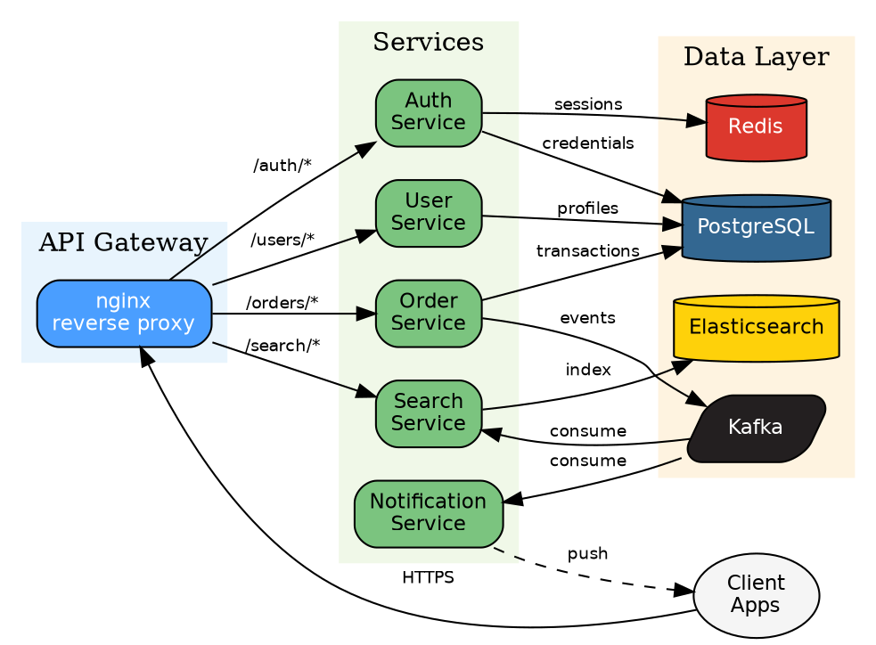
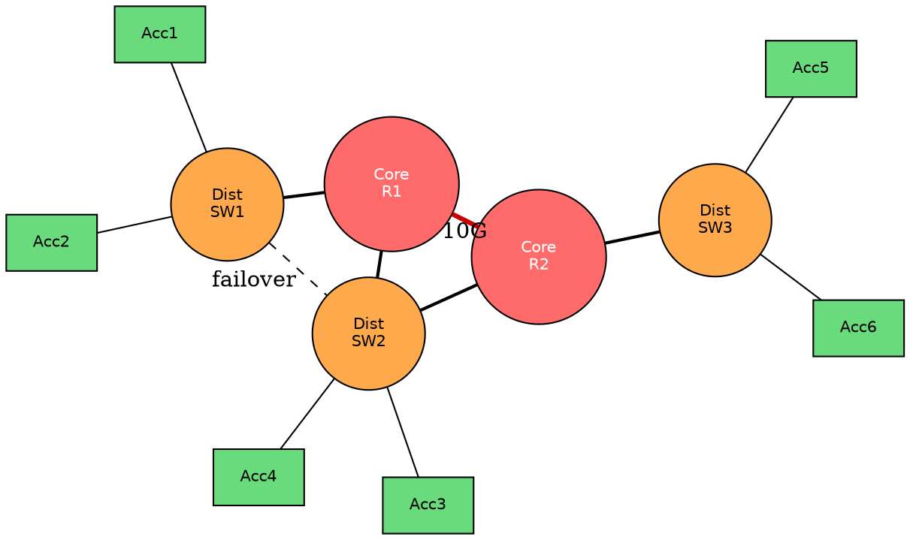
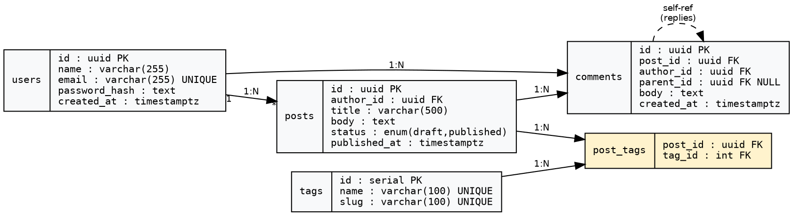
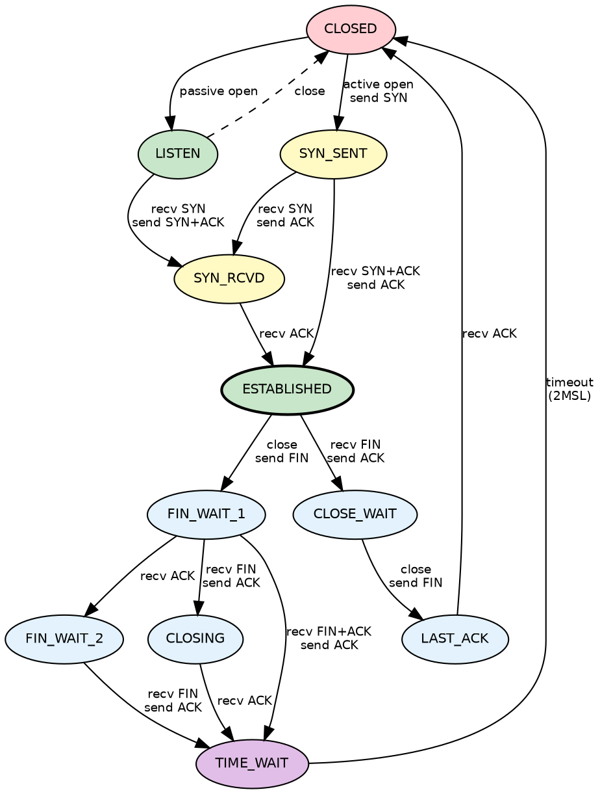
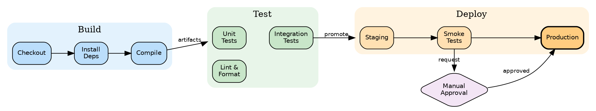
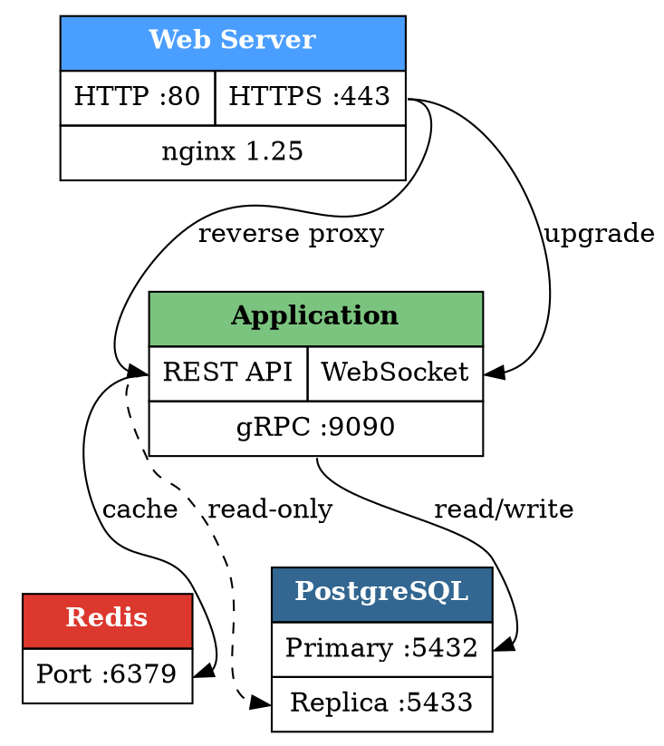
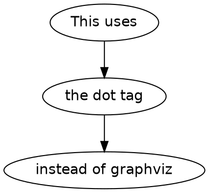

# Graphviz Diagram Gallery

A comprehensive test of Graphviz diagrams rendered via `@hpcc-js/wasm-graphviz`.
Both `graphviz` and `dot` language tags are supported.

---

## 1. Directed Graph — Microservice Architecture

## 2. Undirected Graph — Network Topology

## 3. Record Nodes — Database Schema

## 4. State Machine — TCP Connection

## 5. Subgraphs — CI/CD Pipeline

## 6. Cluster Layout — Compiler Phases

```graphviz
digraph compiler {
    node [shape=box, style="rounded,filled", fontname="Helvetica", fontsize=10]
    edge [fontname="Helvetica", fontsize=9]

    subgraph cluster_frontend {
        label="Frontend"
        style="rounded,filled"
        color="#e8eaf6"
        fillcolor="#e8eaf6"

        source [label="Source\nCode", shape=note, fillcolor=white]
        lexer [label="Lexer\n(Tokenizer)", fillcolor="#c5cae9"]
        parser [label="Parser", fillcolor="#c5cae9"]
        sema [label="Semantic\nAnalysis", fillcolor="#c5cae9"]
        source -> lexer [label="chars"]
        lexer -> parser [label="tokens"]
        parser -> sema [label="AST"]
    }

    subgraph cluster_middle {
        label="Middle End"
        style="rounded,filled"
        color="#e0f2f1"
        fillcolor="#e0f2f1"

        ir_gen [label="IR\nGeneration", fillcolor="#b2dfdb"]
        opt1 [label="Dead Code\nElimination", fillcolor="#b2dfdb"]
        opt2 [label="Constant\nFolding", fillcolor="#b2dfdb"]
        opt3 [label="Loop\nOptimization", fillcolor="#b2dfdb"]
        ir_gen -> opt1 -> opt2 -> opt3
    }

    subgraph cluster_backend {
        label="Backend"
        style="rounded,filled"
        color="#fce4ec"
        fillcolor="#fce4ec"

        isel [label="Instruction\nSelection", fillcolor="#f8bbd0"]
        regalloc [label="Register\nAllocation", fillcolor="#f8bbd0"]
        codegen [label="Code\nGeneration", fillcolor="#f8bbd0"]
        binary [label="Binary", shape=note, fillcolor=white]
        isel -> regalloc -> codegen -> binary
    }

    sema -> ir_gen [label="typed AST", minlen=2]
    opt3 -> isel [label="optimized IR", minlen=2]
}
```

## 7. HTML Labels — Rich Node Content

## 8. Dot Language Tag

The `dot` language tag also works:

