# Graphviz Diagram Gallery

A comprehensive test of Graphviz diagrams rendered via `@hpcc-js/wasm-graphviz`.
Both `graphviz` and `dot` language tags are supported.

## 1. Directed Graph — Microservice Architecture

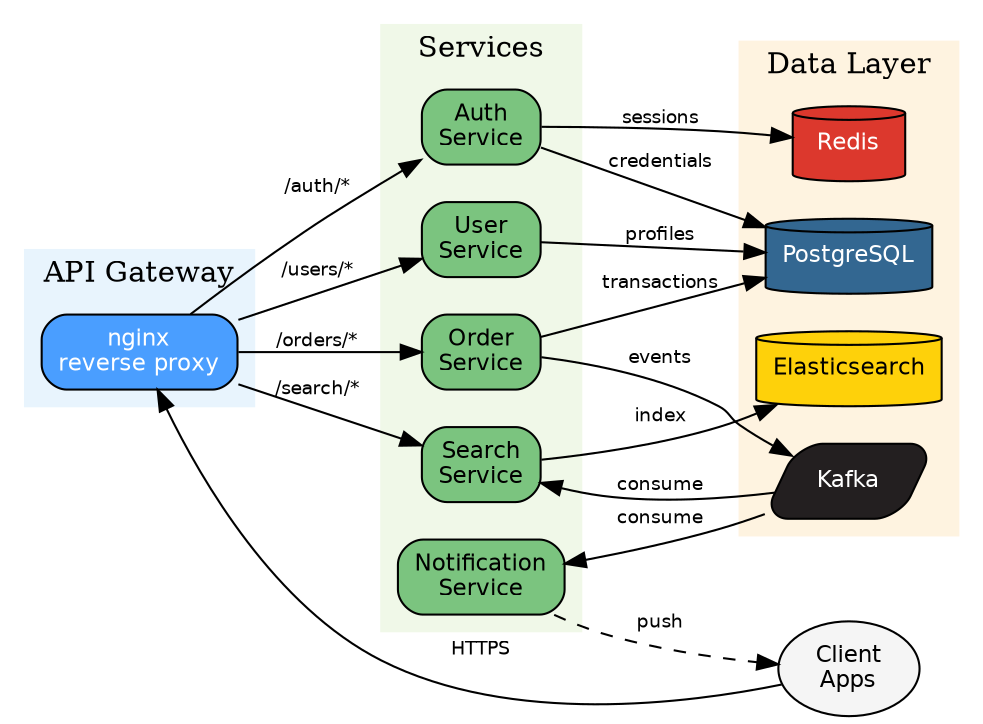

## 2. Undirected Graph — Network Topology

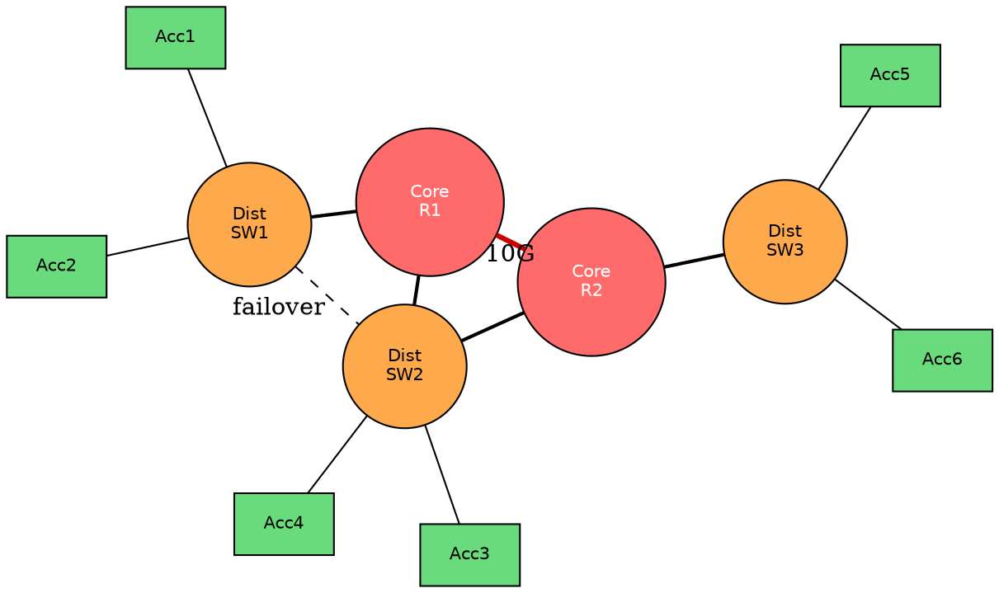

## 3. Record Nodes — Database Schema

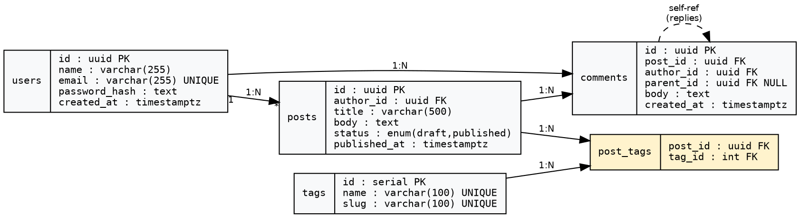

## 4. State Machine — TCP Connection

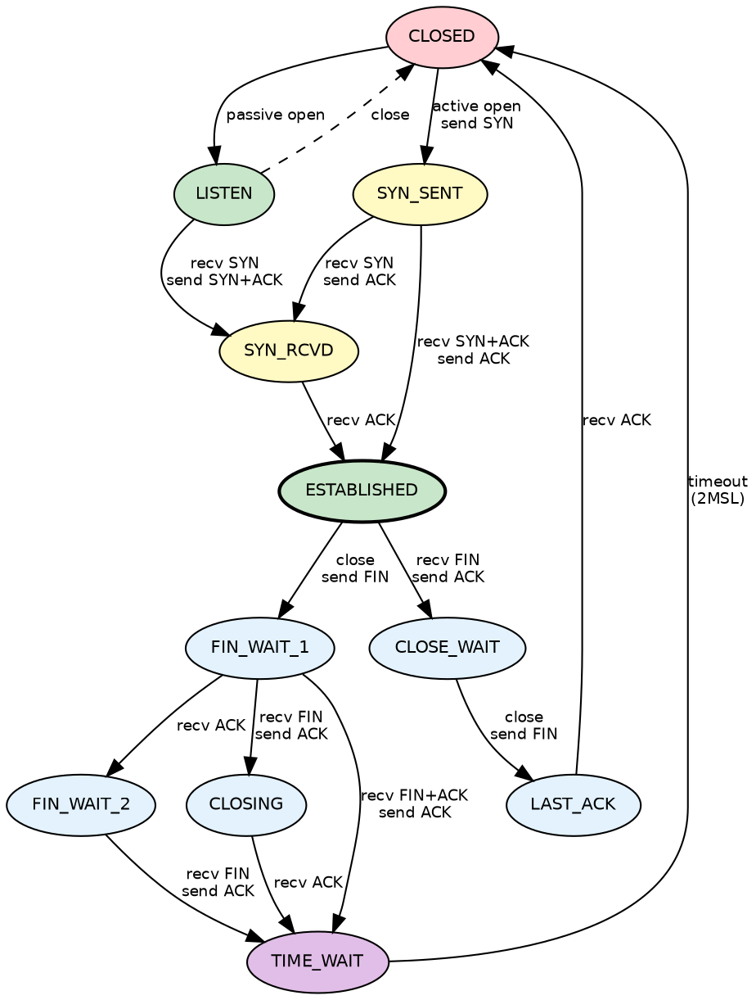

## 5. Subgraphs — CI/CD Pipeline

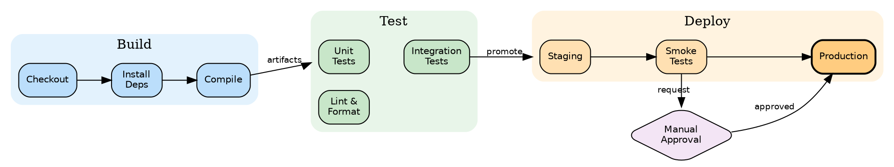

## 6. Cluster Layout — Compiler Phases

```graphviz
digraph compiler {
    node [shape=box, style="rounded,filled", fontname="Helvetica", fontsize=10]
    edge [fontname="Helvetica", fontsize=9]

    subgraph cluster_frontend {
        label="Frontend"
        style="rounded,filled"
        color="#e8eaf6"
        fillcolor="#e8eaf6"

        source [label="Source\nCode", shape=note, fillcolor=white]
        lexer [label="Lexer\n(Tokenizer)", fillcolor="#c5cae9"]
        parser [label="Parser", fillcolor="#c5cae9"]
        sema [label="Semantic\nAnalysis", fillcolor="#c5cae9"]
        source -> lexer [label="chars"]
        lexer -> parser [label="tokens"]
        parser -> sema [label="AST"]
    }

    subgraph cluster_middle {
        label="Middle End"
        style="rounded,filled"
        color="#e0f2f1"
        fillcolor="#e0f2f1"

        ir_gen [label="IR\nGeneration", fillcolor="#b2dfdb"]
        opt1 [label="Dead Code\nElimination", fillcolor="#b2dfdb"]
        opt2 [label="Constant\nFolding", fillcolor="#b2dfdb"]
        opt3 [label="Loop\nOptimization", fillcolor="#b2dfdb"]
        ir_gen -> opt1 -> opt2 -> opt3
    }

    subgraph cluster_backend {
        label="Backend"
        style="rounded,filled"
        color="#fce4ec"
        fillcolor="#fce4ec"

        isel [label="Instruction\nSelection", fillcolor="#f8bbd0"]
        regalloc [label="Register\nAllocation", fillcolor="#f8bbd0"]
        codegen [label="Code\nGeneration", fillcolor="#f8bbd0"]
        binary [label="Binary", shape=note, fillcolor=white]
        isel -> regalloc -> codegen -> binary
    }

    sema -> ir_gen [label="typed AST", minlen=2]
    opt3 -> isel [label="optimized IR", minlen=2]
}
```

## 7. HTML Labels — Rich Node Content

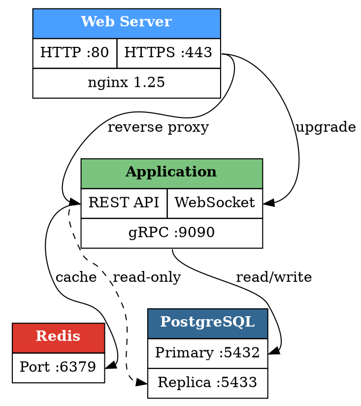

## 8. Dot Language Tag

The `dot` language tag also works:

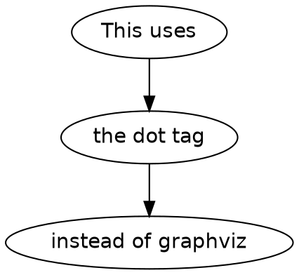

---

## Stress Tests — Advanced Features

### S1. Event-Driven Architecture — Dense Graph with Ports and Styling

HTML labels with ports, `concentrate`, mixed edge styles, subgraph nesting
(3 levels), `rank=same`, weighted edges, and 30+ nodes.

```graphviz
digraph event_arch {
    rankdir=TB
    concentrate=true
    compound=true
    splines=ortho
    nodesep=0.6
    ranksep=0.8
    node [shape=box, style="rounded,filled", fontname="Helvetica", fontsize=10]
    edge [fontname="Helvetica", fontsize=8]

    // --- Clients ---
    subgraph cluster_clients {
        label="Clients"
        style="rounded,filled"
        color="#E2E8F0"
        fillcolor="#F7FAFC"

        web [label="Web App\n(React)", fillcolor="#63B3ED"]
        mobile [label="Mobile App\n(Flutter)", fillcolor="#63B3ED"]
        cli [label="CLI Tool", fillcolor="#63B3ED"]
    }

    // --- Edge ---
    subgraph cluster_edge {
        label="Edge Layer"
        style="rounded,filled"
        color="#C6F6D5"
        fillcolor="#F0FFF4"

        cdn [label="CDN\n(CloudFlare)", shape=hexagon, fillcolor="#68D391"]
        waf [label="WAF", fillcolor="#68D391"]
        lb [label="Load Balancer\n(HAProxy)", fillcolor="#68D391"]

        cdn -> waf -> lb
    }

    // --- API ---
    subgraph cluster_api {
        label="API Gateway"
        style="rounded,filled"
        color="#BEE3F8"
        fillcolor="#EBF8FF"

        gw [label=<
            <TABLE BORDER="0" CELLBORDER="1" CELLSPACING="0" CELLPADDING="4">
                <TR><TD COLSPAN="3" BGCOLOR="#3182CE"><FONT COLOR="white"><B>API Gateway</B></FONT></TD></TR>
                <TR><TD PORT="rest">REST</TD><TD PORT="graphql">GraphQL</TD><TD PORT="ws">WebSocket</TD></TR>
                <TR><TD COLSPAN="3">Rate Limit | Auth | Logging</TD></TR>
            </TABLE>
        >, shape=plaintext]
    }

    // --- Services ---
    subgraph cluster_services {
        label="Domain Services"
        style="rounded,filled"
        color="#FEFCBF"
        fillcolor="#FFFFF0"

        subgraph cluster_ordering {
            label="Order Context"
            style="rounded,filled"
            color="#FED7AA"
            fillcolor="#FFFAF0"

            order_cmd [label="Order\nCommand", fillcolor="#FEEBC8"]
            order_query [label="Order\nQuery", fillcolor="#FEEBC8"]
            pricing [label="Pricing\nEngine", fillcolor="#FEEBC8"]
            order_saga [label="Order\nSaga", fillcolor="#FBD38D"]
        }

        subgraph cluster_payment {
            label="Payment Context"
            style="rounded,filled"
            color="#FED7D7"
            fillcolor="#FFF5F5"

            pay_cmd [label="Payment\nCommand", fillcolor="#FEB2B2"]
            pay_webhook [label="Webhook\nHandler", fillcolor="#FEB2B2"]
            refund [label="Refund\nService", fillcolor="#FEB2B2"]
        }

        subgraph cluster_inventory {
            label="Inventory Context"
            style="rounded,filled"
            color="#C6F6D5"
            fillcolor="#F0FFF4"

            stock [label="Stock\nManager", fillcolor="#9AE6B4"]
            reservation [label="Reservation\nEngine", fillcolor="#9AE6B4"]
            warehouse [label="Warehouse\nSync", fillcolor="#9AE6B4"]
        }

        subgraph cluster_notify {
            label="Notification Context"
            style="rounded,filled"
            color="#E9D8FD"
            fillcolor="#FAF5FF"

            router [label="Notification\nRouter", fillcolor="#D6BCFA"]
            email_svc [label="Email", fillcolor="#D6BCFA"]
            push_svc [label="Push", fillcolor="#D6BCFA"]
            sms_svc [label="SMS", fillcolor="#D6BCFA"]

            router -> email_svc
            router -> push_svc
            router -> sms_svc
        }
    }

    // --- Infrastructure ---
    subgraph cluster_infra {
        label="Infrastructure"
        style="rounded,filled"
        color="#E2E8F0"
        fillcolor="#F7FAFC"

        subgraph cluster_data {
            label="Data Stores"
            color="#FEFCBF"
            style="rounded,filled"
            fillcolor="#FFFFF0"

            orders_db [label="Orders\nDB", shape=cylinder, fillcolor="#D69E2E", fontcolor=white]
            payments_db [label="Payments\nDB", shape=cylinder, fillcolor="#D69E2E", fontcolor=white]
            inventory_db [label="Inventory\nDB", shape=cylinder, fillcolor="#D69E2E", fontcolor=white]
            cache [label="Redis\nCache", shape=cylinder, fillcolor="#E53E3E", fontcolor=white]
        }

        subgraph cluster_messaging {
            label="Messaging"
            color="#C6F6D5"
            style="rounded,filled"
            fillcolor="#F0FFF4"

            events [label="Event Bus\n(NATS)", shape=parallelogram, fillcolor="#38A169", fontcolor=white]
            dlq [label="Dead Letter\nQueue", shape=parallelogram, fillcolor="#E53E3E", fontcolor=white]
            jobs [label="Job Queue\n(BullMQ)", shape=parallelogram, fillcolor="#38A169", fontcolor=white]
        }

        subgraph cluster_observability {
            label="Observability"
            color="#E9D8FD"
            style="rounded,filled"
            fillcolor="#FAF5FF"

            metrics [label="Prometheus", fillcolor="#805AD5", fontcolor=white]
            logs [label="Loki", fillcolor="#805AD5", fontcolor=white]
            traces [label="Tempo", fillcolor="#805AD5", fontcolor=white]
            grafana [label="Grafana", fillcolor="#ED8936", fontcolor=white, penwidth=2]

            metrics -> grafana
            logs -> grafana
            traces -> grafana
        }
    }

    // --- External ---
    subgraph cluster_external {
        label="External Services"
        style="rounded,filled"
        color="#E2E8F0"
        fillcolor="#F7FAFC"

        stripe [label="Stripe", shape=diamond, fillcolor="#635BFF", fontcolor=white]
        sendgrid [label="SendGrid", shape=diamond, fillcolor="#1A82E2", fontcolor=white]
        twilio [label="Twilio", shape=diamond, fillcolor="#F22F46", fontcolor=white]
        s3 [label="S3", shape=diamond, fillcolor="#569A31", fontcolor=white]
    }

    // === Connections ===

    // Client to edge
    {rank=same; web; mobile; cli}
    web -> cdn [label="HTTPS"]
    mobile -> cdn [label="HTTPS"]
    cli -> lb [label="API key"]

    // Edge to gateway
    lb -> gw:rest
    lb -> gw:ws

    // Gateway to services
    gw:rest -> order_cmd [label="/orders", weight=5]
    gw:rest -> order_query [label="/orders\n(GET)", style=dashed]
    gw:rest -> pay_webhook [label="/webhooks"]
    gw:graphql -> order_query [label="query"]
    gw:ws -> router [label="subscribe", style=dashed]

    // Order flow
    order_cmd -> pricing
    order_cmd -> order_saga
    order_saga -> pay_cmd [label="charge"]
    order_saga -> reservation [label="reserve"]
    order_saga -> router [label="notify", style=dashed]

    // Payment flow
    pay_cmd -> stripe
    pay_webhook -> pay_cmd [label="confirm"]
    refund -> stripe

    // Inventory
    stock -> warehouse [dir=both, label="sync"]
    reservation -> stock

    // Notifications to external
    email_svc -> sendgrid
    sms_svc -> twilio

    // Data store connections
    order_cmd -> orders_db [weight=3]
    order_query -> orders_db [style=dashed]
    order_query -> cache [style=dashed, label="read-through"]
    pay_cmd -> payments_db
    stock -> inventory_db
    reservation -> inventory_db

    // Event bus
    order_cmd -> events [label="OrderPlaced", color="#38A169", fontcolor="#38A169"]
    pay_cmd -> events [label="PaymentProcessed", color="#38A169", fontcolor="#38A169"]
    stock -> events [label="StockReserved", color="#38A169", fontcolor="#38A169"]
    events -> order_saga [label="consume", style=dashed, color="#805AD5"]
    events -> router [label="consume", style=dashed, color="#805AD5"]
    events -> dlq [label="failed", color="#E53E3E"]

    // Jobs
    router -> jobs [label="enqueue"]
    jobs -> email_svc [label="process", style=dashed]
    jobs -> push_svc [label="process", style=dashed]

    // Observability (subtle connections)
    order_cmd -> metrics [style=dotted, color="#805AD5", arrowsize=0.5]
    order_cmd -> traces [style=dotted, color="#805AD5", arrowsize=0.5]
    gw -> logs [style=dotted, color="#805AD5", arrowsize=0.5]
}
```

### S2. Compiler Pipeline — Record Nodes with Ports

Complex record-shape nodes with port connections, rank constraints,
and weighted edges for layout control.

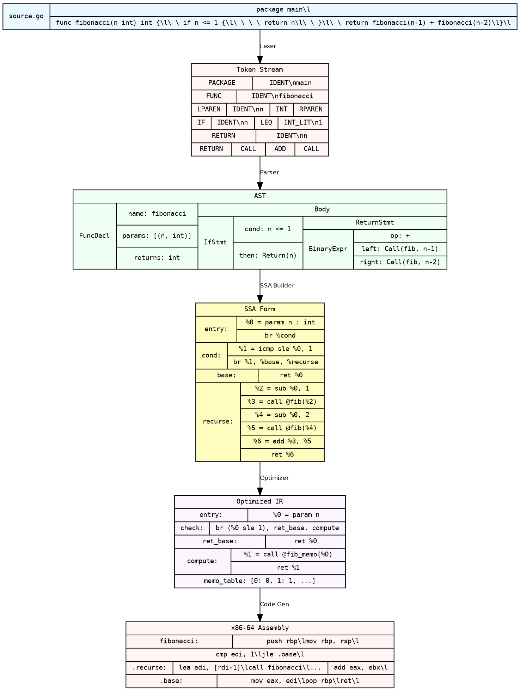

### S3. Shapes Gallery — All Graphviz Node Shapes

Every built-in node shape in a grid layout using `rank=same`.

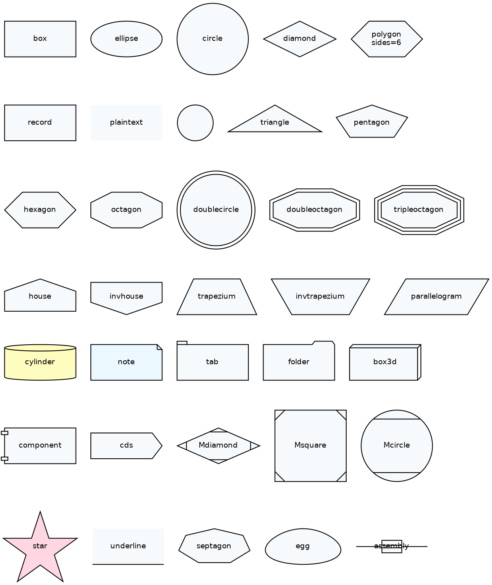
