# PlantUML Diagram Gallery

A comprehensive test of PlantUML diagram types. Rendered via the public
PlantUML server.

---

## Sequence Diagram

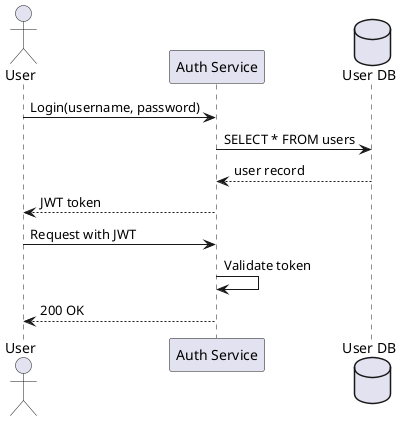

## Use Case Diagram

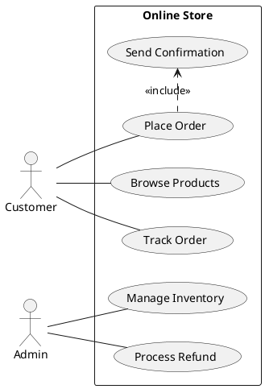

## Class Diagram

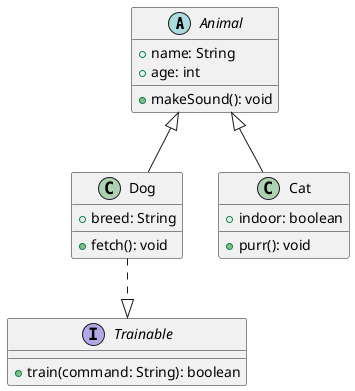

## Object Diagram

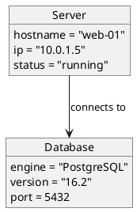

## Activity Diagram

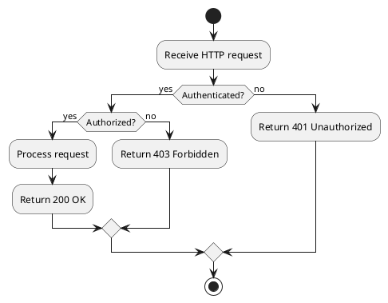

## Component Diagram

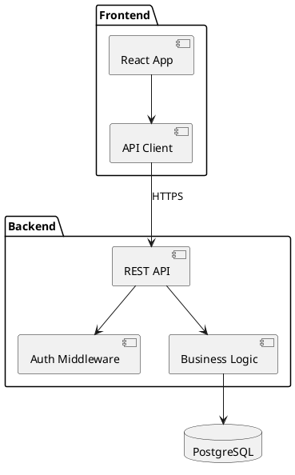

## Deployment Diagram

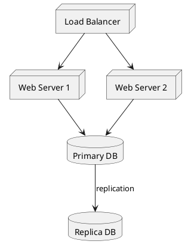

## State Diagram

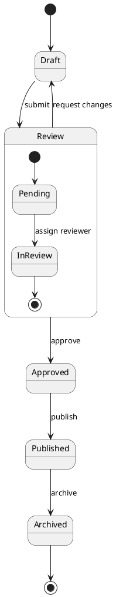

## Timing Diagram

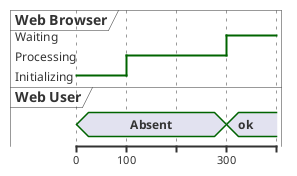

## Entity Relationship (IE Notation)

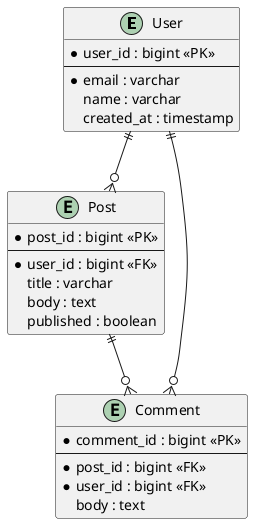

## Gantt Chart

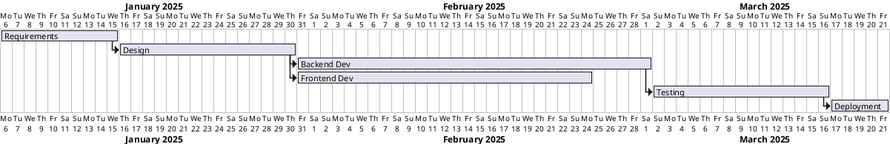

## Mind Map

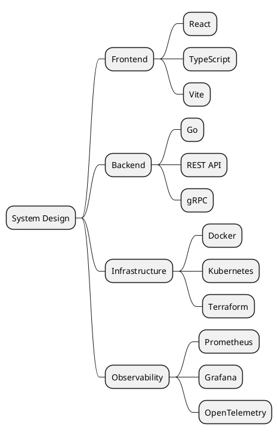

## Work Breakdown Structure (WBS)

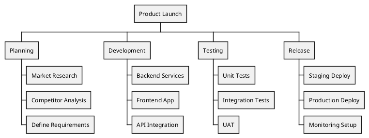

## Network Diagram (nwdiag)

```plantuml
@startnwdiag
network internet {
  address = "203.0.113.0/24"
  web01 [address = "203.0.113.1"]
  web02 [address = "203.0.113.2"]
}

network dmz {
  address = "172.16.0.0/24"
  web01 [address = "172.16.0.1"]
  web02 [address = "172.16.0.2"]
  lb [address = "172.16.0.10"]
}

network internal {
  address = "10.0.0.0/8"
  lb [address = "10.0.0.1"]
  db01 [address = "10.0.0.100"]
  db02 [address = "10.0.0.101"]
}
@endnwdiag
```

## Wireframe (Salt)

### Basic Widgets

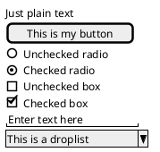

### Grid Layouts

External borders (`{+`):

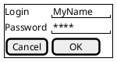

All lines (`{#`):

```plantuml
@startsalt
{#
  .            | Column 2  | Column 3
  Row header 1 | value 1   | value 2
  Row header 2 | A long cell | *
}
@endsalt
```

### Group Box

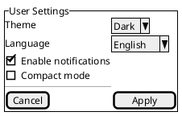

### Separators

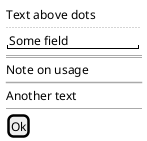

### Tabs and Menu Bar

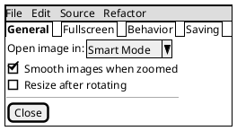

### Tree Widget

```plantuml
@startsalt
{
  {T
    + World
    ++ America
    +++ Canada
    +++ USA
    ++++ New York
    ++++ California
    ++ Europe
    +++ France
    +++ Germany
    +++ Italy
    ++ Asia
    +++ Japan
    +++ South Korea
  }
}
@endsalt
```

### Tree Table

```plantuml
@startsalt
{
  {T
    +Name              | Size     | Modified
    + src               | --       | 2025-03-14
    ++ components        | --       | 2025-03-14
    +++ Button.tsx       | 2.1 KB   | 2025-03-12
    +++ Modal.tsx        | 4.8 KB   | 2025-03-13
    ++ lib               | --       | 2025-03-14
    +++ utils.ts         | 1.3 KB   | 2025-03-10
    + tests              | --       | 2025-03-11
    ++ Button.test.tsx   | 3.2 KB   | 2025-03-11
  }
}
@endsalt
```

### Scroll Bars

```plantuml
@startsalt
{S
  Message line 1
  Message line 2
  Message line 3
  Message line 4
  Message line 5
  Message line 6
  Message line 7
  Message line 8
}
@endsalt
```

### OpenIconic Icons

```plantuml
@startsalt
{+
  <&person> Login    | "MyName   "
  <&key> Password    | "****     "
  [Cancel <&circle-x>] | [OK <&account-login>]
}
@endsalt
```

### Creole Formatting

```plantuml
@startsalt
{
  This is **bold**
  This is //italics//
  This is ""monospaced""
  This is --stricken-out--
  This is __underlined__
  This is ~~wave-underlined~~
}
@endsalt
```

### Colors and Styling

```plantuml
@startsalt
{
  <color:Blue>Blue label text
  [This is my default button]
  [<color:green>Green button]
  [<color:#9a9a9a>Disabled button]
  []  <color:red>Unchecked box
  [X] <color:green>Checked box
  ()  <color:orange>Radio option
}
@endsalt
```

### Composite — Login Dialog

```plantuml
@startsalt
{+
  {* File | Edit | View | Help }
  {
    Name     | "John Doe        "
    Email    | "john@example.com "
    Role     | ^Admin^
    --
    [Cancel] | [  Save  ]
  }
}
@endsalt
```

### Composite — Settings Panel

```plantuml
@startsalt
{+
  {* Application | Window | Help }
  {/ General | Editor | Appearance | Keybindings }
  {#
    Setting          | Value              | Default
    Font family      | "JetBrains Mono  " | Consolas
    Font size        | "14              " | 12
    Tab size         | "2               " | 4
    Line height      | "1.6             " | 1.5
  }
  {
    [X] Word wrap
    [X] Show line numbers
    [] Show minimap
    [] Bracket pair colorization
  }
  ==
  {
    . | [Restore Defaults] | [Apply] | [  OK  ]
  }
}
@endsalt
```

### Composite — File Manager

```plantuml
@startsalt
{+
  {* File | Edit | View | Tools | Help }
  {
    {T
      + <&folder> Home
      ++ <&folder> Documents
      +++ <&file> report.pdf
      +++ <&file> notes.md
      ++ <&folder> Pictures
      +++ <&file> photo.jpg
      ++ <&folder> Projects
      +++ <&folder> dirsv
      ++++ <&file> go.mod
      ++++ <&file> main.go
    } | {#
      Name          | Size     | Type     | Modified
      report.pdf    | 2.4 MB   | PDF      | 2025-03-10
      notes.md      | 12 KB    | Markdown | 2025-03-13
      photo.jpg     | 3.1 MB   | JPEG     | 2025-02-28
    }
  }
  ==
  {
    Path: | "/home/user/Documents          " | [Browse]
  }
}
@endsalt
```

## JSON Visualization

```plantuml
@startjson
{
  "name": "dirsv",
  "version": "0.1.0",
  "features": {
    "markdown": true,
    "mermaid": true,
    "plantuml": true,
    "katex": true
  },
  "stack": ["Go", "Preact", "Vite"],
  "license": "MIT"
}
@endjson
```

## YAML Visualization

```plantuml
@startyaml
service:
  name: api-gateway
  port: 8080
  replicas: 3
  env:
    - name: DATABASE_URL
      value: postgres://db:5432/app
    - name: LOG_LEVEL
      value: info
  healthCheck:
    path: /healthz
    interval: 30s
@endyaml
```

## EBNF Diagram

```plantuml
@startebnf
expression = term , { ("+" | "-") , term } ;
term = factor , { ("*" | "/") , factor } ;
factor = number | "(" , expression , ")" ;
number = digit , { digit } ;
digit = "0" | "1" | "2" | "3" | "4" | "5" | "6" | "7" | "8" | "9" ;
@endebnf
```

## Regex Visualization

```plantuml
@startregex
^[a-zA-Z0-9._%+-]+@[a-zA-Z0-9.-]+\.[a-zA-Z]{2,}$
@endregex
```

## Archimate Diagram

Enterprise architecture layers with ArchiMate stereotypes and relationships.

```plantuml
@startuml
skinparam rectangle<<behavior>> {
  roundCorner 25
}

rectangle "Business Layer" #FFFFCC {
  rectangle "Customer Service" as CS <<business-service>><<behavior>>
  rectangle "Order Processing" as OP <<business-process>><<behavior>>
  rectangle "Sales Rep" as SR <<business-actor>>
}

rectangle "Application Layer" #C2DFFF {
  rectangle "CRM System" as CRM <<application-component>>
  rectangle "Order API" as API <<application-service>><<behavior>>
  rectangle "Inventory App" as INV <<application-component>>
}

rectangle "Technology Layer" #E0FFE0 {
  rectangle "App Server" as APP <<technology-device>>
  rectangle "PostgreSQL" as DB <<technology-device>>
  rectangle "Message Queue" as MQ <<technology-device>>
}

SR -down-> CS : serves
CS -down-> OP : triggers
OP -down-> API : uses
API -down-> CRM
API -down-> INV
CRM -down-> APP : deployed on
INV -down-> APP
APP -right-> DB : reads/writes
APP -right-> MQ : publishes
@enduml
```

### Archimate — Motivation and Strategy

```plantuml
@startuml
skinparam rectangle<<behavior>> {
  roundCorner 25
}

rectangle "Motivation" #FFF0F0 {
  rectangle "Reduce Churn" as goal <<motivation-goal>>
  rectangle "Improve Response Time" as req <<motivation-requirement>>
  rectangle "Customer Satisfaction" as driver <<motivation-driver>>
  rectangle "Competitors Offer\nBetter Support" as concern <<motivation-assessment>>
}

rectangle "Strategy" #F0F0FF {
  rectangle "Self-Service Portal" as cap <<strategy-capability>>
  rectangle "Hire Support Staff" as res <<strategy-resource>>
  rectangle "Automation Initiative" as course <<strategy-course-of-action>><<behavior>>
}

driver -down-> goal : motivates
concern -right-> driver : associated
goal -down-> req : realizes
req -down-> cap : realizes
course -right-> cap : realizes
res -up-> course : assigned to
@enduml
```

## Chart Diagram

Charts require PlantUML 1.2026.0+. The public server may not support these
yet — they will render once the server upgrades.

### Bar Chart — Quarterly Revenue

```plantuml
@startchart
h-axis [Q1, Q2, Q3, Q4]
v-axis "Revenue ($K)" 0 --> 100 spacing 25
bar "Revenue" [45, 62, 58, 70] #3498db
bar "Profit" [20, 35, 30, 42] #2ecc71
legend right
@endchart
```

### Stacked Bar Chart

```plantuml
@startchart
h-axis [Q1, Q2, Q3, Q4]
v-axis 0 --> 120
stackMode stacked
bar "Product A" [30, 40, 35, 50] #3498db
bar "Product B" [20, 25, 30, 28] #2ecc71
bar "Product C" [10, 15, 12, 18] #e74c3c
legend right
@endchart
```

### Line Chart — Performance Trends

```plantuml
@startchart
h-axis [Jan, Feb, Mar, Apr, May, Jun]
v-axis "Score" 0 --> 100 spacing 20 grid
line "Availability" [99, 98, 99, 97, 99, 99] #3498db labels
line "Latency (p99)" [45, 52, 48, 60, 42, 38] #e74c3c labels
legend right
@endchart
```

### Area Chart — Traffic Over Time

```plantuml
@startchart
h-axis [Mon, Tue, Wed, Thu, Fri, Sat, Sun]
v-axis 0 --> 200 spacing 50
area "API Requests" [80, 120, 140, 130, 150, 60, 45] #3498db
area "Page Views" [40, 60, 70, 65, 80, 30, 20] #2ecc71
legend right
@endchart
```

### Scatter Chart

```plantuml
@startchart
h-axis "Response Time (ms)" 0 --> 500 spacing 100
v-axis "Throughput (req/s)" 0 --> 1000 spacing 200
scatter "Service A" [(50,800), (100,750), (150,600), (200,500), (300,350)] #3498db
scatter "Service B" [(80,600), (120,550), (180,450), (250,300), (400,200)] #e74c3c
legend right
@endchart
```

### Dual Axis — Revenue vs Market Share

```plantuml
@startchart
h-axis [Q1, Q2, Q3, Q4]
v-axis "Revenue ($K)" 0 --> 100
v2-axis "Market Share %" 0 --> 50
bar "Revenue" [45, 62, 58, 70] #3498db
line "Market Share" [15, 20, 18, 25] #ff7f0e v2
legend right
@endchart
```

---

## Stress Tests — Advanced Features

The diagrams below combine multiple PlantUML features (skinparam theming,
notes, stereotypes, creole formatting, together grouping, colored arrows,
conditional styling) to stress-test the renderer.

### S1. Sequence Diagram — Distributed Auth with Theming

`skinparam`, `autonumber`, `box`, `alt`/`par`/`loop`/`critical`/`group`,
notes, colored arrows, dividers, and activation bars.

```plantuml
@startuml
skinparam backgroundColor #FEFEFE
skinparam sequenceArrowThickness 2
skinparam sequenceBoxBorderColor #4A5568
skinparam sequenceBoxBackgroundColor #F7FAFC
skinparam sequenceGroupBorderColor #3182CE
skinparam sequenceGroupBackgroundColor #EBF8FF
skinparam noteBorderColor #D69E2E
skinparam noteBackgroundColor #FEFCBF
skinparam participantBorderColor #2D3748
skinparam participantBackgroundColor #E2E8F0

title OAuth2 Authorization Code Flow with PKCE

autonumber

box "Client Side" #F0FFF4
actor "User" as user
participant "Browser\n(SPA)" as browser
end box

box "Auth Infrastructure" #EBF8FF
participant "API Gateway" as gateway
participant "Auth Service" as auth
database "Session Store\n(Redis)" as cache
end box

box "Backend Services" #FFF5F5
participant "Resource API" as api
database "PostgreSQL" as db
end box

== Initialization ==

user -> browser: Click "Sign In"
browser -> browser: Generate code_verifier\n& code_challenge (S256)
browser -[#3182CE]> gateway: GET /authorize?\nresponse_type=code&\ncode_challenge=<hash>
gateway -> auth: Forward auth request

auth -> auth: Generate authorization code
auth --> gateway: 302 Redirect to /callback?code=abc
gateway --> browser: 302 Redirect

== Token Exchange ==

browser -[#38A169]> gateway: POST /token\n{code, code_verifier}
gateway -> auth: Forward token request

critical Token Validation
  auth -> auth: Verify code_challenge\n== SHA256(code_verifier)
  auth -> cache: Store session
  cache --> auth: OK
end

auth --> gateway: {access_token, refresh_token, expires_in}
gateway --> browser: Set httpOnly cookies

note right of browser
  Tokens stored in httpOnly
  secure cookies — not
  accessible via JavaScript.
end note

== API Access ==

loop Every API call
  browser -[#805AD5]> gateway: GET /api/data\n(Cookie: access_token)
  gateway -> auth: Validate JWT
  auth --> gateway: Claims {sub, role, tenant}

  alt Token valid
    gateway -[#38A169]> api: Forward + inject claims
    api -> db: SELECT with tenant scope
    db --> api: Result set
    api --> gateway: 200 OK {data}
    gateway --> browser: 200 OK
  else Token expired
    gateway -[#E53E3E]> browser: 401 Unauthorized
    browser -> gateway: POST /token/refresh\n(Cookie: refresh_token)
    gateway -> auth: Refresh token flow
    auth -> cache: Rotate refresh token
    auth --> gateway: New token pair
    gateway --> browser: Set new cookies
  end
end

== Session Termination ==

user -> browser: Click "Sign Out"
browser -[#E53E3E]> gateway: POST /logout
gateway -> auth: Revoke tokens
auth -> cache: DELETE session
auth --> gateway: 204 No Content
gateway --> browser: Clear cookies
browser --> user: Redirect to login

note over gateway, db
  All requests pass through the API Gateway
  for rate limiting, auth, and request logging.
end note
@enduml
```

### S2. Class Diagram — Domain Model with Patterns

Abstract classes, interfaces, generics, enums, packages, notes,
stereotypes, composition/aggregation, and skinparam styling.

```plantuml
@startuml
skinparam classAttributeIconSize 0
skinparam classBorderColor #4A5568
skinparam classBackgroundColor #F7FAFC
skinparam classFontStyle bold
skinparam packageBorderColor #A0AEC0
skinparam packageBackgroundColor #FFFFFF
skinparam stereotypeCBackgroundColor #EBF8FF
skinparam stereotypeIBackgroundColor #FFF5F5
skinparam stereotypeEBackgroundColor #FEFCBF
skinparam arrowColor #4A5568

title Domain-Driven Design — Order Bounded Context

package "Domain Layer" <<Rectangle>> {

  together {
    abstract class AggregateRoot<ID> <<aggregate>> {
      # id: ID
      # createdAt: Instant
      # updatedAt: Instant
      - domainEvents: List<DomainEvent>
      + getId(): ID
      + addEvent(event: DomainEvent): void
      + clearEvents(): List<DomainEvent>
    }

    interface DomainEvent <<event>> {
      + occurredAt(): Instant
      + aggregateId(): UUID
    }
  }

  class Order <<aggregate>> {
    - items: List<OrderItem>
    - status: OrderStatus
    - totalAmount: Money
    - shippingAddress: Address
    + place(): void
    + cancel(reason: String): void
    + addItem(product: ProductRef, qty: int): void
    + removeItem(itemId: UUID): void
    + calculateTotal(): Money
    + ship(trackingNumber: String): void
  }

  class OrderItem <<entity>> {
    - productId: UUID
    - productName: String
    - quantity: int
    - unitPrice: Money
    - discount: Money
    + subtotal(): Money
  }

  class Money <<value object>> {
    - amountCents: long
    - currency: Currency
    + add(other: Money): Money
    + subtract(other: Money): Money
    + multiply(factor: int): Money
    + isPositive(): boolean
    + {static} zero(currency: Currency): Money
  }

  class Address <<value object>> {
    - street: String
    - city: String
    - state: String
    - postalCode: String
    - country: CountryCode
    + format(): String
    + validate(): boolean
  }

  enum OrderStatus <<enum>> {
    DRAFT
    PLACED
    CONFIRMED
    PROCESSING
    SHIPPED
    DELIVERED
    CANCELLED
    REFUNDED
  }

  enum Currency <<enum>> {
    USD
    EUR
    GBP
    JPY
  }

  class OrderPlaced <<event>> {
    + orderId: UUID
    + customerId: UUID
    + totalAmount: Money
    + occurredAt(): Instant
  }

  class OrderCancelled <<event>> {
    + orderId: UUID
    + reason: String
    + occurredAt(): Instant
  }
}

package "Application Layer" <<Rectangle>> {
  interface OrderRepository <<repository>> {
    + findById(id: UUID): Optional<Order>
    + save(order: Order): Order
    + delete(id: UUID): void
    + findByCustomer(customerId: UUID): List<Order>
  }

  class PlaceOrderCommand <<command>> {
    + customerId: UUID
    + items: List<OrderItemDTO>
    + shippingAddress: AddressDTO
  }

  class PlaceOrderHandler <<handler>> {
    - repository: OrderRepository
    - eventPublisher: EventPublisher
    + handle(cmd: PlaceOrderCommand): UUID
  }
}

' Inheritance
AggregateRoot <|-- Order
DomainEvent <|.. OrderPlaced
DomainEvent <|.. OrderCancelled

' Composition
Order *-- "1..*" OrderItem
Order *-- "1" Money : totalAmount
Order *-- "1" Address
OrderItem *-- "1" Money : unitPrice

' Dependencies
Order --> OrderStatus
Money --> Currency
PlaceOrderHandler --> OrderRepository
PlaceOrderHandler ..> Order : creates

note right of Order
  <b>Invariants:</b>
  - Must have at least 1 item
  - Total must equal sum of items
  - Cannot cancel after shipping
end note

note bottom of Money
  Immutable value object.
  All arithmetic returns
  new instances.
end note
@enduml
```

### S3. Activity Diagram — CI/CD Pipeline with Swimlanes

Swimlanes (`|partition|`), fork/join, signals, notes, colors, and
nested conditionals.

```plantuml
@startuml
skinparam activityBorderColor #4A5568
skinparam activityBackgroundColor #F7FAFC
skinparam activityDiamondBorderColor #3182CE
skinparam activityDiamondBackgroundColor #EBF8FF
skinparam swimlaneBorderColor #A0AEC0

title CI/CD Pipeline — Multi-Stage Deployment

|#F0FFF4|Developer|
start
:Push code to feature branch;
:Create pull request;

|#EBF8FF|CI System|
:Trigger pipeline;

fork
  :Run linter & formatter;
fork again
  :Run unit tests;
fork again
  :Run security scan (SAST);
fork again
  :Check dependencies (Snyk);
end fork

if (All checks pass?) then (yes)
  :Build Docker image;
  :Push to container registry;
  :Tag image with git SHA;
else (no)
  :Notify developer;
  |Developer|
  :Fix issues;
  stop
endif

|#FEFCBF|Review|
:Request code review;

if (Approved?) then (yes)
  :Merge to main;
else (no)
  :Request changes;
  |Developer|
  :Address feedback;
  stop
endif

|CI System|
:Trigger deploy pipeline;

:Run integration tests against staging;

if (Integration tests pass?) then (yes)
  :Deploy to staging;
  :Run smoke tests;

  if (Smoke tests pass?) then (yes)

    |#FFF5F5|Release|
    :Deploy canary (5%);
    :Monitor error rate for 10 min;

    if (Error rate < 0.1%?) then (yes)
      :Ramp to 25%;
      :Monitor for 5 min;
      :Ramp to 100%;
      #palegreen:Production deploy complete;
      :Post to Slack #releases;
    else (no)
      #salmon:Auto-rollback canary;
      :Page on-call engineer;
      :Create incident ticket;
      stop
    endif
  else (no)
    #salmon:Rollback staging;
    |CI System|
    :Notify team;
    stop
  endif
else (no)
  #salmon:Block deploy;
  |CI System|
  :Notify team;
  stop
endif

stop
@enduml
```

### S4. Component Diagram — Platform Architecture

Packages, components, interfaces, stereotypes, database/queue/cloud shapes,
notes, and styled connections.

```plantuml
@startuml
skinparam componentBorderColor #4A5568
skinparam componentBackgroundColor #F7FAFC
skinparam packageBorderColor #A0AEC0
skinparam packageBackgroundColor #FFFFFF
skinparam databaseBorderColor #D69E2E
skinparam databaseBackgroundColor #FEFCBF
skinparam queueBorderColor #38A169
skinparam queueBackgroundColor #F0FFF4
skinparam cloudBorderColor #3182CE
skinparam cloudBackgroundColor #EBF8FF
skinparam interfaceBorderColor #805AD5
skinparam interfaceBackgroundColor #FAF5FF
skinparam arrowColor #4A5568

title SaaS Platform — Component Architecture

cloud "External" {
  [Stripe API] <<payment>>
  [SendGrid] <<email>>
  [CloudFlare CDN] <<cdn>>
  [S3 Object Storage] <<storage>>
}

package "Edge Layer" {
  [CloudFlare CDN] --> [API Gateway]
  [API Gateway] <<gateway>>
  [Rate Limiter] <<middleware>>
  [Auth Middleware] <<middleware>>

  [API Gateway] --> [Rate Limiter]
  [Rate Limiter] --> [Auth Middleware]
}

package "Application Services" {
  package "Auth Context" {
    [Auth Service] <<service>>
    [Token Manager] <<service>>
    [MFA Provider] <<service>>
  }

  package "Order Context" {
    [Order Service] <<service>>
    [Pricing Engine] <<service>>
    [Inventory Service] <<service>>
  }

  package "Notification Context" {
    [Notification Router] <<service>>
    [Email Service] <<service>>
    [Push Service] <<service>>
    [Webhook Dispatcher] <<service>>
  }
}

package "Data Layer" {
  database "Primary DB\n(PostgreSQL)" as pdb
  database "Read Replica" as rdb
  database "Search Index\n(Elasticsearch)" as es
  queue "Event Bus\n(NATS)" as nats
  queue "Job Queue\n(BullMQ)" as jobs
  database "Cache\n(Redis)" as redis
}

' Edge to services
[Auth Middleware] --> [Auth Service] : validate
[Auth Middleware] --> [Order Service] : route /orders
[Auth Middleware] --> [Notification Router] : route /notify

' Auth internals
[Auth Service] --> [Token Manager]
[Auth Service] --> [MFA Provider]
[Auth Service] --> redis : sessions

' Order internals
[Order Service] --> [Pricing Engine]
[Order Service] --> [Inventory Service]
[Order Service] --> pdb : write
[Order Service] --> rdb : read
[Order Service] ..> nats : OrderPlaced

' Notification internals
[Notification Router] --> [Email Service]
[Notification Router] --> [Push Service]
[Notification Router] --> [Webhook Dispatcher]
[Email Service] --> [SendGrid]
nats --> [Notification Router] : consume events
[Notification Router] --> jobs : enqueue

' External integrations
[Order Service] --> [Stripe API] : payment
[Order Service] --> [S3 Object Storage] : invoices

' Replication
pdb --> rdb : replication
pdb --> es : CDC sync

note right of nats
  Event bus handles all
  async communication
  between bounded contexts.
end note

note bottom of pdb
  Row-level security (RLS)
  enforces tenant isolation
  at the database level.
end note
@enduml
```

### S5. State Diagram — Order Lifecycle with Actions

Nested states, concurrent regions, entry/exit/do actions, guards,
history states, and styled transitions.

```plantuml
@startuml
skinparam stateBorderColor #4A5568
skinparam stateBackgroundColor #F7FAFC
skinparam stateArrowColor #4A5568

title Order State Machine

[*] --> Draft

state Draft {
  Draft : entry / initialize empty cart
  Draft : do / validate items on change
  Draft : exit / calculate subtotal
}

Draft --> AwaitingPayment : submit [items > 0]
Draft --> [*] : abandon

state AwaitingPayment {
  [*] --> PaymentPending
  PaymentPending : entry / create payment intent
  PaymentPending --> Processing3DS : requires 3DS
  PaymentPending --> PaymentFailed : declined
  PaymentPending --> PaymentConfirmed : charged

  state Processing3DS {
    Processing3DS : do / poll 3DS status
  }
  Processing3DS --> PaymentConfirmed : 3DS success
  Processing3DS --> PaymentFailed : 3DS failed / timeout

  PaymentFailed --> PaymentPending : retry [attempts < 3]
  PaymentConfirmed --> [*]
  PaymentFailed --> [*] : max retries
}

AwaitingPayment --> Cancelled : payment failed
AwaitingPayment --> Confirmed : payment confirmed

state Confirmed {
  Confirmed : entry / reserve inventory
  Confirmed : entry / send confirmation email
}

Confirmed --> Fulfillment : process

state Fulfillment {
  state "Warehouse" as wh {
    [*] --> Picking
    Picking --> Packing : items collected
    Packing --> QualityCheck : packed
    QualityCheck --> ReadyToShip : passed
    QualityCheck --> Picking : failed / re-pick
  }

  state "Shipping" as sh {
    [*] --> LabelCreated
    LabelCreated --> PickedUp : carrier scanned
    PickedUp --> InTransit : departed hub
    InTransit --> OutForDelivery : local hub
    OutForDelivery --> Delivered : recipient signed
    OutForDelivery --> DeliveryFailed : not home
    DeliveryFailed --> OutForDelivery : reschedule
  }

  wh --> sh : dispatched
}

Fulfillment --> Completed : delivered

state Completed {
  [*] --> ReturnWindow
  ReturnWindow --> Closed : 30d elapsed
  ReturnWindow --> ReturnRequested : request return

  state ReturnRequested {
    [*] --> AwaitingReturn
    AwaitingReturn --> ReturnReceived : item received
    ReturnReceived --> Refunded : refund issued
  }

  ReturnRequested --> Closed : return completed
  Closed --> [*]
}

Cancelled --> [*]
Completed --> [*]

note right of Fulfillment
  Warehouse and Shipping
  are sequential phases
  within fulfillment.
end note

note left of AwaitingPayment
  3DS authentication adds
  an extra verification step
  for card payments.
end note
@enduml
```
