# PlantUML Diagram Gallery

A showcase of all diagram types supported by PlantUML, rendered via the public
server.

## Sequence Diagram

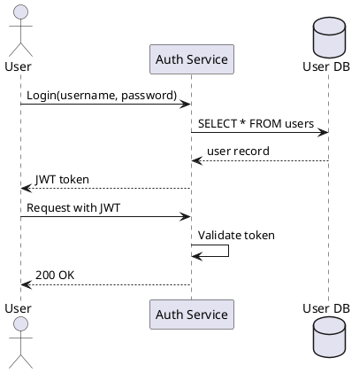

## Use Case Diagram

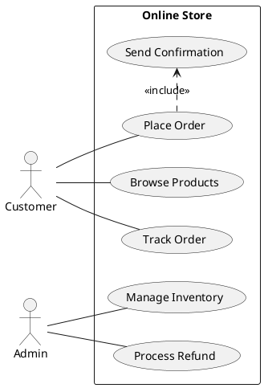

## Class Diagram

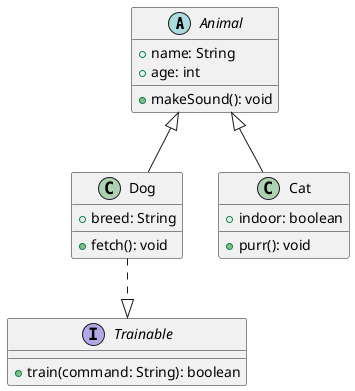

## Object Diagram

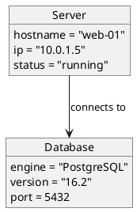

## Activity Diagram

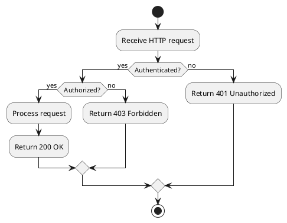

## Component Diagram

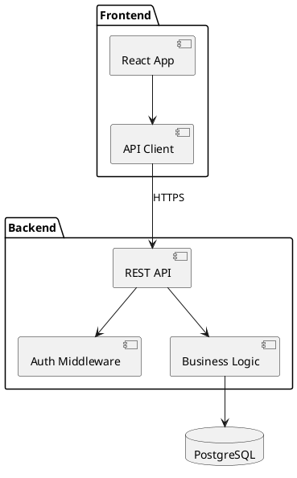

## Deployment Diagram

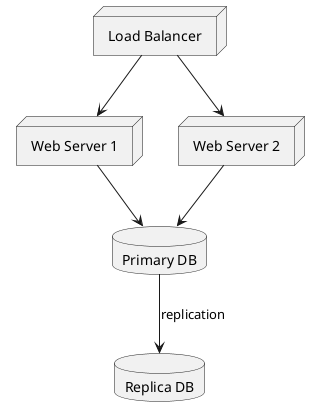

## State Diagram

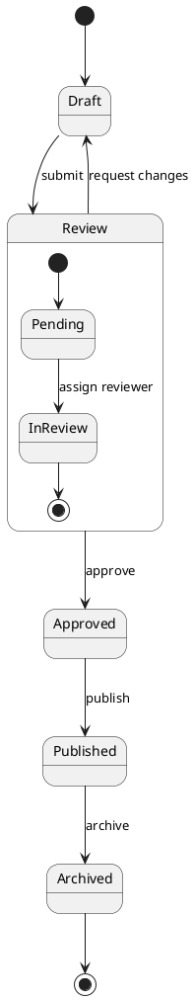

## Timing Diagram

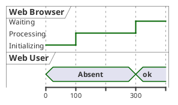

## Entity Relationship (IE Notation)

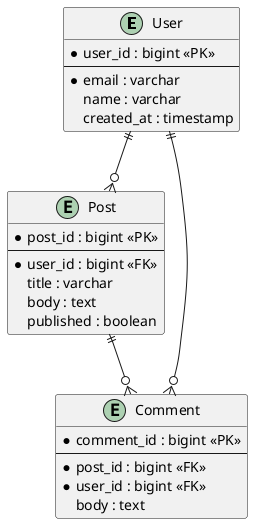

## Gantt Chart

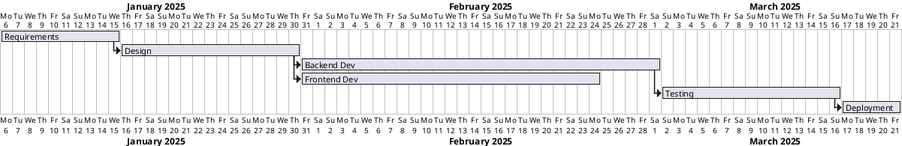

## Mind Map

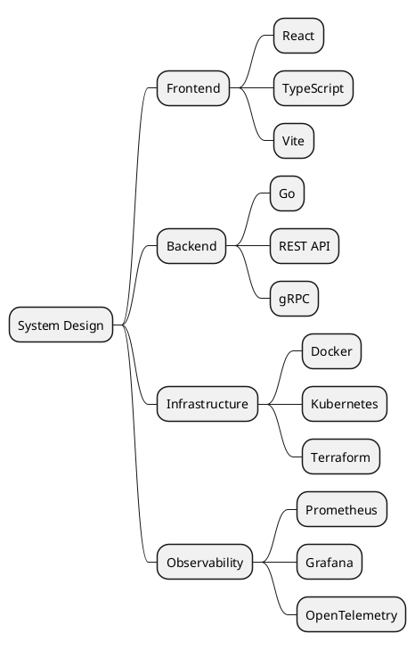

## Work Breakdown Structure (WBS)

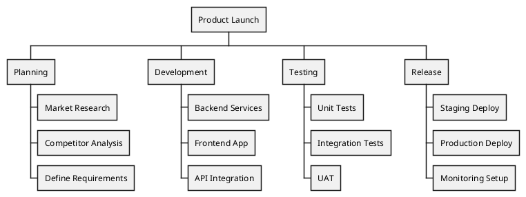

## Network Diagram (nwdiag)

```plantuml
@startnwdiag
network internet {
  address = "203.0.113.0/24"
  web01 [address = "203.0.113.1"]
  web02 [address = "203.0.113.2"]
}

network dmz {
  address = "172.16.0.0/24"
  web01 [address = "172.16.0.1"]
  web02 [address = "172.16.0.2"]
  lb [address = "172.16.0.10"]
}

network internal {
  address = "10.0.0.0/8"
  lb [address = "10.0.0.1"]
  db01 [address = "10.0.0.100"]
  db02 [address = "10.0.0.101"]
}
@endnwdiag
```

## Wireframe (Salt)

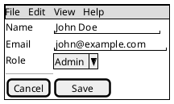

## JSON Visualization

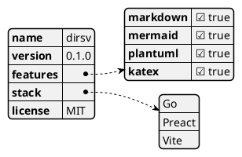

## YAML Visualization

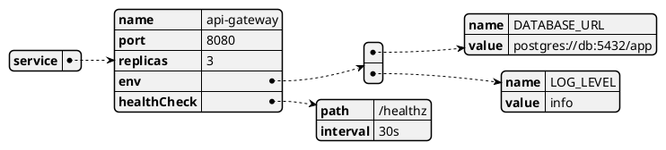

## EBNF Diagram

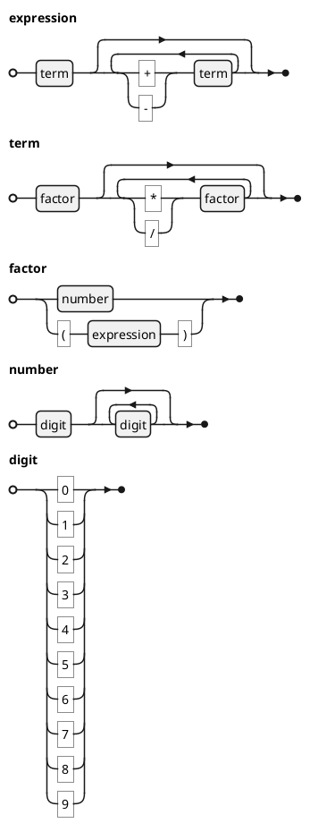

## Regex Visualization

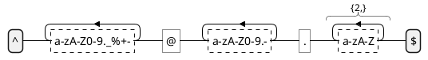
